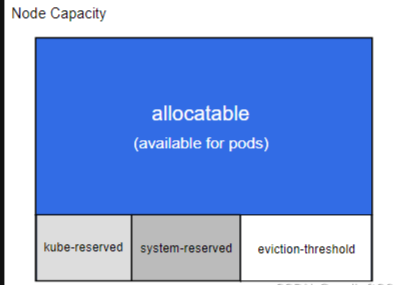
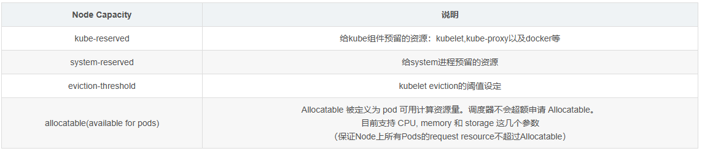

由于Pod没有对内存及CPU进行限制，导致Pod在运行过程中所需的内存超过了节点本身的内存（OOM），从而导致节点崩溃，使得运行在该节点上的所有Pod都失败了。

<!--more-->

为了解决这个问题以及提高节点的稳定性，综合k8s的一些特性，方案如下

1.每个节点为系统守护进程预留计算资源(CPU、内存、磁盘空间)
2.Pod驱逐：节点资源到达一定使用量，开始驱逐 pod
3.每个Pod需指定所需资源

### 预留资源

Kubernetes 的节点可以按照 Capacity 调度。默认情况下 pod 能够使用节点全部可用容量。 这是个问题，因为节点自己通常运行了不少驱动 OS 和 Kubernetes 的系统守护进程。 除非为这些系统守护进程留出资源，否则它们将与 Pod 争夺资源并导致节点资源短缺问题。

kubelet 公开了一个名为 ‘Node Allocatable’ 的特性，有助于为系统守护进程预留计算资源。 Kubernetes 推荐集群管理员按照每个节点上的工作负载密度配置 ‘Node Allocatable’。



Kubernetes 节点上的 ‘Allocatable’ 被定义为 Pod 可用计算资源量。 调度器不会超额申请 ‘Allocatable’。 目前支持 ‘CPU’、‘memory’ 和 ‘ephemeral-storage’ 这几个参数。

可分配的节点暴露为 API 中 v1.Node 对象的一部分，也是 CLI 中 kubectl describe node 的一部分。

在 kubelet 中，可以为两类系统守护进程预留资源。

**Node Capacity：Node的所有硬件资源**


allocatable的值即对应 describe node 时看到的allocatable容量，pod 调度的上限

计算公式：节点上可配置值 = 总量 - 预留值 - 驱逐阈值

```
Allocatable = Capacity - Reserved(kube+system) - Eviction Threshold
```


#### Kube-reserved

Kubelet 标志 ：--kube-reserved=[[cpu=100m][,][memory=100Mi][,][ephemeral-storage=1Gi][,]]()[pid=1000]
Kubelet 标志 ：--kube-reserved-cgroup=
kube-reserved 用来给诸如 kubelet、容器运行时、节点问题监测器等 Kubernetes 系统守护进程记述其资源预留值。 该配置并非用来给以 Pod 形式运行的系统守护进程预留资源。kube-reserved 通常是节点上 Pod 密度 的函数。

Kube-reserved
Kubelet 标志 ：--kube-reserved=[cpu=100m][,][memory=100Mi][,][ephemeral-storage=1Gi][,][pid=1000]
Kubelet 标志 ：--kube-reserved-cgroup=
kube-reserved 用来给诸如 kubelet、容器运行时、节点问题监测器等 Kubernetes 系统守护进程记述其资源预留值。 该配置并非用来给以 Pod 形式运行的系统守护进程预留资源。kube-reserved 通常是节点上 Pod 密度 的函数。

除了 cpu、内存 和 ephemeral-storage 之外，pid 可用来指定为 Kubernetes 系统守护进程预留指定数量的进程 ID。

**设置方式**

1. systemctl status kubelet 查看 kubelet启动的配置文件路径：–kubeconfig=/etc/kubernetes/kubelet.conf --config=/var/lib/kubelet/config.yaml

2. 编辑/var/lib/kubelet/config.yaml，添加如下内容

```
apiVersion: kubelet.config.k8s.io/v1beta1
...
kubeReserved:  # 配置 kube 资源预留, 根据实际情况进行设置
  cpu: 1000m
  memory: 5Gi
  ephemeral-storage: 5Gi
```

重启kubelet服务生效

#### System-reserved

Kubelet 标志 ：--system-reserved=[[cpu=100m][,][memory=100Mi][,][ephemeral-storage=1Gi][,]]()[pid=1000]
Kubelet 标志 ：--system-reserved-cgroup=
system-reserved 用于为诸如 sshd、udev 等系统守护进程记述其资源预留值。 system-reserved 也应该为 kernel 预留 内存，因为目前 kernel 使用的内存并不记在 Kubernetes 的 Pod 上。 同时还推荐为用户登录会话预留资源（systemd 体系中的 user.slice）。

除了 cpu、内存 和 ephemeral-storage 之外，pid 可用来指定为 Kubernetes 系统守护进程预留指定数量的进程 ID。

**设置方式**

编辑/var/lib/kubelet/config.yaml，添加如下内容

```
apiVersion: kubelet.config.k8s.io/v1beta1
...
systemReserved:  # 配置系统资源预留
  cpu: 1000m
  memory: 10Gi
  ephemeral-storage: 10Gi
```

参数解释：

**systemReserved**：为系统预留的资源，确保节点上的系统进程有足够的资源运行。

- `cpu: 500m`：预留500毫核的CPU资源。
- `memory: 4Gi`：预留4GiB的内存资源。

重启kubelet服务生效

#### Eviction Thresholds

Kubelet 标志 ：--eviction-hard=[memory.available<500Mi]

节点级别的内存压力将导致系统内存不足，这将影响到整个节点及其上运行的所有 Pod。 节点可以暂时离线直到内存已经回收为止。为了防止系统内存不足（或减少系统内存不足的可能性）， kubelet 提供了资源不足管理。 驱逐操作只支持 memory 和 ephemeral-storage。 通过 --eviction-hard 标志预留一些内存后，当节点上的可用内存降至预留值以下时， kubelet 将尝试驱逐 Pod。 如果节点上不存在系统守护进程，Pod 将不能使用超过 capacity-eviction-hard 所指定的资源量。 因此，为驱逐而预留的资源对 Pod 是不可用的。

**设置方式**

编辑/var/lib/kubelet/config.yaml，添加如下内容

```
evictionHard:
  memory.available: 10%
  nodefs.available: 10%
  nodefs.inodesFree: 5%
  imagefs.available: 15%
evictionSoft:
  imagefs.available: 15%
  memory.available: 15%
  nodefs.available: 15%
  nodefs.inodesFree: 10%
evictionSoftGracePeriod:
  imagefs.available: "90s"
  memory.available: "90s"
  nodefs.available: "90s"
  nodefs.inodesFree: "90s"
evictionMaxPodGracePeriod: 100
```

参数解释：

1. **evictionHard**：硬驱逐阈值，当节点资源低于这些阈值时，Kubernetes会立即驱逐Pod。
   - `memory.available: 10%`：可用内存低于10%时触发驱逐。
   - `nodefs.available: 10%`：节点文件系统可用空间低于10%时触发驱逐。
   - `nodefs.inodesFree: 5%`：节点文件系统可用inode数低于5%时触发驱逐。
   - `imagefs.available: 15%`：镜像文件系统可用空间低于15%时触发驱逐。
2. **evictionSoft**：软驱逐阈值，当节点资源低于这些阈值时，Kubernetes会在一定的宽限期内尝试驱逐Pod。
   - `imagefs.available: 15%`：镜像文件系统可用空间低于15%时触发驱逐。
   - `memory.available: 15%`：可用内存低于15%时触发驱逐。
   - `nodefs.available: 15%`：节点文件系统可用空间低于15%时触发驱逐。
   - `nodefs.inodesFree: 10%`：节点文件系统可用inode数低于10%时触发驱逐。
3. **evictionSoftGracePeriod**：软驱逐的宽限期，Kubernetes会在这段时间内尝试驱逐Pod，如果资源仍然不足，则会触发硬驱逐。
   - `imagefs.available: "90s"`：镜像文件系统可用空间低于15%时，宽限期为90秒。
   - `memory.available: "90s"`：可用内存低于15%时，宽限期为90秒。
   - `nodefs.available: "90s"`：节点文件系统可用空间低于15%时，宽限期为90秒。
   - `nodefs.inodesFree: "90s"`：节点文件系统可用inode数低于10%时，宽限期为90秒。
4. **evictionMaxPodGracePeriod**：Pod的最大宽限期，在驱逐Pod时，Kubernetes会等待这段时间以确保Pod有足够的时间优雅地终止。

重启kubelet服务生效


当触发驱逐的时候，有一个bug，驱逐的pod不会自动删除，状态会变为Error或者ContainerStatusUnknown


可以写个脚本定时去清理：

```
#!/bin/bash
for ns in `kubectl get ns | awk 'NR>1{print $1}'`
do
      kubectl get pods -n ${ns} | egrep 'ContainerStatusUnknown|Error' | awk '{print $1}' | xargs kubectl delete pod -n ${ns}
done
```

