在k8s中，你可以约束一个 Pod 以便限制其只能在特定的节点上运行， 或优先在特定的节点上运行。有几种方法可以实现这点，推荐的方法都是用 标签选择算符来进行选择。 通常这样的约束不是必须的，因为调度器将自动进行合理的放置（比如，将 Pod 分散到节点上， 而不是将 Pod 放置在可用资源不足的节点上等等）。但在某些情况下，你可能需要进一步控制 Pod 被部署到哪个节点。例如，确保 Pod 最终落在连接了 SSD 的机器上， 或者将来自两个不同的服务且有大量通信的 Pod 被放置在同一个可用区。

<!--more-->

你可以使用下列方法中的任何一种来选择 Kubernetes 对特定 Pod 的调度：

- 与节点标签匹配的 nodeSelector
- 亲和性与反亲和性
- nodeName 字段
- Pod 拓扑分布约束

## 环境配置

```bash
[root@k8s-master ~]# kubectl get nodes 
NAME         STATUS   ROLES           AGE   VERSION
k8s-master   Ready    control-plane   11d   v1.24.4
k8s-slave1   Ready    <none>          11d   v1.24.4
k8s-slave2   Ready    <none>          11d   v1.24.4
[root@k8s-master ~]# 
```

## nodeName

**nodeName：**

 在 Kubernetes 中，NodeName 是每个 Node 节点的唯一标识符，它是一个字符串，通常是节 点的主机名（hostname）。在创建 Pod 时，可以通过指定 nodeName 字段来将 Pod 调度到特定的 Node 节点上。

**指定pod运行在哪个节点上**

```yaml
[root@k8s-master day9]# cat nodename_pod.yaml 
apiVersion: v1
kind: Pod
metadata:
  name: nodename-pod
  namespace: default
  labels:
    app: nginx
spec:
  nodeName: k8s-slave2
  containers: 
  - name: mynginx
    ports:
    - containerPort: 80
    image: nginx
```

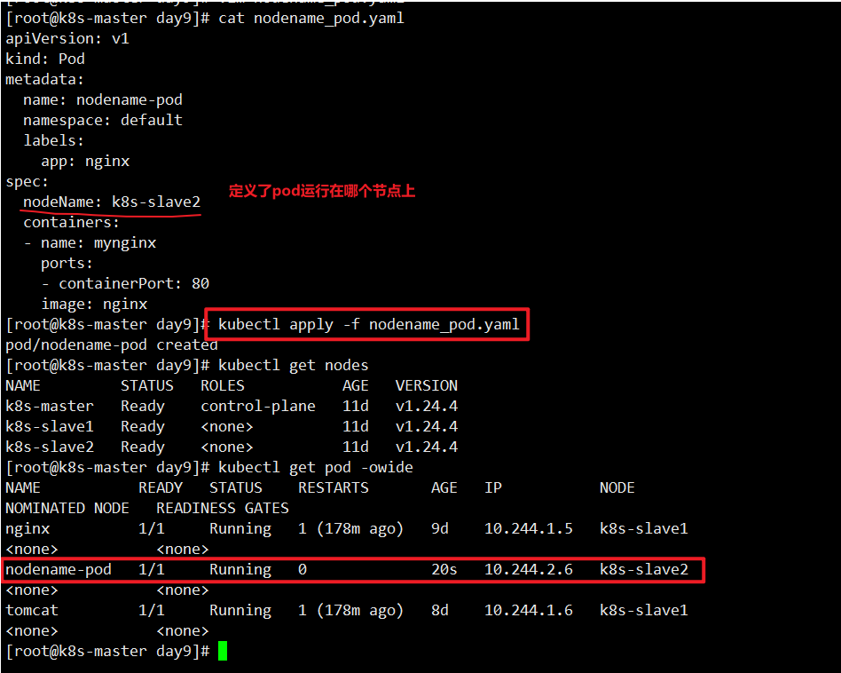

## nodeSelector

 在 Kubernetes 中，Node 节点选择器（NodeSelector）是用来将 Pod 调度到特定节点的一种机 制。它基于 Node 节点的标签（Node Labels）来进行筛选和匹配，从而使 Pod 能够被分配到满足其要 求的节点上。

 具体来说，Node 节点选择器允许用户为 Node 节点打上一组键值对标签，例如： nodeType=compute、diskType=ssd 等等。当用户在创建 Pod 时指定一个或多个 Node Selector 时，Kubernetes 调度器会根据这些选择器的键值对与 Node 节点的标签进行匹配，最终将 Pod 分配到 匹配的节点上。

 例如，如果用户定义了一个 Pod 需要一个节点具有标签“nodeType=compute”，那么 Kubernetes 调度器将只会将该 Pod 调度到具有此标签的节点上。如果没有节点具有该标签，则 Pod 将 保持处于 Pending 状态直到有符合条件的节点出现。

 例子展示：创建一个pod， nodeSelector选择要带ssd标签的。

```yaml
root@k8s-master day9]# cat nodeSelector_pod.yaml 
apiVersion: v1
kind: Pod
metadata:
  name: nodeselector-pod
  namespace: default
  labels:
    app: nginx
spec:
  nodeSelector:
    disktype: ssd 
  containers: 
  - name: mynginx2
    ports:
    - containerPort: 80
    image: nginx
[root@k8s-master day9]# kubectl apply -f nodeSelector_pod.yaml 
```

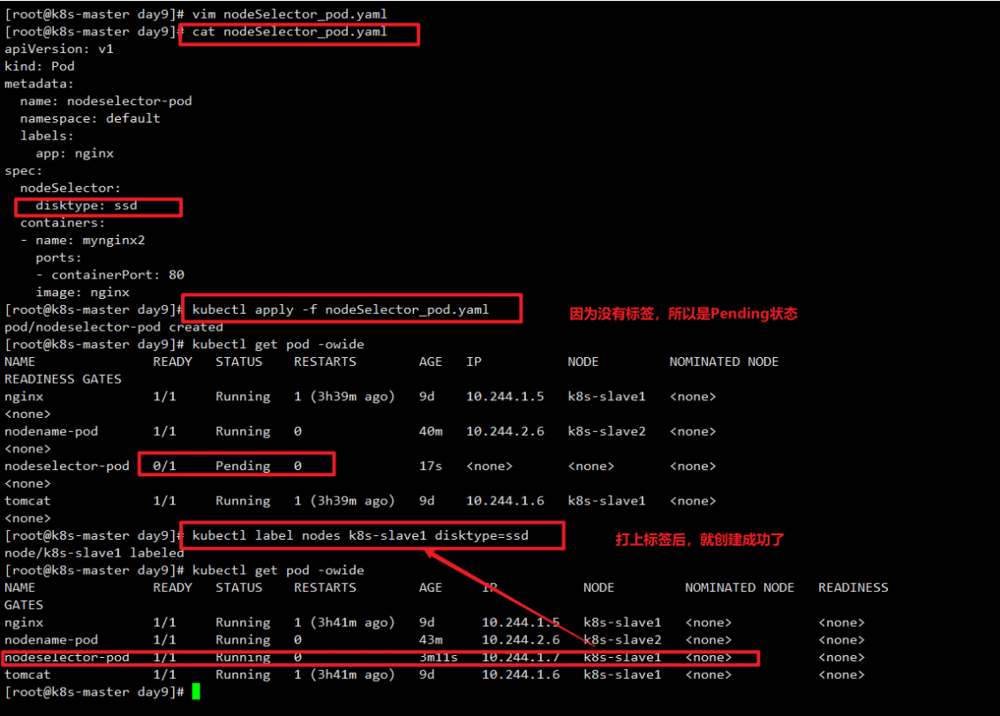

## 打标签常用命令

```bash
#添加标签
kubectl label nodes k8s-slave1 disktype=ssd
#查看标签
kubectl get nodes --show-labels
#删除标签
kubectl label nodes k8s-slave1 disktype-
#帮助命令
kubectl label --help
```

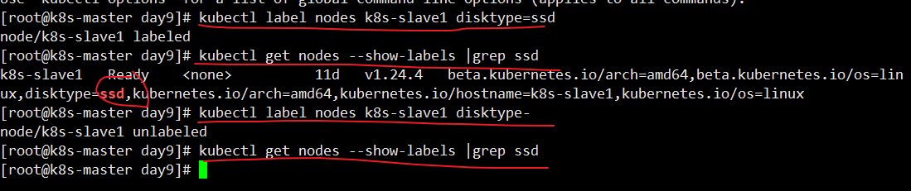

## 亲和性 affinity

在 Kubernetes 中，`亲和性（Affinity）是一种机制`，用于控制 Pod 调度器将 Pod 调度到与其最匹 配的节点上。亲和性机制允许用户定义一组规则，以便将 Pod 调度到具有指定特征的节点上，这些特征 可以是节点的标签（Labels）、污点（Taints）或其他属性。

亲和性有两种类型：节点亲和性（Node Affinity）和 Pod 亲和性（Pod Affinity）。节点亲和性指 定了节点和 Pod 之间的关系，而 Pod 亲和性指定了 Pod 和其他 Pod 之间的关系。

### node节点亲和性（Node Affinity）

```bash
kubectl explain pod.spec
```

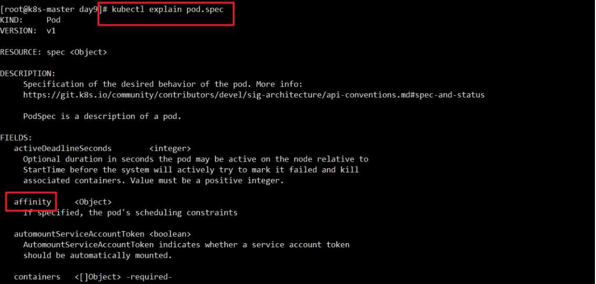

```bash
 kubectl explain pod.spec.affinity
```

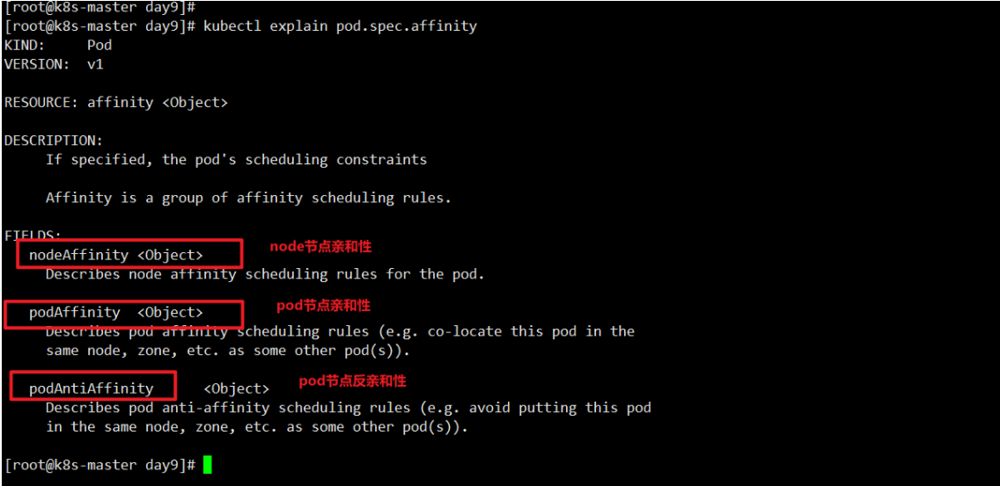

```bash
[root@k8s-master day9]# kubectl explain pod.spec.affinity.nodeAffinity
 preferredDuringSchedulingIgnoredDuringExecution	#软亲和性
 requiredDuringSchedulingIgnoredDuringExecution	   #硬亲和性
```

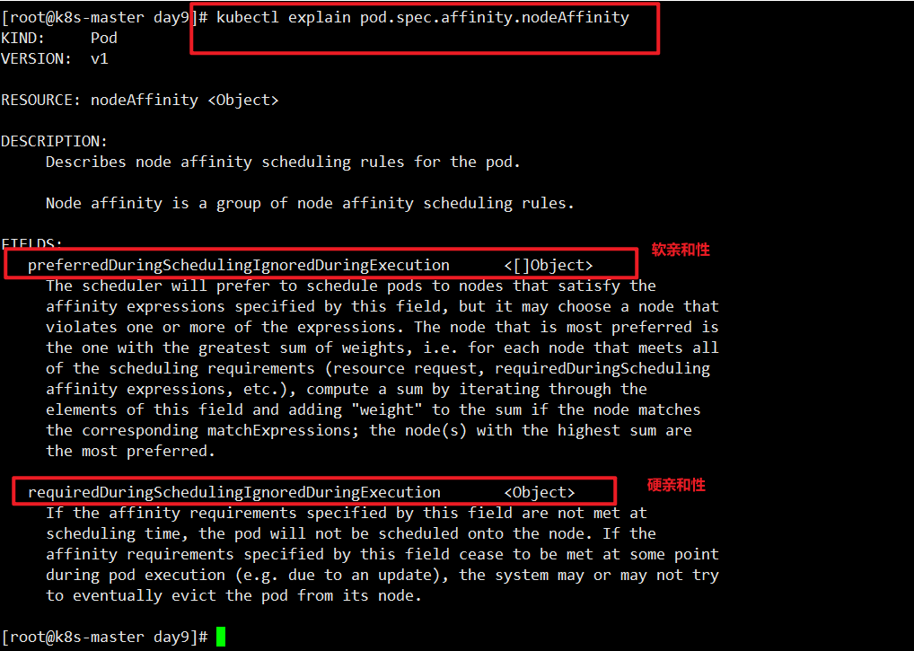

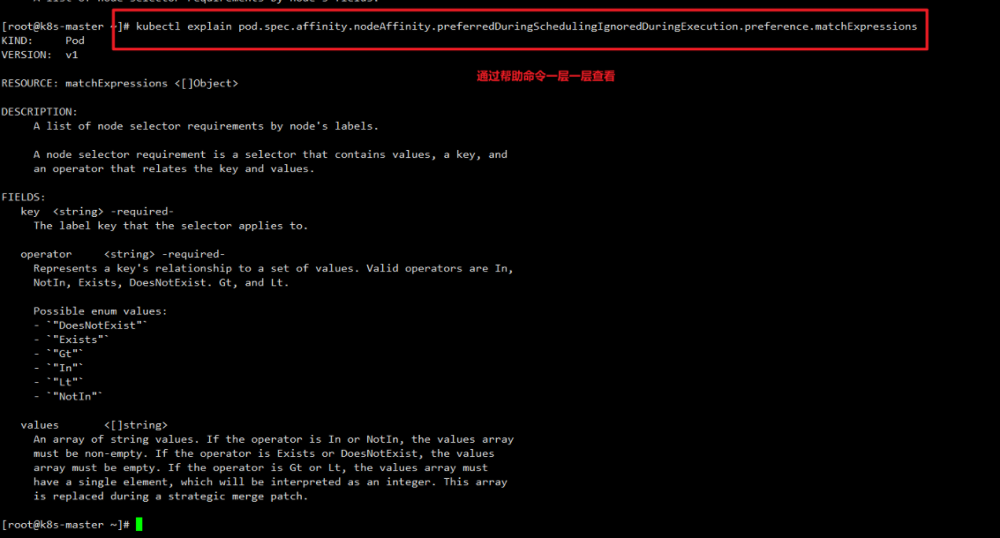

#### 硬亲和性，创建一个案例

```yaml
[root@k8s-master ~]# cat nodeaffinity.yaml 
apiVersion: v1
kind: Pod
metadata:
  name: nodeaffinity-1
  namespace: default
  labels:
     app: myapp
     item: pro
spec:
    containers:
    - name: myapp
      image: tomcat
      imagePullPolicy: IfNotPresent
    affinity:
        nodeAffinity:
            requiredDuringSchedulingIgnoredDuringExecution:
                   nodeSelectorTerms:
                   - matchExpressions:
                     - key: a
                       operator: In
                       values:
                       - b
```

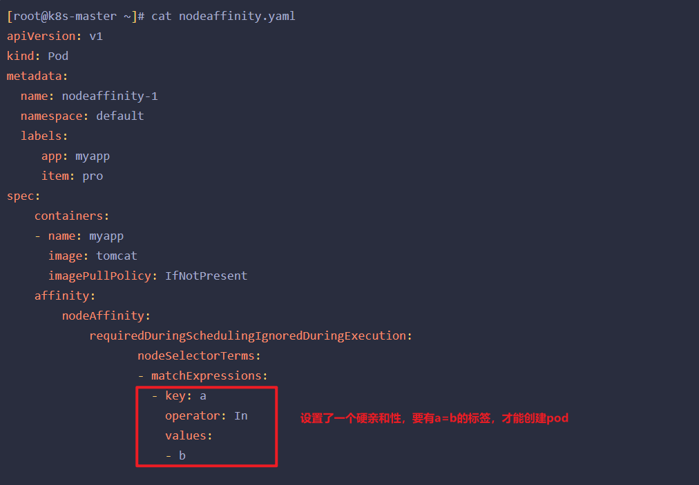

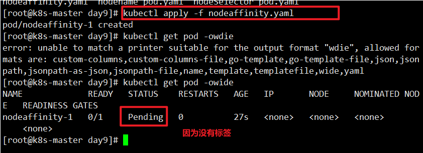

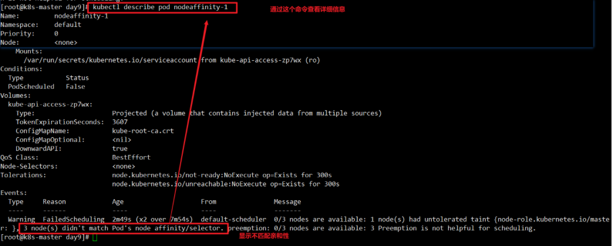

**打上一个a=b的标签**

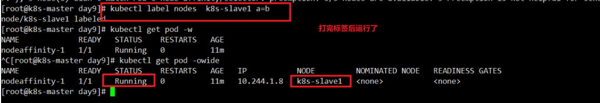

#### 软亲和性案例，单个条件

```yaml
[root@k8s-master day9]# cat nodeaffinity_ruan.yaml 
apiVersion: v1
kind: Pod
metadata:
  name: nodeaffinity-ruan
  namespace: default
  labels:
    app: myapp-ruan
spec:
  containers:
  - name: myapp
    image: tomcat
    imagePullPolicy: IfNotPresent
  affinity:
    nodeAffinity:
      preferredDuringSchedulingIgnoredDuringExecution:
      - preference:
          matchExpressions:
          - key: a1
            operator: In
            values:
            - b1
        weight: 80
```

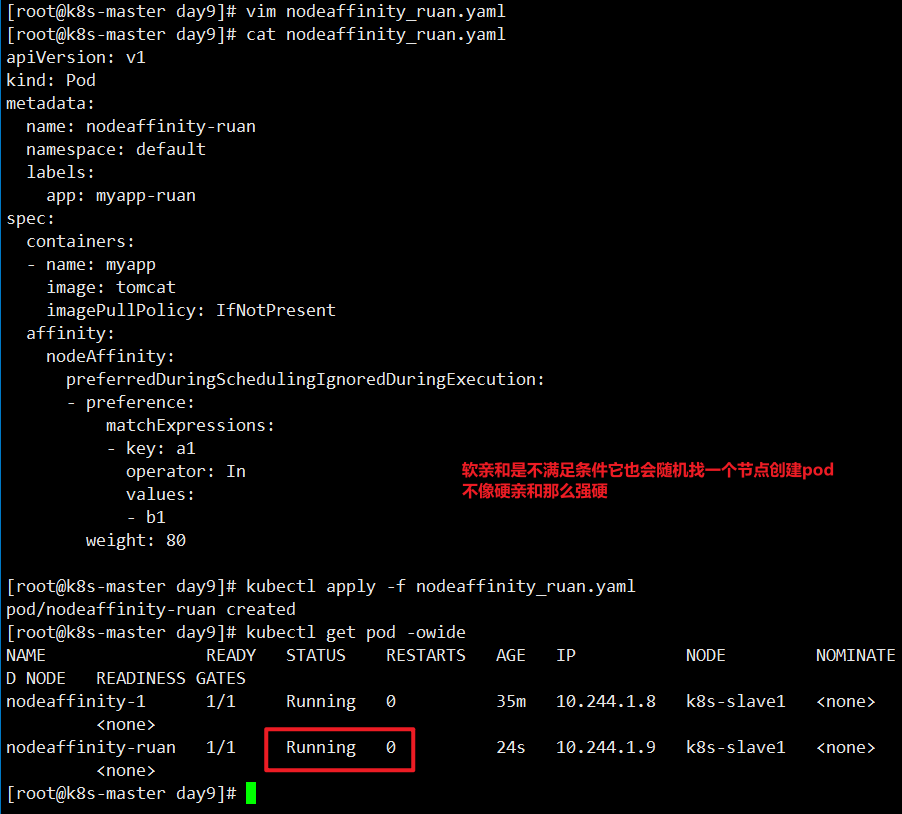

上面说明软亲和性是可以运行这个 pod 的，尽管没有任何一个节点具有 a1=b1 这个标签.

#### 软亲和第二个案例,多个条件

备注：

yaml 文件解释：

使用 weight 字段来指定权重。weight 字段是一个整数值，表示优先级，取值范围为 1 到 100。如果多个节点满足软亲和性的要求，那么 Kubernetes 会根据节点的权重来决定 pod 最终调度的 节点。在这个例子中，weight=80 表示这个软亲和性的优先级为 80。

具体案例分享： 假设我们有一个 Kubernetes 集群，其中有多个节点，每个节点都有不同的标签。现在有一个 Pod，需要运行在 CPU 性能较好的节点上，同时如果有多个节点都满足要求，优先选择具有更多内存的 节点。此时，我们可以使用节点亲和性和软亲和性来指定 Pod 的调度。

首先，我们可以在节点上添加标签，例如，我们可以给性能较好的节点打上 cpu=high 的标签，给 内存较大的节点打上 memory=large 的标签。

其次，我们可以在 Pod 的配置文件中，使用 requiredDuringSchedulingIgnoredDuringExecution 字段来指定硬亲和性，让 Pod 只能调度到具 有 cpu=high 标签的节点上。

最后，我们可以使用 preferredDuringSchedulingIgnoredDuringExecution 字段来指定软亲和 性，同时设置权重值，让 Kubernetes 在有多个节点满足软亲和性时，优先选择具有更多内存的节点。

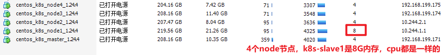

```bash
[root@k8s-master day9]# kubectl get nodes 
NAME         STATUS   ROLES           AGE   VERSION
k8s-master   Ready    control-plane   12d   v1.24.4
k8s-slave1   Ready    <none>          12d   v1.24.4   # 4c 8g
k8s-slave2   Ready    <none>          12d   v1.24.4   #4c 4g
k8s-slave3   Ready    <none>          40h   v1.24.4   #4c 4g
k8s-slave4   Ready    <none>          40h   v1.24.4   #4c 4g
apiVersion: v1
kind: Pod
metadata:
  name: nodeaffinity-ruan2
  namespace: default
  labels:
    app: myapp-ruan2
spec:
  containers:
  - name: myapp2
    image: tomcat
    imagePullPolicy: IfNotPresent
  affinity:
    nodeAffinity:
      requiredDuringSchedulingIgnoredDuringExecution:
        nodeSelectorTerms:
        - matchExpressions:
          - key: cpu
            operator: In
            values:
            - high
      preferredDuringSchedulingIgnoredDuringExecution:
      - preference:
          matchExpressions:
          - key: memory
            operator: In
            values:
            - high
        weight: 80
      - preference:
          matchExpressions:
          - key: memory
            operator: In
            values:
            - low
        weight: 60
```

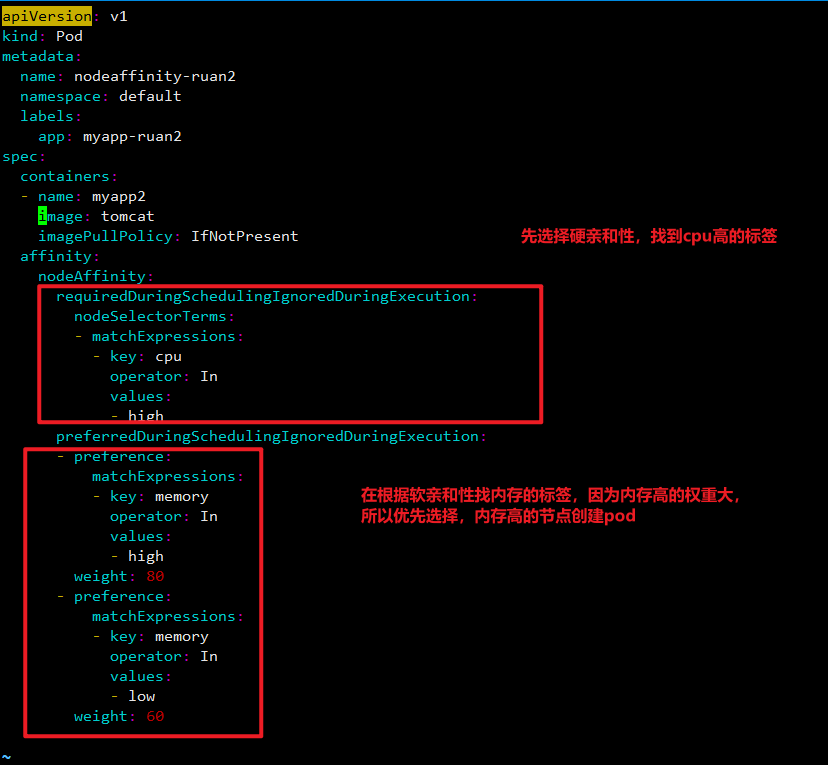

```bash
#主机打标签
[root@k8s-master day9]# kubectl label nodes k8s-slave1 cpu=high
node/k8s-slave1 labeled
[root@k8s-master day9]# kubectl label nodes k8s-slave2 cpu=high
node/k8s-slave2 labeled
[root@k8s-master day9]# kubectl label nodes k8s-slave3 cpu=high
node/k8s-slave3 labeled
[root@k8s-master day9]# kubectl label nodes k8s-slave4 cpu=high
node/k8s-slave4 labeled
[root@k8s-master day9]# kubectl label nodes k8s-slave4 memory=low
node/k8s-slave4 labeled
[root@k8s-master day9]# kubectl label nodes k8s-slave3 memory=low
node/k8s-slave3 labeled
[root@k8s-master day9]# kubectl label nodes k8s-slave2 memory=low
node/k8s-slave2 labeled
[root@k8s-master day9]# kubectl label nodes k8s-slave1 memory=high
node/k8s-slave1 labeled
[root@k8s-master day9]# 
```

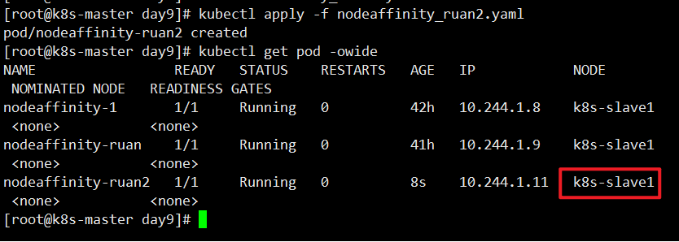

## pod 亲和性

Kubernetes 中的 Pod 亲和性可以用来控制将一个 Pod 调度到与其它 Pod 具有特定关系的节点 上。这可以实现多种不同的需求，例如：

• 通过 pod 亲和性提高服务的性能和可靠性：通过将相关服务部署在同一个节点上，可以降低网 络延迟和提高服务响应速度。此外，如果某个节点出现故障，只会影响到部署在该节点上的服 务，不会影响到其它服务。

• 通过 pod 反亲和性分离敏感数据：通过将处理敏感数据的 Pod 与其它 Pod 隔离开来，不调 度到同一个节点上，可以提高系统的安全性。

podAffinity：表示 Pod 与其它 Pod 的亲和性。

可以使用 requiredDuringSchedulingIgnoredDuringExecution、 preferredDuringSchedulingIgnoredDuringExecution

等字段来指定 Pod 与其它 Pod 的亲和性规则。这些字段中可以使用 topologyKey 和 labelSelector 字段来指定 Pod 之间的关系。

pod 亲和性分两种：

podaffinity（pod 亲和性）：Pod 亲和性是指一组 Pod 可以被调度到同一节点上，即它们互相吸 引，倾向于被调度在同一台节点上。例如，假设我们有一组具有相同标签的 Pod，通过使用 Pod 亲和性规则，我们可以让它们在同一节点上运行，以获得更高的性能和更好的可靠性。

podunaffinity（pod 反亲和性）：Pod 反亲和性是指一组 Pod 不应该被调度到同一节点上，即它 们互相排斥，避免被调度在同一台节点上。例如，如果我们有一组应用程序 Pod，我们可以使用 Pod 反亲和性规则来避免它们被调度到同一节点上，以减少单点故障的风险和提高可靠性。

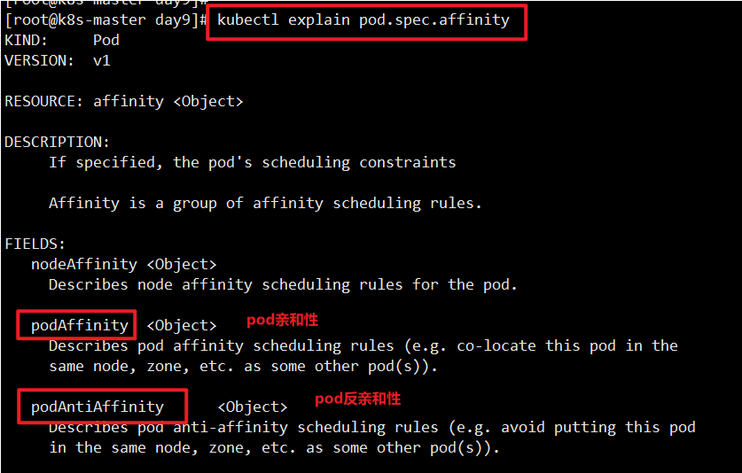

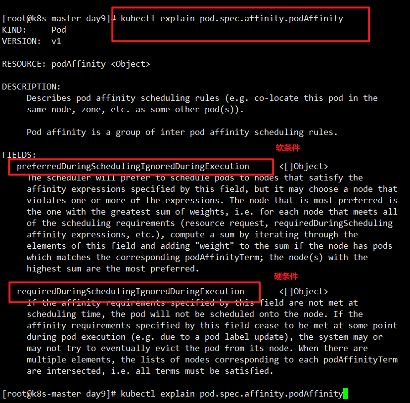

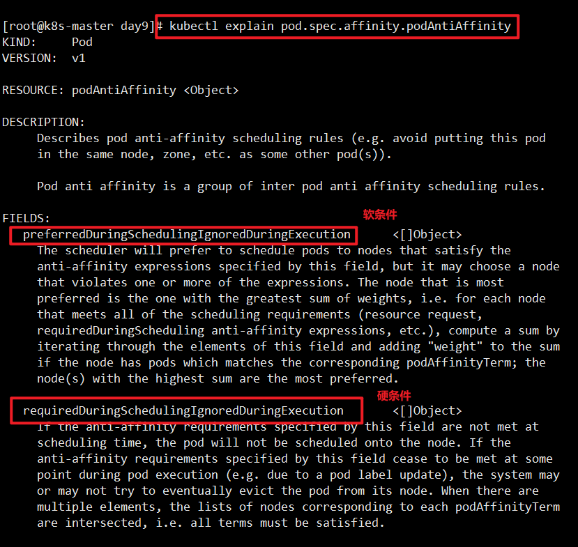

### 定义两个pod，调度到同一位置

```yaml
[root@k8s-master day9]# cat podaffinity-require.yaml 
apiVersion:  v1
kind: Pod
metadata:
  name: first
  labels:
    app: first
spec:
  containers:
  - name: myapp
    image: tomcat
```

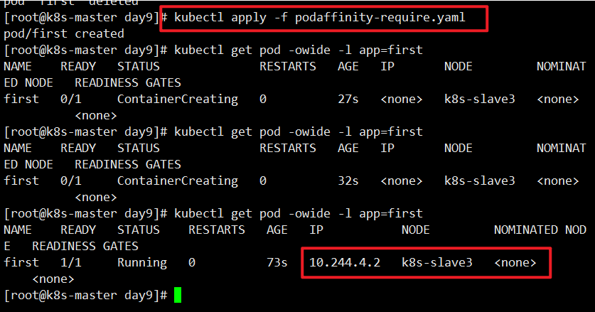

```yaml
[root@k8s-master day9]# cat podaffinity-require2.yaml 
apiVersion: v1
kind: Pod
metadata:
  name: second
  labels:
    app: second
spec:
  containers:
  - name: myapp2
    image: nginx
  affinity:
    podAffinity:
      requiredDuringSchedulingIgnoredDuringExecution:
      - labelSelector:
          matchExpressions:
          - {key: app, operator: In, values: ["first"]}
        topologyKey: kubernetes.io/hostname
```

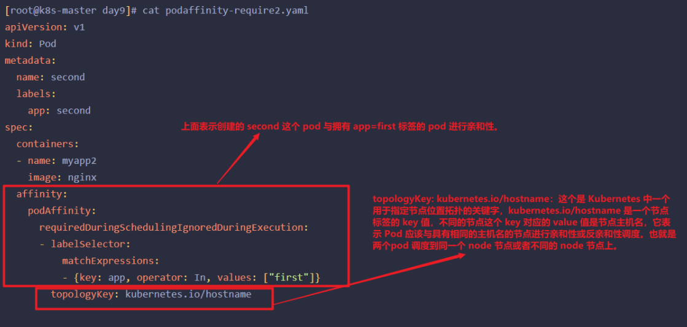

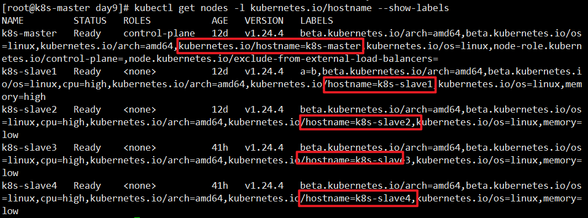

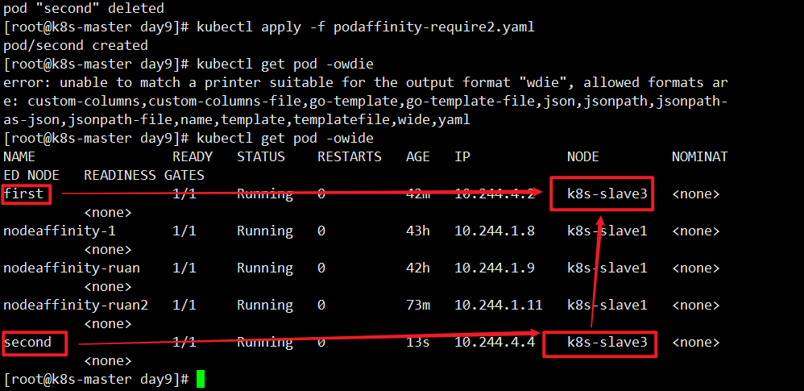

这个案例中，第一个pod调度到哪个节点，第二个pod也会 s调度到同样的节点。

## pod反亲和性

定义两个pod，第一个pod做为标准，第二个pod跟它调度到不同的节点上

```yaml
[root@k8s-master day9]# cat podunaffinity-require.yaml 
apiVersion:  v1
kind: Pod
metadata:
  name: first-1
  labels:
    app: first-1
spec:
  containers:
  - name: myapp
    image: tomcat
[root@k8s-master day9]# cat podunaffinity-require2.yaml 
apiVersion: v1
kind: Pod
metadata:
  name: second-2
  labels:
    app: second-2
spec:
  containers:
  - name: myapp2-2
    image: nginx
  affinity:
    podAntiAffinity:
      requiredDuringSchedulingIgnoredDuringExecution:
      - labelSelector:
          matchExpressions:
          - {key: app, operator: In, values: ["first-1"]}
        topologyKey: kubernetes.io/hostname
```

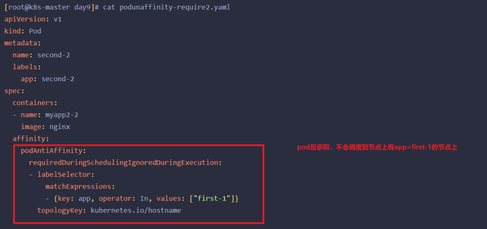

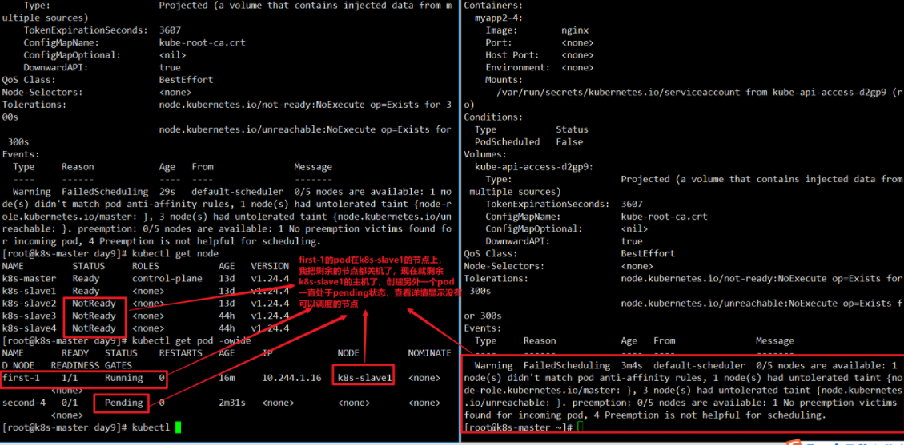

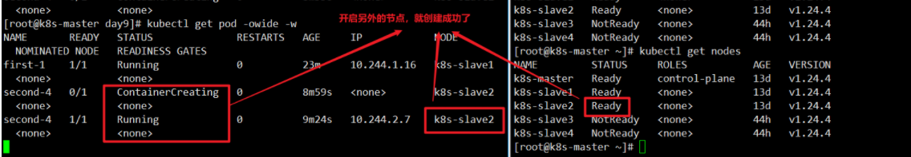

上面的案例就是pod的反亲和性，两个pod不会在一个节点上。

## pod高级用法：污点和容忍度

在 k8s 集群中，节点可能会发生各种问题，如资源瓶颈、故障、维护等，这些问题可能会影响节点 上运行的 pod。为了解决这些问题，k8s 提供了污点和容忍度机制。

污点（Taint）是一种节点上的属性，它表示该节点存在某种问题，如磁盘空间不足、内存不足等。 如果一个节点被标记了污点，那么默认情况下，k8s 不会在该节点上调度新的 Pod。这是因为 k8s 希 望确保 Pod 在运行时能够获得足够的资源，并且不会因为节点问题而意外终止。

容忍度（Toleration）是一种 Pod 的属性，容忍度只是告诉 Kubernetes，这个 Pod 可以容忍 特定的污点，但是并不意味着 Pod 必须被调度到拥有这个污点的节点上。实际上，Pod 仍然可以被调度到没有对应污点的节点上。

使用容忍度的主要目的是允许某些 Pod 能够运行在一些不符合正常调度要求的节点上，例如由于节点故障或维护等原因导致节点暂时不可用时，一些 Pod 定义容忍度之后可以被调度到其他节点上，以确保应用程序的高可用性。

假设我们有一个 k8s 集群，其中有两个节点：k8s-slave1 和k8s-slave2。我们想要在 k8s-slave1上运行一个特定的应用程序 Pod，但是 k8s-slave1 节点有一个特定的污点，需要通过容忍度来容忍。

首先，我们给k8s-slave1打一个污点，可以使用一下命令：

```bash
[root@k8s-master day9]# kubectl taint node k8s-slave1 a=b:NoSchedule
node/k8s-slave1 tainted
```

这会在 k8s-slave1 节点上打一个名为 a=b 的污点，它的效果是 NoSchedule，意味着新的 Pod 无法被调度到该节点上，除非该 Pod 设置了容忍度。

```yaml
[root@k8s-master day9]# cat podtaint.yaml 
apiVersion: v1
kind: Pod
metadata:
  name: example-pod
  labels:
     app: taint
spec:
  containers:
  - name: example-container
    image: ikubernetes/myapp:v1
    imagePullPolicy: IfNotPresent
  tolerations:
  - key: "a"
    operator: "Equal"
    value: "b"
    effect: "NoSchedule"
```

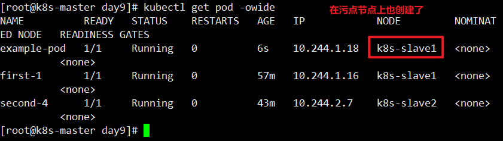

在刚才的yaml文件定义了一个容忍度规则，它告诉k8s，如果有一个a=b、效果为NoSchedule的污点，则允许被调度到有这个污点的节点上。

```
注意！ 定义了容忍度，也不代表pod一定会创建在有污点的主机上，它也会调度到没有污点的节点上。
```

定义一个pod，但不定义容忍度，那它肯定不会调度到k8s-slave1节点上。

```yaml
[root@k8s-master day9]# cat podtaint-1.yaml 
apiVersion: v1
kind: Pod
metadata:
  name: taint-1
  labels:
     app: taint-1
spec:
  containers:
  - name: taint
    image: ikubernetes/myapp:v1
    imagePullPolicy: IfNotPresent
```

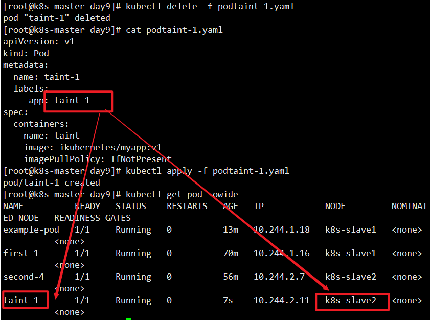

## 设置污点常用命令

```bash
#打污点
kubectl taint node k8s-slave1 a=b:NoSchedule

#查看污点
kubectl describe nodes k8s-slave1 |grep Taint

#取消污点
 kubectl taint node k8s-slave1 a-
```

#### 查看污点如何定义的

```bash
[root@k8s-master day9]# kubectl explain node.spec.taints
KIND:     Node
VERSION:  v1

RESOURCE: taints <[]Object>

DESCRIPTION:
     If specified, the node's taints.

     The node this Taint is attached to has the "effect" on any pod that does
     not tolerate the Taint.

FIELDS:
   effect	<string> -required-
     Required. The effect of the taint on pods that do not tolerate the taint.
     Valid effects are NoSchedule, PreferNoSchedule and NoExecute.

     Possible enum values:
     - `"NoExecute"` Evict any already-running pods that do not tolerate the
     taint. Currently enforced by NodeController.
     - `"NoSchedule"` Do not allow new pods to schedule onto the node unless
     they tolerate the taint, but allow all pods submitted to Kubelet without
     going through the scheduler to start, and allow all already-running pods to
     continue running. Enforced by the scheduler.
     - `"PreferNoSchedule"` Like TaintEffectNoSchedule, but the scheduler tries
     not to schedule new pods onto the node, rather than prohibiting new pods
     from scheduling onto the node entirely. Enforced by the scheduler.

   key	<string> -required-
     Required. The taint key to be applied to a node.

   timeAdded	<string>
     TimeAdded represents the time at which the taint was added. It is only
     written for NoExecute taints.

   value	<string>
     The taint value corresponding to the taint key.
```

node.spec.taints 字段是定义节点上的污点（taints）。每个污点由三个属性组成：key、value 和 effect。

key：污点的名称，可以是任意字符串。在同一节点上，多个污点的 key 不能相同。

value：污点的值，可以是任意字符串，用于进一步标识污点。可以为空字符串。

effect：污点的效果，用于告诉 Kubernetes，哪些 Pod 可以被调度到该节点上。有三种效果可供选择：

NoSchedule：表示新的 Pod 无法被调度到该节点上，但不会影响已有的Pod。

PreferNoSchedule：表示新的 Pod 会尽量不被调度到该节点上，除非没有其它节点可调度。

NoExecute：表示在该节点上运行的现有 Pod，如果不符合污点要求，则会被逐渐终止并移除。

#### 查看pod容忍度如何定义

```bash
[root@k8s-master day9]# kubectl explain pods.spec.tolerations
KIND:     Pod
VERSION:  v1

RESOURCE: tolerations <[]Object>

DESCRIPTION:
     If specified, the pod's tolerations.

     The pod this Toleration is attached to tolerates any taint that matches the
     triple <key,value,effect> using the matching operator <operator>.

FIELDS:
   effect	<string>
     Effect indicates the taint effect to match. Empty means match all taint
     effects. When specified, allowed values are NoSchedule, PreferNoSchedule
     and NoExecute.

     Possible enum values:
     - `"NoExecute"` Evict any already-running pods that do not tolerate the
     taint. Currently enforced by NodeController.
     - `"NoSchedule"` Do not allow new pods to schedule onto the node unless
     they tolerate the taint, but allow all pods submitted to Kubelet without
     going through the scheduler to start, and allow all already-running pods to
     continue running. Enforced by the scheduler.
     - `"PreferNoSchedule"` Like TaintEffectNoSchedule, but the scheduler tries
     not to schedule new pods onto the node, rather than prohibiting new pods
     from scheduling onto the node entirely. Enforced by the scheduler.

   key	<string>
     Key is the taint key that the toleration applies to. Empty means match all
     taint keys. If the key is empty, operator must be Exists; this combination
     means to match all values and all keys.

   operator	<string>
     Operator represents a key's relationship to the value. Valid operators are
     Exists and Equal. Defaults to Equal. Exists is equivalent to wildcard for
     value, so that a pod can tolerate all taints of a particular category.

     Possible enum values:
     - `"Equal"`
     - `"Exists"`

   tolerationSeconds	<integer>
     TolerationSeconds represents the period of time the toleration (which must
     be of effect NoExecute, otherwise this field is ignored) tolerates the
     taint. By default, it is not set, which means tolerate the taint forever
     (do not evict). Zero and negative values will be treated as 0 (evict
     immediately) by the system.

   value	<string>
     Value is the taint value the toleration matches to. If the operator is
     Exists, the value should be empty, otherwise just a regular string.

[root@k8s-master day9]# 
```

key：表示污点的键，必须与节点上的污点键相匹配才能容忍此污点。

value：表示污点的值，必须与节点上的污点值相匹配才能容忍此污点。如果未指定，则默认为空字 符串。

operator：表示匹配操作符。可以是 Equal、Exists 。在 Equal 操作符下，如果 key、value 和 effect 都与节点上的污点匹配，则该容忍度规则会被视为匹配。因此，key、value 和 effect 都需要匹配才能算作是匹配的容忍度规则。"Exists" 表示只要节点上存在 key 字段指定的污点，无论其对应 的 value 是什么，都将被视为匹配的容忍度规则。

effect：表示容忍度的作用效果。跟 node 节点上的 effect 匹配即可。

tolerationSeconds：要想在 pod 容忍度中指定 tolerationSeconds 参数，effect 字段必须设置 为 NoExecute 才可以。如果一个节点上出现了被标记为 NoExecute 的污点，所有已经运行在该节点 上的 Pod 不能容忍这个污点，将会被终止并且删除。如果当 pod 定义容忍度时候容忍 node 节点排斥 等级是 Noexecute 污点时，Pod 会等待 tolerationSeconds 指定的时间，如果在这段时间内污点被 删除，则 Pod 将可以继续在该节点上运行。 否则过了这个时间 pod 就被删除了。

#### 案例NoSchedule

再看一个案例，假如 k8s 集群有三个节点，k8s-master 、k8s-slave1、k8s-slave2，k8s-master 默 认是控制节点，把 k8s-slave1和 k8s-slave2 都打污点，测试让 pod 调度到 k8s-slave1 上。

```bash
[root@k8s-master day9]# kubectl taint node  k8s-slave1 key=value:NoSchedule
node/k8s-slave1 tainted
[root@k8s-master day9]# kubectl taint node  k8s-slave2 key=value:NoSchedule
node/k8s-slave2 tainted
[root@k8s-master day9]# 
```

定义pod没有容忍度

```yaml
[root@k8s-master day9]# cat pod-toleration-1.yaml 
apiVersion: v1
kind: Pod
metadata:
  name: my-pod
  labels:
    app: my-pod
spec:
  containers:
  - name: nginx
    image: nginx
    imagePullPolicy: IfNotPresent
```

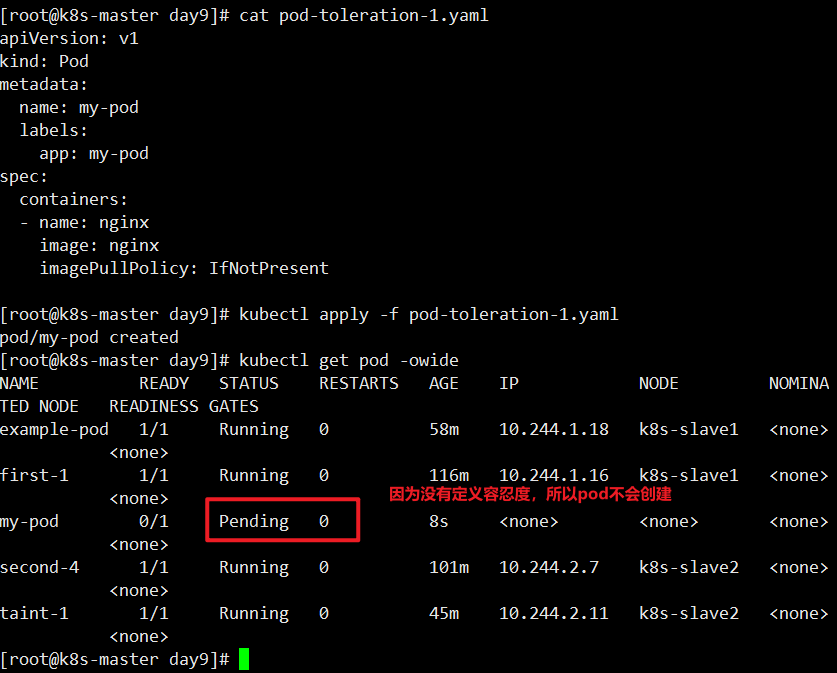

让pod调度到k8s-slave2上

```yaml
[root@k8s-master day9]# cat pod-toleration-2.yaml 
apiVersion: v1
kind: Pod
metadata:
  name: my-pod-1
  labels:
    app: my-pod-1
spec:
  containers:
  - name: nginx
    image: nginx
    imagePullPolicy: IfNotPresent
  tolerations:
  - key: "key"
    operator: "Exists"
    effect: "NoSchedule"
  nodeSelector:
    kubernetes.io/hostname: k8s-slave2
```

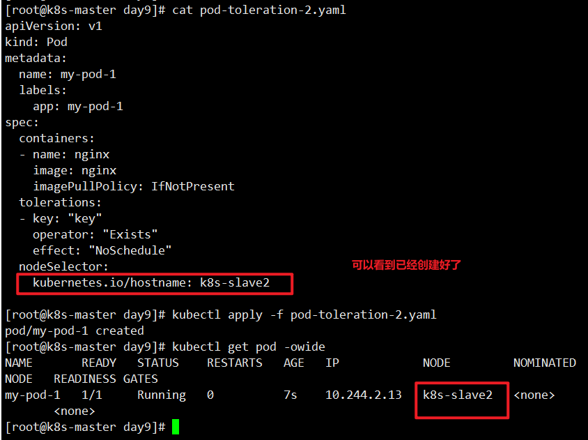

把之前创建的污点都删除

```bash
[root@k8s-master day9]# kubectl taint node k8s-slave1 key-
node/k8s-slave1 untainted
[root@k8s-master day9]# kubectl taint node k8s-slave2 key-
node/k8s-slave2 untainted
```

#### 案例，演示tolerationSeconds场景

创建一个pod，定义容忍度

```bash
[root@k8s-master day9]# cat pod-toleration-3.yaml 
apiVersion: v1
kind: Pod
metadata:
  name: my-pod-1
  labels:
    app: my-pod-1
spec:
  containers:
  - name: nginx
    image: nginx
    imagePullPolicy: IfNotPresent
  tolerations:
  - key: "key"
    operator: "Exists"
    effect: "NoExecute"
    tolerationSeconds: 300
```

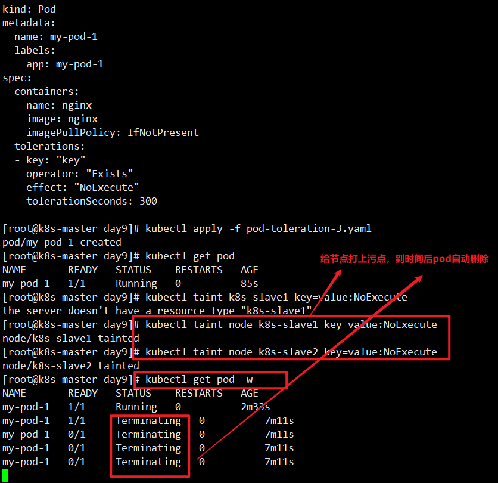

## 总结

综上，我们可以总结出来 node 节点亲和性、node 节点选择器、node 节点污点分别适用什么场 景：

节点亲和性（Node Affinity）适合用于将 Pod 部署在特定的节点上的场景，比如需要特定硬件 或软件配置的节点，或者需要将某些 Pod 部署在与其他相关服务相同的节点上。通过使用节点亲和性， 可以确保 Pod 在运行时可以获得所需的资源，并提高应用程序的性能和可靠性。

节点选择器（Node Selector）是一种简单的调度策略，它允许在 Pod 中指定一个节点标签，使 得 pod 只能调度到拥有该标签的节点上。如果没有节点满足条件，则该 Pod 无法调度。

污点（Taints）是一种用于标记节点的机制，可以在节点上设置污点来阻止不应该在该节点上运行 的 Pod 调度到该节点上。只有带有相应容忍污点（Tolerations）的 Pod 才能被调度到该节点上。例 如，可以在节点上设置污点来阻止一些敏感应用程序运行在该节点上。

在生产环境中，这些调度策略可以用于以下场景：

节点亲和性：在多节点集群中，通过将某些 Pod 调度到拥有特定硬件或软件配置的节点上，以最大化应用程序性能。例如，可以将需要 GPU 计算能力的机器学习任务调度到拥有 GPU 的节点上，以 提高计算速度。 节点选择器：在多租户环境中，可以使用节点选择器将不同的 Pod 部署在不同的节点上，以隔离 应用程序并避免资源竞争。例如，可以将测试环境的 Pod 调度到专用的测试节点上，而将生产环境的 Pod 调度到专用的生产节点上。 污点和容忍：在生产环境中，可以使用污点和容忍来确保敏感应用程序不会运行在错误的节点上。 例如，可以在拥有机密数据的节点上设置污点，并将只允许在经过身份验证的容器内运行的应用程序的容 忍添加到 Pod 中，以确保敏感数据得到保护。
