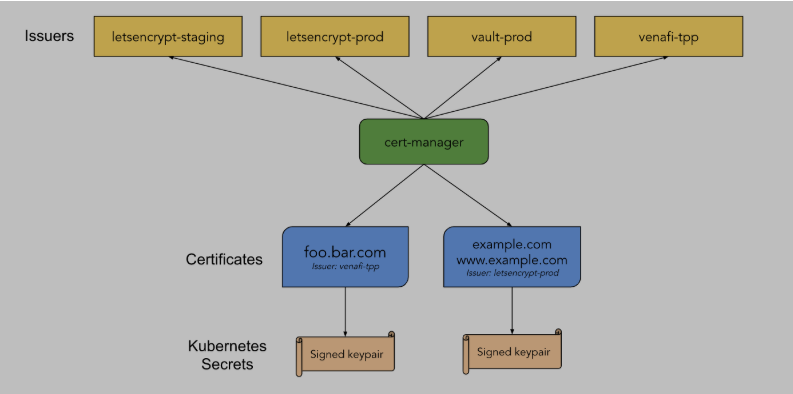
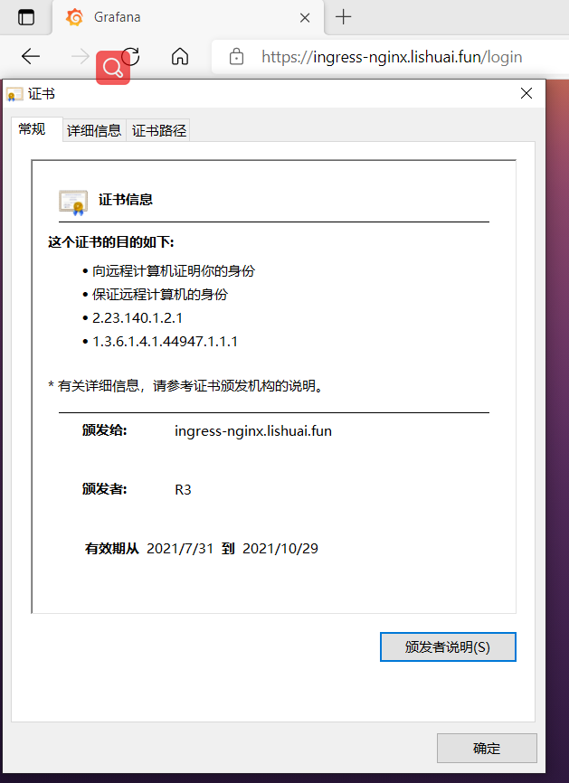
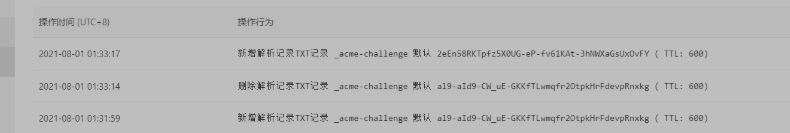
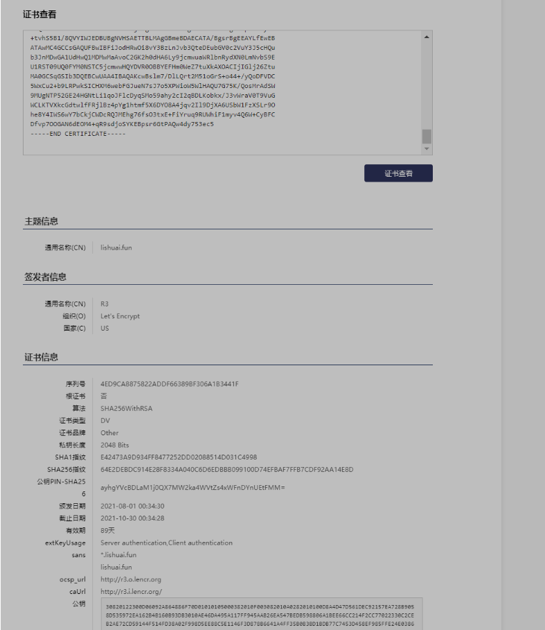
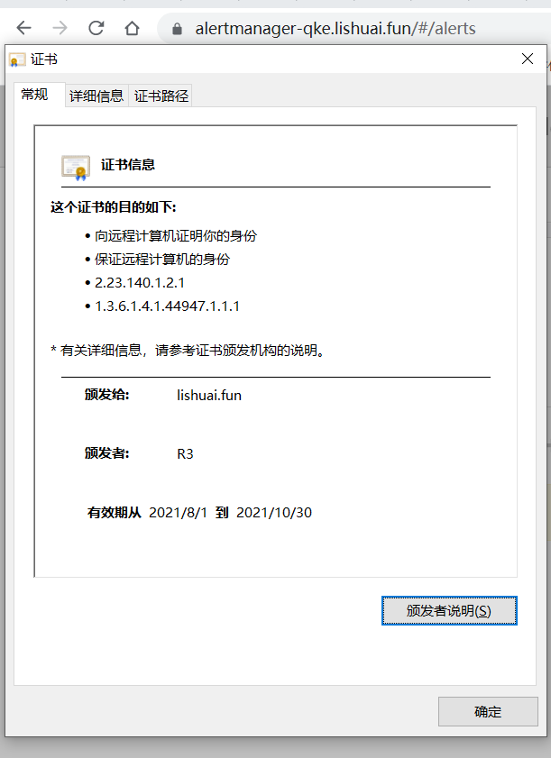

cert-manager 是一个云原生证书管理开源项目，用于在 Kubernetes 集群中自动管理和颁发来自各种颁发源的 TLS 证书，它可以从各种受支持的来源颁发证书，包括 [Let’s Encrypt](https://letsencrypt.org/)、[HashiCorp Vault](https://www.vaultproject.io/)和[Venafi](https://www.venafi.com/)以及私有 PKI，它将确保证书定期有效和更新，并在到期前的适当时间尝试更新证书。

<!--more-->

## 架构



Issuers/ClusterIssuers：定义使用 什么证书颁发机构 (CA) 来去颁发证书，Issuers和ClusterIssuers区别是issuers是一个名称空间级别的资源， 只能用来签发自己所在 namespace 下的证书，ClusterIssuer是个集群级别的资源 可以签发任意 namespace 下的证书

Certificate：定义所需的 X.509 证书，该证书将更新并保持最新。Certificate是一个命名空间资源，当Certificate被创建时，它会去创建相应的CertificateRequest资源来去申请证书。

## 安装

安装cert-manager相对比较简单，这里安装的cert-manager版本为v1.4，注意该版本要求kubectl版本>= v1.19.0-rc.1

所有资源（CustomResourceDefinitions和 cert-manager、cainjector 和 webhook 组件）都包含在一个 YAML 清单文件中：

```
wget https://github.com/jetstack/cert-manager/releases/download/v1.4.0/cert-manager.yaml
root@i-tsfhx8p6:~/qke-k8s/cert-manager# vi cert-manager.yaml
root@i-tsfhx8p6:~/qke-k8s/cert-manager# kubectl apply -f cert-manager.yaml 
customresourcedefinition.apiextensions.k8s.io/certificaterequests.cert-manager.io created
customresourcedefinition.apiextensions.k8s.io/certificates.cert-manager.io created
customresourcedefinition.apiextensions.k8s.io/challenges.acme.cert-manager.io created
customresourcedefinition.apiextensions.k8s.io/clusterissuers.cert-manager.io created
customresourcedefinition.apiextensions.k8s.io/issuers.cert-manager.io created
customresourcedefinition.apiextensions.k8s.io/orders.acme.cert-manager.io created
namespace/cert-manager unchanged
serviceaccount/cert-manager-cainjector created
serviceaccount/cert-manager created
serviceaccount/cert-manager-webhook created
clusterrole.rbac.authorization.k8s.io/cert-manager-cainjector created
clusterrole.rbac.authorization.k8s.io/cert-manager-controller-issuers created
clusterrole.rbac.authorization.k8s.io/cert-manager-controller-clusterissuers created
clusterrole.rbac.authorization.k8s.io/cert-manager-controller-certificates created
clusterrole.rbac.authorization.k8s.io/cert-manager-controller-orders created
clusterrole.rbac.authorization.k8s.io/cert-manager-controller-challenges created
clusterrole.rbac.authorization.k8s.io/cert-manager-controller-ingress-shim created
clusterrole.rbac.authorization.k8s.io/cert-manager-view created
clusterrole.rbac.authorization.k8s.io/cert-manager-edit created
clusterrole.rbac.authorization.k8s.io/cert-manager-controller-approve:cert-manager-io created
clusterrole.rbac.authorization.k8s.io/cert-manager-controller-certificatesigningrequests created
clusterrole.rbac.authorization.k8s.io/cert-manager-webhook:subjectaccessreviews created
clusterrolebinding.rbac.authorization.k8s.io/cert-manager-cainjector created
clusterrolebinding.rbac.authorization.k8s.io/cert-manager-controller-issuers created
clusterrolebinding.rbac.authorization.k8s.io/cert-manager-controller-clusterissuers created
clusterrolebinding.rbac.authorization.k8s.io/cert-manager-controller-certificates created
clusterrolebinding.rbac.authorization.k8s.io/cert-manager-controller-orders created
clusterrolebinding.rbac.authorization.k8s.io/cert-manager-controller-challenges created
clusterrolebinding.rbac.authorization.k8s.io/cert-manager-controller-ingress-shim created
clusterrolebinding.rbac.authorization.k8s.io/cert-manager-controller-approve:cert-manager-io created
clusterrolebinding.rbac.authorization.k8s.io/cert-manager-controller-certificatesigningrequests created
clusterrolebinding.rbac.authorization.k8s.io/cert-manager-webhook:subjectaccessreviews created
role.rbac.authorization.k8s.io/cert-manager-cainjector:leaderelection created
role.rbac.authorization.k8s.io/cert-manager:leaderelection created
role.rbac.authorization.k8s.io/cert-manager-webhook:dynamic-serving created
rolebinding.rbac.authorization.k8s.io/cert-manager-cainjector:leaderelection created
rolebinding.rbac.authorization.k8s.io/cert-manager:leaderelection created
rolebinding.rbac.authorization.k8s.io/cert-manager-webhook:dynamic-serving created
service/cert-manager created
service/cert-manager-webhook created
deployment.apps/cert-manager-cainjector created
deployment.apps/cert-manager created
deployment.apps/cert-manager-webhook created
mutatingwebhookconfiguration.admissionregistration.k8s.io/cert-manager-webhook created
validatingwebhookconfiguration.admissionregistration.k8s.io/cert-manager-webhook created
```

默认情况下，cert-manager 将安装到`cert-manager` 命名空间中，我们可以使用如下命令验证安装

```
root@i-tsfhx8p6:~/qke-k8s/cert-manager# kubectl get pod -n cert-manager 
NAME                                       READY   STATUS    RESTARTS   AGE
cert-manager-7456795566-9xcth              1/1     Running   0          47s
cert-manager-cainjector-75d558f967-5tjvc   1/1     Running   0          47s
cert-manager-webhook-7bb859bd44-7zsx5      1/1     Running   0          47s
```

## 配置Issuer/ClusterIssuer

cert-manager支持以下几种证书颁发者

- SelfSigned
- CA
- Vault
- Venafi
- External
- ACME

这里只介绍使用ACME作为证书颁发者的方式。

### HTTP-01 校验原理

HTTP-01 的校验原理是给你域名指向的 HTTP 服务增加一个临时 location ，Let’s Encrypt 会发送 http 请求到 http:///.well-known/acme-challenge/，YOUR_DOMAIN 就是被校验的域名，TOKEN 是 ACME 协议的客户端负责放置的文件，在这里 ACME 客户端就是 cert-manager，它通过修改或创建 Ingress 规则来增加这个临时校验路径并指向提供 TOKEN 的服务。Let’s Encrypt 会对比 TOKEN 是否符合预期，校验成功后就会颁发证书。此方法仅适用于给使用 Ingress 暴露流量的服务颁发证书，并且不支持泛域名证书。

### DNS-01 校验原理

DNS-01 的校验原理是利用 DNS 提供商的 API Key 拿到你的 DNS 控制权限， 在 Let’s Encrypt 为 ACME 客户端提供令牌后，ACME 客户端 (cert-manager) 将创建从该令牌和您的帐户密钥派生的 TXT 记录，并将该记录放在 _acme-challenge.。 然后 Let’s Encrypt 将向 DNS 系统查询该记录，如果找到匹配项，就可以颁发证书。此方法不需要你的服务使用 Ingress，并且支持泛域名证书。

### 校验方式对比

HTTP-01 的校验方式的优点是: 配置简单通用，不管使用哪个 DNS 提供商都可以使用相同的配置方法；缺点是：需要依赖 Ingress，如果你的服务不是用 Ingress 暴露流量的就不适用，而且不支持泛域名证书。

DNS-01 的校验方式的优点是没有 HTTP-01 校验方式缺点，不依赖 Ingress，也支持泛域名；缺点就是不同 DNS 提供商的配置方式不一样，而且 DNS 提供商有很多，cert-manager 的 Issuer 不可能每个都去支持，支持如下的dns提供商：

- Akamai

- AzureDNS

- CloudFlare

- Google

- Route53

- DigitalOcean

- RFC2136

  Cert-manager 还支持使用外部 webhook 的接入 DNS 提供商，支持如下webhook

- [`AliDNS-Webhook`](https://github.com/pragkent/alidns-webhook)

- [`cert-manager-webhook-civo`](https://github.com/okteto/cert-manager-webhook-civo)

- [`cert-manager-webhook-dnspod`](https://github.com/qqshfox/cert-manager-webhook-dnspod)

- [`cert-manager-webhook-dnsimple`](https://github.com/neoskop/cert-manager-webhook-dnsimple)

- [`cert-manager-webhook-gandi`](https://github.com/bwolf/cert-manager-webhook-gandi)

- [`cert-manager-webhook-infomaniak`](https://github.com/Infomaniak/cert-manager-webhook-infomaniak)

- [`cert-manager-webhook-inwx`](https://gitlab.com/smueller18/cert-manager-webhook-inwx)

- [`cert-manager-webhook-oci`](https://gitlab.com/dn13/cert-manager-webhook-oci) （Oracle 云基础设施）

- [`cert-manager-webhook-scaleway`](https://github.com/scaleway/cert-manager-webhook-scaleway)

- [`cert-manager-webhook-selectel`](https://github.com/selectel/cert-manager-webhook-selectel)

- [`cert-manager-webhook-softlayer`](https://github.com/cgroschupp/cert-manager-webhook-softlayer)

- [`cert-manager-webhook-ibmcis`](https://github.com/jb-dk/cert-manager-webhook-ibmcis)

- [`cert-manager-webhook-loopia`](https://github.com/Identitry/cert-manager-webhook-loopia)

- [`cert-manager-webhook-arvan`](https://github.com/kiandigital/cert-manager-webhook-arvan)

- [`bizflycloud-certmanager-dns-webhook`](https://github.com/bizflycloud/bizflycloud-certmanager-dns-webhook)

### HTTP01配置示例

```
apiVersion: cert-manager.io/v1
kind: ClusterIssuer
metadata:
  name: tls
spec:
  acme:
    # You must replace this email address with your own.
    # Let's Encrypt will use this to contact you about expiring
    # certificates, and issues related to your account.
    email: xxxxxxx@qq.com
    server: https://acme-v02.api.letsencrypt.org/directory
    privateKeySecretRef:
      # Secret resource that will be used to store the account's private key.
      name: issuer-account-key
    # Add a single challenge solver, HTTP01 using nginx
    solvers:
    - http01:
        ingress:
          class: nginx
```

说明：

- metadata.name: 是我们创建的签发机构的名称，后面我们创建证书的时候会引用它
- spec.acme.email: 是你自己的邮箱，证书快过期的时候会有邮件提醒，不过 cert-manager 会利用 acme 协议自动给我们重新颁发证书来续期
- spec.acme.server: 是 acme 协议的服务端，我们这里用 Let’s Encrypt，这个地址就写死成这样就行
- spec.acme.privateKeySecretRef: 指示此签发机构的私钥将要存储到哪个 Secret 对象中，名称不重要
- spec.acme.solvers: 这里指示签发机构校验方式，有http01和dns01两种，该字段下配置的class和name只能同时存在一个，class指定使用的ingress class 名称，name比较少用，通常用于云上自带的ingress

我们部署上述示例，并部署一个ingress 代理集群内的grafana服务验证签发证书

```
root@i-tsfhx8p6:~/qke-k8s/cert-manager# kubectl apply -f clusterissuer.yaml 
clusterissuer.cert-manager.io/tls created

root@i-tsfhx8p6:~/qke-k8s/cert-manager# cat ingress/ingree-nginx.yaml
apiVersion: networking.k8s.io/v1
kind: Ingress
metadata:
  annotations:
    cert-manager.io/cluster-issuer: tls
  name: test
  namespace: monitoring
spec:
  rules:
  - host: ingress-nginx.lishuai.fun
    http:
      paths:
      - backend:
          service:
            name: grafana
            port:
              number: 3000
        path: /
        pathType: Prefix
  tls: # < placing a host in the TLS config will indicate a certificate should be created
  - hosts:
    - ingress-nginx.lishuai.fun
    secretName: ingress-nginx--tls
    
root@i-tsfhx8p6:~/qke-k8s/cert-manager# kubectl apply -f ingress/ingree-nginx.yaml 
ingress.networking.k8s.io/test created
```

我们可以查看生成的certificate和签发的证书(安全原因删除了部分证书中的字符)

```
root@i-tsfhx8p6:~/qke-k8s/cert-manager# kubectl -n monitoring  get certificate
NAME                 READY   SECRET               AGE
ingress-nginx--tls   True    ingress-nginx--tls   2m26s

root@i-tsfhx8p6:~/qke-k8s/cert-manager# kubectl -n monitoring  get secret ingress-nginx--tls -o yaml
apiVersion: v1
data:
  tls.crt: LS0tLS1CRUdJT********kMrT0IrYTl2VXZhRUFkZ0QyWEpRdjBYY3dJaFJVR0FndwpsRmFPNDAwVEdUTy8zd3d2SUF2TVR2Rms0d0FBQVhyN3Fzcy9BQUFFQXdCSE1FVUNJQ2svS2VodE1YOUlLZEFyCjhZTVMyZU9ZR05mbXlBSnZQR0tYS3Bxc3NyNkJBaUVBZ1FZM1ZmWFUvZEd0TDQ3VytsOCt3WTRxd0VONkowN3MKUFVTNUhPZm1HNmN3RFFZSktvWklodmNOQVFFTEJRQURnZ0VCQUxqT1JBQUJPbVMzdUwrTktNWCtPTVBZWXltYwpjSnFkdDRhUFUxUUhvMk5mY2NnbG9PeVl0ci9MclQvSytQOGUxQkN1Q0Jqd2d2MVpBbzhUUWxiVU1POE9BbGhYClB6dWk4YnV3VnF2N0Jvb3BvRVUyNVZuU0FOb3B3ZVVWM1RrNW1DSEs5YW9ORVpBZUF4NEE4T3o0MWdNeVN0SnEKOFpqZnBxZCtJUmNUdzNGL0E4MVhRTmJzYnVTaG5DWUZMZkxQUkpMZDNGeGszOGRpSEsrZ0UxT0JZV1REZSsvdQpJWTFGT1R1TkhFSmoybzBJbEFZTE5ueTM4ZHcxQkEyQ3VDZVFHNE1TWHYxdnhFVFhwWjUrNzNBclFFUDlydXZpClNBSTh2VEtYM2gycGFDS0lhdEZIMEZDTE9uQUZDMU9ia0ZCanRLTUJTWDRMZE5UZDQ3S0pIcHg3bUJVPQotLS0tLUVORCBDRVJUSUZJQ0FURS0tLS0tCi0tLS0tQkVHSU4gQ0VSVElGSUNBVEUtLS0tLQpNSUlGRmpDQ0F2NmdBd0lCQWdJUkFKRXJDRXJQREJpblUvYldMaVduWDFvd0RRWUpLb1pJaHZjTkFRRUxCUUF3ClR6RUxNQWtHQTFVRUJoTUNWVk14S1RBbkJnTlZCQW9USUVsdWRHVnlibVYwSUZObFkzVnlhWFI1SUZKbGMyVmgKY21Ob0lFZHliM1Z3TVJVd0V3WURWUVFERXd4SlUxSkhJRkp2YjNRZ1dERXdIaGNOTWpBd09UQTBNREF3TURBdwpXaGNOTWpVd09URTFNVFl3TURBd1dqQXlNUXN3Q1FZRFZRUUdFd0pWVXpFV01CUUdBMVVFQ2hNTlRHVjBKM01nClJXNWpjbmx3ZERFTE1Ba0dBMVVFQXhNQ1VqTXdnZ0VpTUEwR0NTcUdTSWIzRFFFQkFRVUFBNElCRHdBd2dnRUsKQW9JQkFRQzdBaFVvelBhZ2xOTVBFdXlOVlpMRCtJTHhtYVo2UW9pblhTYXF0U3U1eFV5eHI0NXIrWFhJbzljUApSNVFVVlRWWGpKNm9vamtaOVlJOFFxbE9idlU3d3k3YmpjQ3dYUE5aT09mdHoybndXZ3NidnNDVUpDV0gramR4CnN4UG5IS3pobSsvYjVEdEZVa1dXcWNGVHpqVElVdTYxcnUyUDNtQnc0cVZVcTdadERwZWxRRFJySzlPOFp1dG0KTkh6NmE0dVBWeW1aK0RBWFhicHliL3VCeGEzU2hsZzlGOGZuQ2J2eEsvZUczTUhhY1YzVVJ1UE1yU1hCaUx4ZwpaM1Ztcy9FWTk2SmM1bFAvT29pMlI2WC9FeGpxbUFsM1A1MVQrYzhCNWZXbWNCY1VyMk9rLzVtems1M2NVNmNHCi9raUZIYUZwcmlWMXV4UE1VZ1AxN1ZHaGk5c1ZBZ01CQUFHamdnRUlNSUlCQkRBT0JnTlZIUThCQWY4RUJBTUMKQVlZd0hRWURWUjBsQkJZd0ZBWUlLd1lCQlFVSEF3SUdDQ3NHQVFVRkJ3TUJNQklHQTFVZEV3RUIvd1FJTUFZQgpBZjhDQVFBd0hRWURWUjBPQkJZRUZCUXVzeGUzV0ZiTHJsQUpRT1lmcjUyTEZNTEdNQjhHQTFVZEl3UVlNQmFBCkZIbTBXZVo3dHVYa0FYT0FDSWpJR2xqMjZadHVNRElHQ0NzR0FRVUZCd0VCQkNZd0pEQWlCZ2dyQmdFRkJRY3cKQW9ZV2FIUjBjRG92TDNneExta3ViR1Z1WTNJdWIzSm5MekFuQmdOVkhSOEVJREFlTUJ5Z0dxQVloaFpvZEhSdwpPaTh2ZURFdVl5NXNaVzVqY2k1dmNtY3ZNQ0lHQTFVZElBUWJNQmt3Q0FZR1o0RU1BUUlCTUEwR0N5c0dBUVFCCmd0OFRBUUVCTUEwR0NTcUdTSWIzRFFFQkN3VUFBNElDQVFDRnlrNUhQcVAzaFVTRnZOVm5lTEtZWTYxMVRSNlcKUFRObGNsUXRnYURxdyszNElMOWZ6TGR3QUxkdU8vWmVsTjdrSUorbTc0dXlBK2VpdFJZOGtjNjA3VGtDNTN3bAppa2ZtWlc0L1J2VFo4TTZVSys1VXpoSzhqQ2RMdU1HWUw2S3Z6WEdSU2dpM3lMZ2pld1F0Q1BrSVZ6NkQyUVF6CkNrY2hlQW1DSjhNcXlKdTV6bHp5Wk1qQXZubkFUNDV0UkF4ZWtyc3U5NHNRNGVnZFJDbmJXU0R0WTdraCtCSW0KbEpOWG9CMWxCTUVLSXE0UURVT1hvUmdmZnVEZ2hqZTFXckc5TUwrSGJpc3EveUZPR3dYRDlSaVg4RjZzdzZXNAphdkF1dkRzenVlNUwzc3o4NUsrRUM0WS93RlZETnZabzRUWVhhbzZaMGYrbFFLYzB0OERRWXprMU9YVnU4cnAyCnlKTUM2YWxMYkJmT0RBTFp2WUg3bjdkbzFBWmxzNEk5ZDFQNGpua0RyUW94QjNVcVE5aFZsM0xFS1E3M3hGMU8KeUs1R2hERFg4b1ZmR0tGNXUrZGVjSXNINFlhVHc3bVAzR0Z4SlNxdjMrMGxVRkpvaTVMYzVkYTE0OXA5MElkcwpoQ0V4cm9MMSs3bXJ5SWtYUGVGTTVUZ085cjBydlphQkZPdlYyejBncDM1WjArTDRXUGxidUVqTi9seFBGaW4rCkhsVWpyOGdSc0kzcWZKT1FGeS85cktJSlIwWS84T213dC84b1RXZ3kxbWRlSG1tams3ajFuWXN2QzlKU1E2WnYKTWxkbFRUS0IzemhUaFYxK1hXWXA2cmpkNUpXMXpiVldFa0xOeEU3R0pUaEVVRzNzemdCVkdQN3BTV1RVVHNxWApuTFJid0hPb3E3aEh3Zz09Ci0tLS0tRU5EIENFUlRJRklDQVRFLS0tLS0KLS0tLS1CRUdJTiBDRVJUSUZJQ0FURS0tLS0tCk1JSUZZRENDQkVpZ0F3SUJBZ0lRUUFGM0lUZlU2VUs0N25hcVBHUUt0ekFOQmdrcWhraUc5dzBCQVFzRkFEQS8KTVNRd0lnWURWUVFLRXh0RWFXZHBkR0ZzSUZOcFoyNWhkSFZ5WlNCVWNuVnpkQ0JEYnk0eEZ6QVZCZ05WQkFNVApEa1JUVkNCU2IyOTBJRU5CSUZnek1CNFhEVEl4TURFeU1ERTVNVFF3TTFvWERUSTBNRGt6TURFNE1UUXdNMW93ClR6RUxNQWtHQTFVRUJoTUNWVk14S1RBbkJnTlZCQW9USUVsdWRHVnlibVYwSUZObFkzVnlhWFI1SUZKbGMyVmgKY21Ob0lFZHliM1Z3TVJVd0V3WURWUVFERXd4SlUxSkhJRkp2YjNRZ1dERXdnZ0lpTUEwR0NTcUdTSWIzRFFFQgpBUVVBQTRJQ0R3QXdnZ0lLQW9JQ0FRQ3Q2Q1J6OUJRMzg1dWVLMWNvSEllKzNMZmZPSkNNYmp6bVY2QjQ5M1hDCm92NzFhbTcyQUU4bzI5NW9obXhFazdheFkvMFVFbXUvSDlMcU1ac2hmdEV6UExwSTlkMTUzN080L3hMeElacEwKd1lxR2NXbEtabVpzajM0OGNMK3RLU0lHOCtUQTVvQ3U0a3VQdDVsK2xBT2YwMGVYZkpsSUkxUG9PSzVQQ20rRApMdEZKVjR5QWRMYmFMOUE0alhzRGNDRWJkZkl3UFBxUHJ0M2FZNnZyRmsvQ2poRkxmczhMNlArMWR5NzBzbnRLCjRFd1NKUXh3alFNcG9PRlRKT3dUMmU0WnZ4Q3pTb3cvaWFOaFVkNnNod2VVOUdOeDdDN2liMXVZZ2VHSlhEUjUKYkhidk81QmllZWJicEpvdkpzWFFFT0VPM3RrUWpoYjd0L2VvOThmbEFnZVlqellJbGVmaU41WU5ObldlK3c1eQpzUjJidkFQNVNRWFlnZDBGdENyV1FlbXNBWGFWQ2cvWTM5VzlFaDgxTHlnWGJOS1l3YWdKWkhkdVJ6ZTZ6cXhaClhtaWRmM0xXaWNVR1FTaytXVDdkSnZVa3lSR25XcU5NUUI5R29abTFwenBSYm9ZN25uMXlweElGZUZudFBsRjQKRlFzRGo0M1FMd1d5UG50S0hFdHpCUkw4eHVyZ1VCTjhRNU4wczhwMDU0NGZBUWpRTU5SYmNUYTBCN3JCTURCYwpTTGVDTzVpbWZXQ0tvcU1wZ3N5NnZZTUVHNktEQTBHaDFnWHhHOEsyOEtoOGhqdEdxRWdxaU54Mm1uYS9IMnFsClBSbVA2emp6Wk43SUt3MEtLUC8zMitJVlF0UWkwQ2RkNFhuK0dPZHdpSzFPNXRtTE9zYmRKMUZ1Lzd4azlUTkQKVHdJREFRQUJvNElCUmpDQ0FVSXdEd1lEVlIwVEFRSC9CQVV3QXdFQi96QU9CZ05WSFE4QkFmOEVCQU1DQVFZdwpTd1lJS3dZQkJRVUhBUUVFUHpBOU1Ec0dDQ3NHQVFVRkJ6QUNoaTlvZEhSd09pOHZZWEJ3Y3k1cFpHVnVkSEoxCmMzUXVZMjl0TDNKdmIzUnpMMlJ6ZEhKdmIzUmpZWGd6TG5BM1l6QWZCZ05WSFNNRUdEQVdnQlRFcDdHa2V5eHgKK3R2aFM1QjEvOFFWWUlXSkVEQlVCZ05WSFNBRVRUQkxNQWdHQm1lQkRBRUNBVEEvQmdzckJnRUVBWUxmRXdFQgpBVEF3TUM0R0NDc0dBUVVGQndJQkZpSm9kSFJ3T2k4dlkzQnpMbkp2YjNRdGVERXViR1YwYzJWdVkzSjVjSFF1CmIzSm5NRHdHQTFVZEh3UTFNRE13TWFBdm9DMkdLMmgwZEhBNkx5OWpjbXd1YVdSbGJuUnlkWE4wTG1OdmJTOUUKVTFSU1QwOVVRMEZZTTBOU1RDNWpjbXd3SFFZRFZSME9CQllFRkhtMFdlWjd0dVhrQVhPQUNJaklHbGoyNlp0dQpNQTBHQ1NxR1NJYjNEUUVCQ3dVQUE0SUJBUUFLY3dCc2xtNy9EbExRcnQyTTUxb0dyUytvNDQrL3lRb0RGVkRDCjVXeEN1MitiOUxSUHdrU0lDSFhNNndlYkZHSnVlTjdzSjdvNVhQV2lvVzVXbEhBUVU3Rzc1Sy9Rb3NNckFkU1cKOU1VZ05UUDUyR0UyNEhHTnRMaTFxb0pGbGNEeXFTTW81OWFoeTJjSTJxQkRMS29ia3gvSjN2V3JhVjBUOVZ1RwpXQ0xLVFZYa2NHZHR3bGZGUmpsQno0cFlnMWh0bWY1WDZEWU84QTRqcXYySWw5RGpYQTZVU2JXMUZ6WFNMcjlPCmhlOFk0SVdTNndZN2JDa2pDV0RjUlFKTUVoZzc2ZnNPM3R4RStGaVlydXE5UlVXaGlGMW15djRRNlcrQ3lCRkMKRGZ2cDdPT0dBTjZkRU9NNCtxUjlzZGpvU1lLRUJwc3I2R3RQQVF3NGR5NzUzZWM1Ci0tLS0tRU5EIENFUlRJRklDQVRFLS0tLS0K
  tls.key: LS0tLS1CRUdJTiBSx********************************************VFY2J3SStsNGFCM2NWMjNDMlIyM0wvbFNNY3MzSUIKZHZLQVQ5RUNnWUVBeHVhNlNWV0pyamJ5bmZwRVRQajNWa3ZTRm5rM0lxS1BZS2hUSW9VaGNmOGVSUkkvZzhkWApsVzVJZTNHbjhWaWlTTzB3TFJuZ3lHUVFSZDFDVGk5NEZNMmNabHA5czl3RHhWZFhlRm5FbmhhQVh5ZEVhQThmCkVteG04ek9TNWV0cnBiY2hueEI3eCtOaWo3MktZcFo4cnhobG1XcFRaRVJETzRveExWLzZYa1VDZ1lFQTRWTnMKUlkzME5LWmk2S0IxYWI1RFFYSTJTekJSeVdjbmd6ZjZRT3JEaVpldWsraS9CMGUrM2ZUNkRoSGl3bVNBcWtVUAo3b1Z0L1JNbkNDR1kwb1B1d0NkaSt5b1A0ejNOVTJpNWJDRk45eU12WUNkVWxVRG9KRVQ3YUdBV3QybTJtZDRiClgzaXpId1JaZVkyNk1FRFdUdUltSVFBdlRVdkRRS0RxeTNlSzRBc0NnWUVBZzRzdW9yZDJrZ2gzRnJIZ29BTjgKR00rV1J4U3R1VE5IbmNaVkRSeDlEUmFMbjJTOUt0c1llcFJ3VFd2U2hWUjRKOER1UHJYQnF1WTZ1T25uSXl4VAp2M1pvUEcwV2UzQkQ4aXljaGRUZ3F5ajRoM1hCMFF4SElYa2Q4VFFuci9XdHdQQkh4Um95c3ZVWVJ6WTBvcFVpCkt1NzRxcWplTkE3TlpFQTEyK3VBK3YwQ2dZRUFrVzRobEtieGRrWHAwdEUxMXdFcE1ZV0F5M2l0WVB1R1FpZ1EKQ25RN3JvUEs5c1lpL1pUdCtSNFRncDlDcDByc3pIajB0bk5DTVRSNlhjSXBlNzRSaTg0Z0VaSHRYVExYWWoxVwphQmI2MWtiTVhoZ2tmSXkvQ0NISnptMHVYRVVMeVRYVW53TXRRUml5azBUSlpqbUMyTGtYK1BiQWtQZ1VWcE5GCjEvc1pGRThDZ1lCekhVZE9LWVBjMUtlKzlwcGVvVlR1UjZ4bTlrTGJ0WHpPcXpuRVhQZUNMVmQyOWFBaTRGYUsKMXVocXdwcFVpL2x6N2VIb2pySDFmSXNaMDliTTd0aVBDY0FJK2NRemlGVWJvc2ZCdmxVakFzRVRNREFYbU5GLwpQYUhHWVR3MHVkVVlWL3YzdysxcXNsZG03a1kyN000anI4RGFITENKdlZERlpYMzRCMW9mVVE9PQotLS0tLUVORCBSU0EgUFJJVkFURSBLRVktLS0tLQo=
kind: Secret
metadata:
  annotations:
    cert-manager.io/alt-names: ingress-nginx.lishuai.fun
    cert-manager.io/certificate-name: ingress-nginx--tls
    cert-manager.io/common-name: ingress-nginx.lishuai.fun
    cert-manager.io/ip-sans: ""
    cert-manager.io/issuer-group: cert-manager.io
    cert-manager.io/issuer-kind: ClusterIssuer
    cert-manager.io/issuer-name: tls
    cert-manager.io/uri-sans: ""
  creationTimestamp: "2021-07-31T08:25:14Z"
  managedFields:
  - apiVersion: v1
    fieldsType: FieldsV1
    fieldsV1:
      f:data:
        .: {}
        f:tls.crt: {}
        f:tls.key: {}
      f:metadata:
        f:annotations:
          .: {}
          f:cert-manager.io/alt-names: {}
          f:cert-manager.io/certificate-name: {}
          f:cert-manager.io/common-name: {}
          f:cert-manager.io/ip-sans: {}
          f:cert-manager.io/issuer-group: {}
          f:cert-manager.io/issuer-kind: {}
          f:cert-manager.io/issuer-name: {}
          f:cert-manager.io/uri-sans: {}
      f:type: {}
    manager: controller
    operation: Update
    time: "2021-07-31T08:25:14Z"
  name: ingress-nginx--tls
  namespace: monitoring
  resourceVersion: "274536"
  selfLink: /api/v1/namespaces/monitoring/secrets/ingress-nginx--tls
  uid: 929f9252-1905-4afc-b622-892151f1bbf3
type: kubernetes.io/tls
```

此时我们访问我们ingress文件里定义的域名可以看到此时证书已经签发



### DNS01配置示例

这里使用的dns服务商为阿里云，需要使用[`AliDNS-Webhook`](https://github.com/pragkent/alidns-webhook)

#### 安装alidns-webhook

```
wget https://raw.githubusercontent.com/pragkent/alidns-webhook/master/deploy/bundle.yaml
```

建议修改文件中的acme.yourcompany.com

```
sed -i s/'acme.yourcompany.com'/'acme.lishuai.fun'/g bundle.yaml
```

安装alidns-webhook

```
kubectl apply -f bundle.yaml
```

创建一个包含阿里dns凭据的secert

```
apiVersion : v1 
kind : Secret 
metadata :
  name : alidns-secret 
  namespace : cert-manager 
data :
  access-key : YOUR_ACCESS_KEY(base64) 
  secret-key : YOUR_SECRET_KEY(base64)
```

或者使用如下命令行方式创建

```
kubectl -n cert-manager create secret generic alidns-secret --from-literal=access-key='YOUR_ACCESS_KEY' --from-literal=secret-key='YOUR_SECRET_KEY'
```

编写ClusterIssuer yaml文件

```
apiVersion: cert-manager.io/v1
kind: ClusterIssuer
metadata:
  name: letsencrypt-staging
spec:
  acme:
    # Change to your letsencrypt email
    email: 912988434@qq.com
    server: https://acme-v02.api.letsencrypt.org/directory
    privateKeySecretRef:
      name: letsencrypt-staging-account-key
    solvers:
    - dns01:
        webhook:
          groupName: acme.lishuai.fun #须和bundle.yaml文件中定义的groupname 一致
          solverName: alidns
          config:
            region: ""
            accessKeySecretRef:
              name: alidns-secret
              key: access-key
            secretKeySecretRef:
              name: alidns-secret
              key: secret-key
```

创建ClusterIssuer

```
kubectl apply -f ClusterIssuer.yaml
```

我们创建一个 手动去申请证书

```
root@i-tsfhx8p6:~/qke-k8s/cert-manager/alidns-webhook# cat certificate.yaml 
apiVersion: cert-manager.io/v1
kind: Certificate
metadata:
  name: lishuai-fun-tls
spec:
  secretName: lishuai-fun-tls
  dnsNames:
  - lishuai.fun
  - "*.lishuai.fun"
  issuerRef:
    name: letsencrypt-staging
    kind: ClusterIssuer


root@i-tsfhx8p6:~/qke-k8s/cert-manager/alidns-webhook# kubectl apply -f  certificate.yaml 
certificate.cert-manager.io/lishuai-fun-tls created
root@i-tsfhx8p6:~/qke-k8s/cert-manager/alidns-webhook# kubectl get secrets 
NAME                    TYPE                                  DATA   AGE
default-token-v24ww     kubernetes.io/service-account-token   3      25h
lishuai-fun-tls-4wcmc   Opaque                                1      1s
qingcloud               kubernetes.io/dockerconfigjson        1      25h
root@i-tsfhx8p6:~/qke-k8s/cert-manager/alidns-webhook# kubectl get certificate
NAME              READY   SECRET            AGE
lishuai-fun-tls   False   lishuai-fun-tls   10s
```

刚创建后我们查看certificate会发现ready状态为false,此时稍等会自动在我们的dns解析里创建txt 记录，然后去签发证书，该字段就会变为true



此时查看发现secert和certificate都发生变化

```
root@i-tsfhx8p6:~/qke-k8s/cert-manager/alidns-webhook# kubectl get certificate
NAME              READY   SECRET            AGE
lishuai-fun-tls   True    lishuai-fun-tls   5m27s
root@i-tsfhx8p6:~/qke-k8s/cert-manager/alidns-webhook# kubectl get secrets 
NAME                  TYPE                                  DATA   AGE
default-token-v24ww   kubernetes.io/service-account-token   3      25h
lishuai-fun-tls       kubernetes.io/tls                     2      2m14s  #此时DATA 变为2，说明里面存着真正的证书文件
qingcloud             kubernetes.io/dockerconfigjson        1      25h
```

查看证书详情

```
root@i-tsfhx8p6:~/qke-k8s/cert-manager/ingress# kubectl get secrets lishuai-fun-tls -o json |jq --raw-output '.data["tls.crt"]'|base64 -d  #从secert中解析证书
-----BEGIN CERTIFICATE-----
MIIFKzCCBBOgAwIBAgISBO2cqIdYIq3fZjib8wahs0QfMA0GCSqGSIb3DQEBCwUA
MDIxCzAJBgNVBAYTAlVTMRYwFAYDVQQKEw1MZXQncyBFbmNyeXB0MQswCQYDVQQD
EwJSMzAeFw0yMTA3MzExNjM0MzBaFw0yMTEwMjkxNjM0MjhaMBYxFDASBgNVBAMT
C2xpc2h1YWkuZnVuMIIBIjANBgkqhkiG9w0BAQEFAAOCAQ8AMIIBCgKCAQEA2KTU
fVYd7JIVfqcouQWNU1ly6hYrSxYLk9swEK5G2klaEX/5RaqybqVHvttZiAahvuZs
whTyzHcCIzDCzrKucs1ZFE9RT9OKAvmY1e6IxeEUbz2Hi2ZBpP81sLO9G9t3x0U9
RY75hf/iTgOGI2ZCm9quxROApMpiWNHHNO6GHk7sDZSKGjbgRttnbowh6HhQ2l22
q3W0L71cAxMEYM/WkKVSUhKKuMewChylieHckCouIpALF5R162x+0fYYFo22e2Ou
lmpfRfgGTRsmAZfSKMgj93H4yZfUwfT+tAM5Tvk4emk2NWVwmlGfzcfa+20nmhcs
wUtChOBG1jGFtw8QeQIDAQABo4ICVTCCAlEwDgYDVR0PAQH/BAQDAgWgMB0GA1Ud
JQQWMBQGCCsGAQUFBwMBBggrBgEFBQcDAjAMBgNVHRMBAf8EAjAAMB0GA1UdDgQW
BBRJ7mAMSacV9+dtpnyLJowYhXAlWDAfBgNVHSMEGDAWgBQULrMXt1hWy65QCUDm
.....

root@i-tsfhx8p6:~/qke-k8s/cert-manager/alidns-webhook# kubectl get secrets lishuai-fun-tls -o json |jq --raw-output '.data["tls.crt"]'|base64 -d >tls.crt 

root@i-tsfhx8p6:~/qke-k8s/cert-manager/alidns-webhook# openssl x509 -in tls.crt -noout -text
Certificate:
    Data:
        Version: 3 (0x2)
        Serial Number:
            04:ed:9c:a8:87:58:22:ad:df:66:38:9b:f3:06:a1:b3:44:1f
        Signature Algorithm: sha256WithRSAEncryption
        Issuer: C = US, O = Let's Encrypt, CN = R3
        Validity
            Not Before: Jul 31 16:34:30 2021 GMT
            Not After : Oct 29 16:34:28 2021 GMT
        Subject: CN = lishuai.fun
        Subject Public Key Info:
            Public Key Algorithm: rsaEncryption
                RSA Public-Key: (2048 bit)
                Modulus:
                    00:d8:a4:d4:7d:56:1d:ec:92:15:7e:a7:28:b9:05:
                    8d:53:59:72:ea:16:2b:4b:16:0b:93:db:30:10:ae:
                    46:da:49:5a:11:7f:f9:45:aa:b2:6e:a5:47:be:db:
                    59:88:06:a1:be:e6:6c:c2:14:f2:cc:77:02:23:30:
                    c2:ce:b2:ae:72:cd:59:14:4f:51:4f:d3:8a:02:f9:
                    98:d5:ee:88:c5:e1:14:6f:3d:87:8b:66:41:a4:ff:
                    35:b0:b3:bd:1b:db:77:c7:45:3d:45:8e:f9:85:ff:
                    e2:4e:03:86:23:66:42:9b:da:ae:c5:13:80:a4:ca:
                    62:58:d1:c7:34:ee:86:1e:4e:ec:0d:94:8a:1a:36:
                    e0:46:db:67:6e:8c:21:e8:78:50:da:5d:b6:ab:75:
                    b4:2f:bd:5c:03:13:04:60:cf:d6:90:a5:52:52:12:
                    8a:b8:c7:b0:0a:1c:a5:89:e1:dc:90:2a:2e:22:90:
                    0b:17:94:75:eb:6c:7e:d1:f6:18:16:8d:b6:7b:63:
                    ae:96:6a:5f:45:f8:06:4d:1b:26:01:97:d2:28:c8:
                    23:f7:71:f8:c9:97:d4:c1:f4:fe:b4:03:39:4e:f9:
                    38:7a:69:36:35:65:70:9a:51:9f:cd:c7:da:fb:6d:
                    27:9a:17:2c:c1:4b:42:84:e0:46:d6:31:85:b7:0f:
                    10:79
                Exponent: 65537 (0x10001)
        X509v3 extensions:
            X509v3 Key Usage: critical
                Digital Signature, Key Encipherment
            X509v3 Extended Key Usage: 
                TLS Web Server Authentication, TLS Web Client Authentication
            X509v3 Basic Constraints: critical
                CA:FALSE
            X509v3 Subject Key Identifier: 
                49:EE:60:0C:49:A7:15:F7:E7:6D:A6:7C:8B:26:8C:18:85:70:25:58
            X509v3 Authority Key Identifier: 
                keyid:14:2E:B3:17:B7:58:56:CB:AE:50:09:40:E6:1F:AF:9D:8B:14:C2:C6

            Authority Information Access: 
                OCSP - URI:http://r3.o.lencr.org
                CA Issuers - URI:http://r3.i.lencr.org/

            X509v3 Subject Alternative Name: 
                DNS:*.lishuai.fun, DNS:lishuai.fun
            X509v3 Certificate Policies: 
                Policy: 2.23.140.1.2.1
                Policy: 1.3.6.1.4.1.44947.1.1.1
                  CPS: http://cps.letsencrypt.org

            CT Precertificate SCTs: 
                Signed Certificate Timestamp:
                    Version   : v1 (0x0)
                    Log ID    : F6:5C:94:2F:D1:77:30:22:14:54:18:08:30:94:56:8E:
                                E3:4D:13:19:33:BF:DF:0C:2F:20:0B:CC:4E:F1:64:E3
                    Timestamp : Jul 31 17:34:30.686 2021 GMT
                    Extensions: none
                    Signature : ecdsa-with-SHA256
                                30:45:02:21:00:B3:44:02:18:42:96:53:DA:94:34:99:
                                1B:DE:3A:37:85:72:E4:2B:43:D6:66:99:D9:4D:DF:02:
                                A7:5A:A4:54:80:02:20:34:C4:45:7D:B4:F8:19:8D:A4:
                                09:41:3A:7E:23:B3:4D:4B:04:76:9E:E1:F2:94:EC:50:
                                2C:BF:A7:3B:71:75:E4
                Signed Certificate Timestamp:
                    Version   : v1 (0x0)
                    Log ID    : 6F:53:76:AC:31:F0:31:19:D8:99:00:A4:51:15:FF:77:
                                15:1C:11:D9:02:C1:00:29:06:8D:B2:08:9A:37:D9:13
                    Timestamp : Jul 31 17:34:30.744 2021 GMT
                    Extensions: none
                    Signature : ecdsa-with-SHA256
                                30:45:02:20:26:99:A1:07:A5:B1:48:10:B4:8D:30:20:
                                E4:AC:A2:44:1A:8B:FD:17:52:FF:CC:9E:FC:A2:02:66:
                                C2:B7:A9:9C:02:21:00:BB:F2:DD:2E:1A:1C:20:56:BE:
                                96:7C:94:56:EC:40:9F:9C:0F:70:F2:DC:CF:65:DC:7B:
                                37:26:1E:02:5E:E9:9E
    Signature Algorithm: sha256WithRSAEncryption
         23:b9:f4:b1:c7:95:3e:ef:5d:41:42:1d:17:a9:1b:d2:f1:b6:
         42:61:ca:d4:63:9e:c4:f1:11:0d:8a:03:29:66:9b:98:58:98:
         42:2d:eb:ee:d8:16:f5:7e:4f:e6:28:c1:82:bd:5e:b0:28:82:
         56:a0:0a:34:13:d6:15:98:8c:97:c6:c2:7f:64:50:d7:19:4c:
         25:45:4e:c0:ff:ee:90:63:29:bb:ba:01:1f:62:b5:d4:5d:50:
         49:0d:af:a0:f6:94:af:68:29:1a:46:34:13:c0:e4:26:68:22:
         ba:fe:58:c7:6e:79:a4:3b:9f:80:dc:cd:ef:44:21:57:e1:36:
         2e:36:b2:98:a4:ea:38:f9:ed:f9:3e:31:df:47:03:32:63:8f:
         8a:9a:a2:2a:7d:4a:2b:23:c0:e6:9f:35:b4:b6:3a:ac:c1:e6:
         40:91:5c:f0:5c:17:48:9b:ac:49:5f:f6:91:e8:03:0a:9c:37:
         48:46:40:29:b1:85:72:40:3c:05:a8:3d:13:67:20:4a:36:6f:
         4c:c0:a9:b8:40:dc:96:3b:99:da:82:3a:71:6f:41:93:aa:e2:
         22:c4:19:14:7b:8c:64:0b:b5:9b:b1:d0:56:b1:17:93:72:d7:
         94:7e:a9:08:f6:f4:0c:1d:4e:36:be:1d:14:ff:a2:9a:02:af:
         82:9d:bb:8f
```

我们也可以使用一些网站提供的在线证书查看



我们可以看到这个证书是个泛域名证书，此时我们ingress 可以直接使用该secert，不需要再去添加注解执行使用的issuer/cluseteissuer了，例如

```
root@i-tsfhx8p6:~/qke-k8s/cert-manager/ingress# cat alertmanager-ingress.yaml 
apiVersion: networking.k8s.io/v1
kind: Ingress
metadata:
  name: alertmanager
  namespace: monitoring
spec:
  rules:
  - host: alertmanager-qke.lishuai.fun
    http:
      paths:
      - backend:
          service:
            name: alertmanager-main
            port:
              number: 9093
        path: /
        pathType: Prefix
  tls: # < placing a host in the TLS config will indicate a certificate should be created
  - hosts:
    - alertmanager-qke.lishuai.fun
    secretName: lishuai-fun-tls
```



## 创建Certificate

这里拿我们上面创建的那个Certificate来讲解

```
apiVersion: cert-manager.io/v1
kind: Certificate
metadata:
  name: lishuai-fun-tls
spec:
  secretName: lishuai-fun-tls
  dnsNames:
  - lishuai.fun
  - "*.lishuai.fun"
  issuerRef:
    name: letsencrypt-staging
    kind: ClusterIssuer
```

- spec.secretName 指示证书最终存到哪个 Secret 中
- spec.issuerRef.kind 值为 ClusterIssuer 说明签发机构不在本 namespace 下，而是在全局
- spec.issuerRef.name 我们创建的签发机构的名称 (ClusterIssuer.metadata.name)
- spec.dnsNames 指示该证书的可以用于哪些域名

下面是一个官方的包含完整字段的Certificate

```
apiVersion: cert-manager.io/v1
kind: Certificate
metadata:
  name: example-com
  namespace: sandbox
spec:
  # Secret names are always required.
  secretName: example-com-tls
  duration: 2160h # 90d
  renewBefore: 360h # 15d
  subject:
    organizations:
      - jetstack
  # The use of the common name field has been deprecated since 2000 and is
  # discouraged from being used.
  commonName: example.com
  isCA: false
  privateKey:
    algorithm: RSA
    encoding: PKCS1
    size: 2048
  usages:
    - server auth
    - client auth
  # At least one of a DNS Name, URI, or IP address is required.
  dnsNames:
    - example.com
    - www.example.com
  uris:
    - spiffe://cluster.local/ns/sandbox/sa/example
  ipAddresses:
    - 192.168.0.5
  # Issuer references are always required.
  issuerRef:
    name: ca-issuer
    # We can reference ClusterIssuers by changing the kind here.
    # The default value is Issuer (i.e. a locally namespaced Issuer)
    kind: Issuer
    # This is optional since cert-manager will default to this value however
    # if you are using an external issuer, change this to that issuer group.
    group: cert-manager.io
```

转载自：[k8s安装cert-manager及签发泛域名证书 · kubernetes](https://www.lishuai.fun/2021/08/01/k8s-create-cert-manager/#/简介)