Elasticsearch和Kibana是一对强大的开源工具，通常一起使用以构建实时数据分析和可视化解决方案。

<!--more-->

### 介绍

Elasticsearch: Elasticsearch是一个分布式、高性能的实时搜索和分析引擎。它构建在开源搜索引擎库Lucene之上，并提供了一个分布式、可扩展的架构，用于存储、检索和分析大规模的数据。Elasticsearch支持全文搜索、结构化搜索、地理空间搜索等多种查询方式，并提供了强大的聚合和分析功能。它还支持实时数据的索引和搜索，使得您可以快速地在大数据集中进行复杂的搜索和分析操作。

Kibana: Kibana是一个开源的数据可视化工具，专门用于分析和展示Elasticsearch中的数据。它提供了直观的图表、图形和仪表盘，可用于实时监控和可视化大规模数据集。Kibana允许用户通过仪表盘配置和自定义可视化组件，然后通过交互式的界面进行数据的探索和导航。它还支持复杂的数据过滤、查询和聚合操作，使用户能够深入了解数据并发现隐藏的模式和见解。

通过将Elasticsearch和Kibana结合在一起，可以构建强大的实时数据分析和可视化解决方案。Elasticsearch负责高性能的数据存储、检索和分析，而Kibana则提供了直观易用的界面和工具，使您能够将数据转化为有意义的见解和洞察。无论是监控日志数据、分析业务指标，还是构建实时仪表盘和报告，Elasticsearch和Kibana的组合可以帮助您实现强大的数据分析和可视化需求。

版本:

es 7.17.6 

kibana 7.17.6 

k8s:1.19.16

### 部署es

#### 创建es namespace

```
apiVersion: v1
kind: Namespace
metadata:
   name: elk
   labels:
     name: elk
```

#### 创建es StorageClass和pvc

```
apiVersion: storage.k8s.io/v1
kind: StorageClass
metadata:
  name: es-storageclass
provisioner: nfs-storage-01
allowVolumeExpansion: true
reclaimPolicy: Retain
apiVersion: v1
kind: PersistentVolumeClaim
metadata:
  name: es-storageclass
  namespace: elk
  annotations:
    volume.beta.kubernetes.io/storage-class: "es-storageclass"
spec:
  resources:
    requests:
      storage: 200Gi
  volumeMode: Filesystem
  accessModes:
    - ReadWriteOnce
```

#### 通过sts的方式来部署es集群

```
apiVersion: apps/v1
kind: StatefulSet
metadata:
  name: es-cluster
  namespace: elk
spec:
  # 必须设置
  serviceName: es-cluster-svc
  replicas: 3
  selector:
    # 设置标签
    matchLabels:
      app: es-cluster
  template:
    metadata:
      labels:
        app: es-cluster
    spec:
      # 初始化容器
      initContainers:
        - name: increase-vm-max-map
          image: busybox
          command: ["sysctl", "-w", "vm.max_map_count=262144"]
          securityContext:
            privileged: true
        - name: increase-fd-ulimit
          image: busybox
          command: ["sh", "-c", "ulimit -n 65536"]
          securityContext:
            privileged: true
        - name: increase-es-cluster
          image: busybox
          command: ["/bin/sh", "-c", "mkdir -p /data/esbak","chown -R elasticsearch.elasticsearch /data/esbak" ,"chmod -R 777 /data/esbak"]
          securityContext:
            privileged: true
      containers:
        - name: es-container
          image: elasticsearch:7.17.6
          ports:
            # 容器内端口
            - name: rest
              containerPort: 9200
              protocol: TCP
          # 设置挂载目录
          volumeMounts:
            - name: es-data
              mountPath: /usr/share/elasticsearch/data
            - name: es-plugins
              mountPath: /usr/share/elasticsearch/plugins
              #快照持久化路径
            - name: snapshot-volume
              mountPath: /data/esbak      
          # 设置环境变量
          env:
            # 自定义集群名
            - name: cluster.name
              value: k8s-es
            # 定义节点名，使用metadata.name名称
            - name: node.name
              valueFrom:
                fieldRef:
                  fieldPath: metadata.name
            # 初始化集群时，ES从中选出master节点
            - name: cluster.initial_master_nodes
              # 对应metadata.name名称加编号，编号从0开始
              value: "es-cluster-0,es-cluster-1,es-cluster-2"
            - name: discovery.zen.minimum_master_nodes
              value: "2"
              #es快照备份路径
            - name: path.repo
              value: /data/esbak
            # 发现节点的地址，discovery.seed_hosts的值应包括所有master候选节点
            # 如果discovery.seed_hosts的值是一个域名，且该域名解析到多个IP地址，那么es将处理其所有解析的IP地址。
            - name: discovery.seed_hosts
              value: "es-cluster-0.es-cluster-svc,es-cluster-1.es-cluster-svc,es-cluster-2.es-cluster-svc"
            # 配置内存
            - name: ES_JAVA_OPTS
              value: "-Xms8192m -Xmx8192m"
            - name: network.host
              value: "0.0.0.0"
              #允许来自任意源的跨域请求
            - name: "http.cors.allow-origin"
              value: "*"
              #启用跨域资源共享
            - name: "http.cors.enabled"
              value: "true"
              #索引分片数量
            - name: "number_of_shards"
              value: "5"
              #分片的副本数量
            - name: "number_of_replicas"
              value: "2"
 
  volumeClaimTemplates:
    - metadata:
        # 对应容器中volumeMounts.name
        name: es-data
        labels:
          app: es-volume
      spec:
        accessModes: [ "ReadWriteOnce" ]
        storageClassName: es-storageclass
        resources:
          requests:
            storage: 50Gi
    - metadata:
        name: es-plugins
      spec:
        accessModes: [ "ReadWriteOnce" ]
        storageClassName: es-storageclass
        resources:
          requests:
            storage: 2Gi
    - metadata:
        name: es-plugins
      spec:
        accessModes: [ "ReadWriteOnce" ]
        storageClassName: es-storageclass
        resources:
          requests:
            storage: 2Gi
    - metadata:
        name: snapshot-volume
      spec:
        accessModes: [ "ReadWriteOnce" ]
        storageClassName: es-storageclass
        # 申请资源的大小
        resources:
          requests:
            storage: 100Gi
```

#### 部署es svc

```
apiVersion: v1
kind: Service
metadata:
  name: es-svc
  namespace: elk
spec:
  selector:
    app: es-cluster
  type: NodePort
  ports:
  - name: cluster
    port: 9200
    targetPort: 9200
    nodePort: 19200
  - name: transport
    port: 9300

```

#### 发布es

```
kubectl applf -f ./
```

#### 验证

ip+端口验证一下，浏览器访问、curl命令都可以

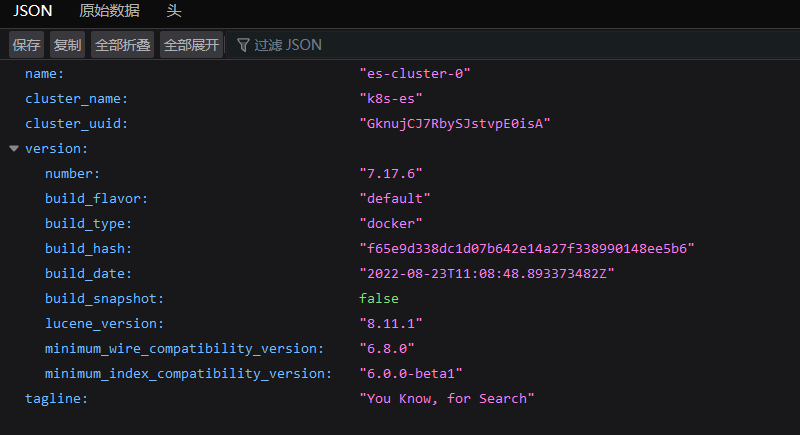

### 部署es-head插件

这个插件方便我们查询es集群状态

####  编写yaml文件

```
apiVersion: apps/v1
kind: Deployment
metadata:
  labels:
    app: elasticsearch-head
  name: elasticsearch-head
  namespace: elk
spec:
  replicas: 1
  selector:
    matchLabels:
      app: elasticsearch-head
  template:
    metadata:
      labels:
        app: elasticsearch-head
    spec:
      containers:
      - image: springgos/es-head:latest
        imagePullPolicy: Always
        name: elasticsearch-head
        ports:
        - containerPort: 9100
          name: 9100tcp191001
          protocol: TCP
        resources: {}
 
---
apiVersion: v1
kind: Service
metadata:
  labels:
    app: elasticsearch-head
  name: elasticsearch-head
  namespace: elk
spec:
  ports:
  - name: 9100tcp191001
    nodePort: 19100
    port: 9100
    protocol: TCP
    targetPort: 9100
  selector:
    app: elasticsearch-head
  type: NodePort

```

#### 访问验证

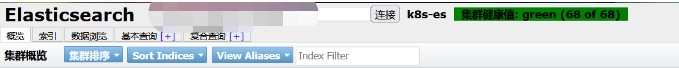


###  部署kibana

#### 编写kibana-deploy.yaml和svc

注意：kibana必须跟es保持同一个版本

```
apiVersion: apps/v1
kind: Deployment
metadata:
  name: kibana
  namespace: elk
spec:
  selector:
    matchLabels:
      app: kibana
  replicas: 1
  template:
    metadata:
      labels:
        app: kibana
    spec:
      restartPolicy: Always
      containers:
        - name: kibana
          image: kibana:7.17.6
          imagePullPolicy: Always
          ports:
            - containerPort: 5601
          env:
            - name: ELASTICSEARCH_HOSTS
              value: http://es-cluster-svc:9200
---
apiVersion: v1
kind: Service
metadata:
  name: kibana
  namespace: elk
spec:
  type: NodePort
  ports:
    - name: kibana
      port: 5601
      targetPort: 5601
      nodePort: 25601
  selector:
    app: kibana
```


然后发布应用 

```
kubectl applf -f ./
```

#### 浏览器验证

如果es集群没有启动正常这里面是会报错的

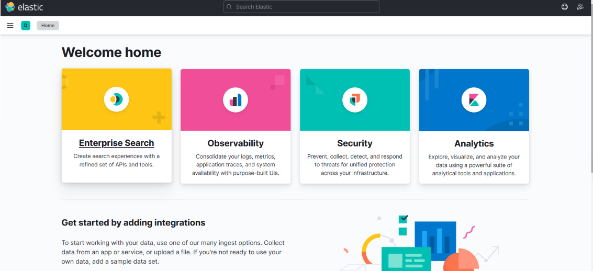

###  通过kibana来创建es快照

#### 什么是es快照

在Elasticsearch中，快照备份是一种将索引和集群的状态数据保存到可恢复的快照中的机制。通过创建快照，你可以在需要时恢复数据，或在不同的集群之间迁移数据。

存储库（Repository）：存储库是用来保存快照数据的位置，可以是本地文件系统、远程文件系统或云存储服务。你需要在Elasticsearch中配置一个存储库，指定存储快照的位置。
快照（Snapshot）：快照是在存储库中保存的索引和集群状态的副本。它包含了所有或指定的索引的数据、设置和元数据信息。
过程（Process）：创建快照的过程涉及协调节点（coordinating node）与数据节点（data node）之间的协作。协调节点负责指导数据节点将数据写入存储库，并协调快照的创建过程

#### 创建es快照

##### 点击Stack Management

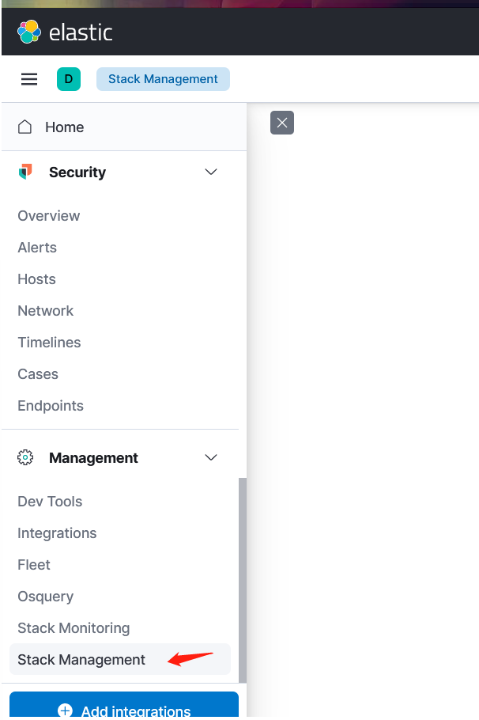

#####  创建快照库

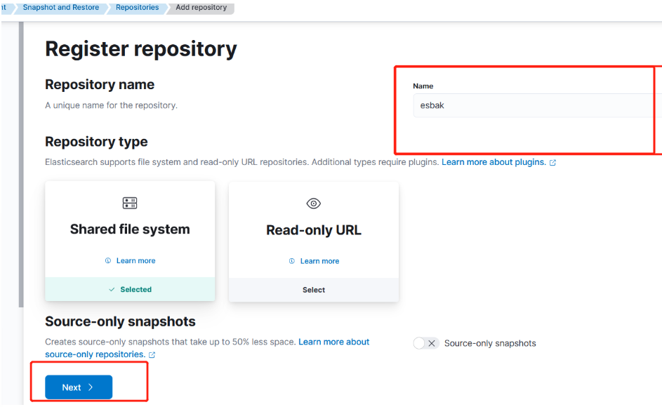


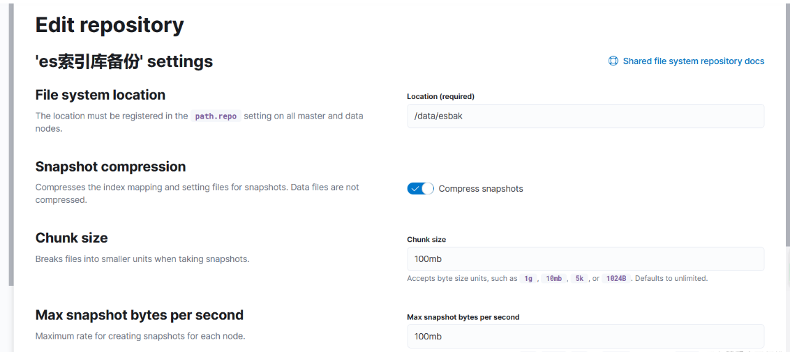


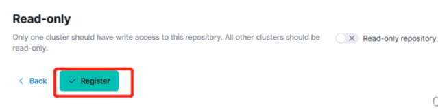

##### 参数解释

**File system location**

这个是定义快照仓库路径，我这边直接在es容器里面创建了所以我直接写的/data/esbak，填写的目录一定要存在哟，要不保存会报错提示没有这个目录。

**Snapshot compression**

参数用于压缩快照的索引映射和设置文件，而数据文件本身不会被压缩。减少快照对磁盘空间占用。

**Chunk size**

“分块大小”是用于在快照过程中将大文件分成较小单元的概念。当创建快照时，通常会将数据分割成更小、可管理的块，以便进行高效的存储和备份。

**Max snapshot bytes per second**

“Max snapshot bytes per second”是每个节点创建快照的最大速率。

在数据存储系统中，当创建快照时，系统会复制数据并保存为快照。但是，为了避免对系统的过度负载，可以设置每个节点可以每秒复制的最大字节数。

**Max restore bytes per second**

Max restore bytes per second” 是每个节点进行快照还原的最大速率。

在数据存储系统中，当需要从快照还原数据时，系统会将快照中的数据复制回原始存储位置或目标位置。为了避免对系统造成过载，可以设置每个节点每秒复制的最大字节数。

通过设置 “Max restore bytes per second”，可以限制每个节点进行快照还原的速率。这有助于平衡系统资源的使用，确保还原操作不会过多地消耗节点的处理能力或网络带宽。

**Read-only**

表示只有一个集群可以对该存储库进行写入操作，而其他所有集群只能进行读取操作。

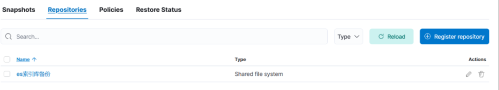


####  创建定时备份

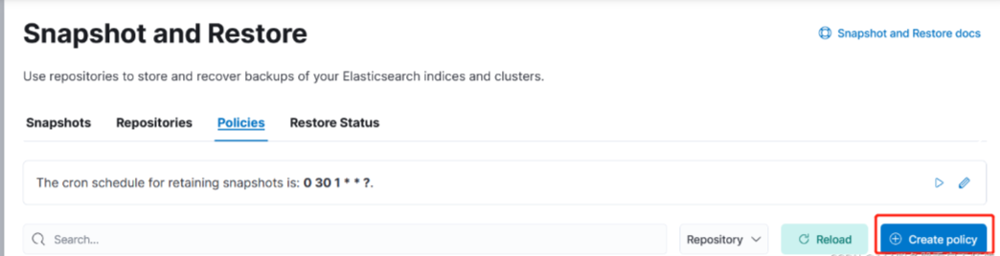


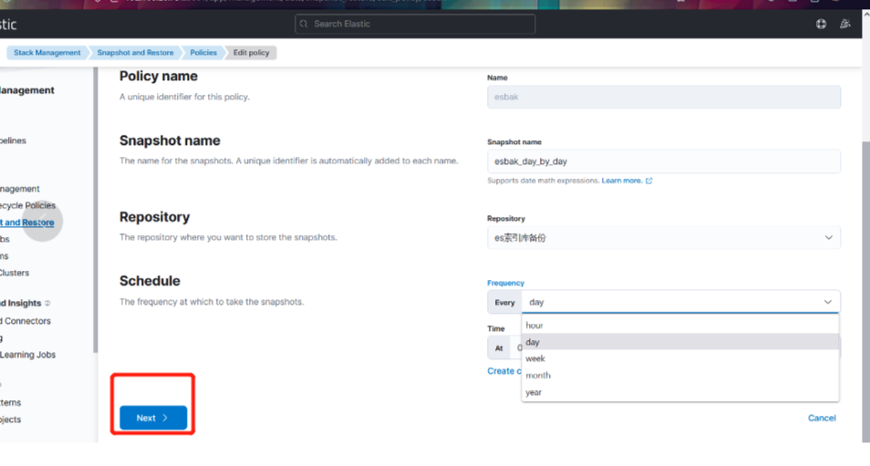

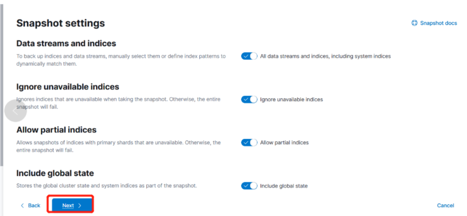


##### 参数解释

**Data streams and indices**

要备份索引和数据流，可以手动选择它们或定义索引模式以动态匹配它们

**Ignore unavailable indices**

在进行快照时忽略不可用的索引。否则，整个快照将会失败。

在进行数据快照时，如果其中一个索引不可用（比如索引已被删除或处于不可访问状态），默认情况下整个快照操作都将失败。为了避免这种情况，可以选择忽略不可用的索引。

通过设置 “忽略不可用的索引”，即使某些索引在快照时不可用，快照操作也会继续进行，并且其他可用的索引将会被备份。这样可以确保整个快照操作的成功。

**Allow partial indices**

允许备份部分索引，即允许备份包含不可用主分片的索引。否则，整个快照将会失败。

在进行数据快照时，如果某个索引的主分片不可用（比如主分片丢失或不可访问），默认情况下整个快照操作都将失败。为了避免这种情况，可以选择允许备份部分索引。

通过设置 “允许部分索引”，即使某个索引的主分片不可用，快照操作仍将继续进行，并且其他可用的分片将被备份。这样可以确保整个快照操作的成功。

**Include global state**

是指在进行数据快照时，将全局集群状态和系统索引作为快照的一部分进行存储。

全局集群状态包含了有关整个Elasticsearch集群的配置和元数据信息，例如索引模板、映射和设置等。系统索引包含了与Elasticsearch集群运行和管理相关的索引，例如集群状态索引（cluster state）、索引模板索引、别名索引等。

通过包含全局状态，可以完整地备份整个集群配置和元数据，以便在需要时进行还原或迁移。

在进行快照时忽略不可用的索引。否则，整个快照将会失败。

在进行数据快照时，如果其中一个索引不可用（比如索引已被删除或处于不可访问状态），默认情况下整个快照操作都将失败。为了避免这种情况，可以选择忽略不可用的索引。

通过设置 “忽略不可用的索引”，即使某些索引在快照时不可用，快照操作也会继续进行，并且其他可用的索引将会被备份。这样可以确保整个快照操作的成功。

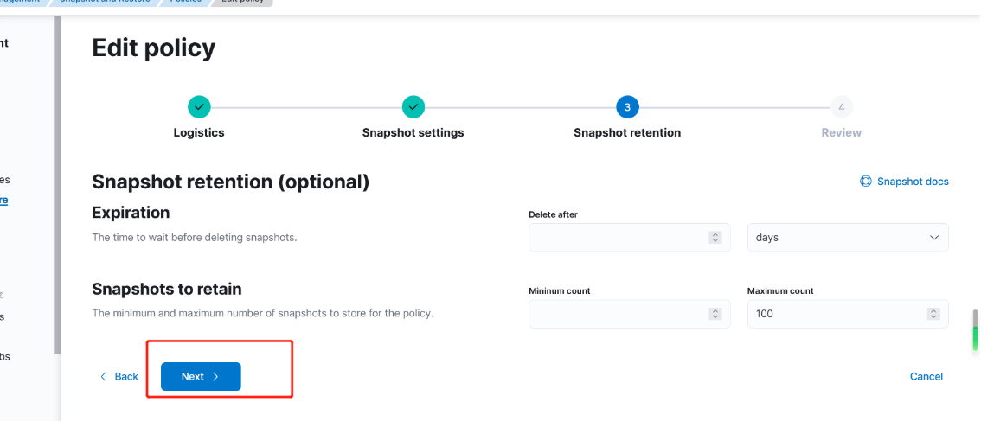

参数解释

**Snapshots to retain**

最小快照数: 这是策略中必须保留的最低快照数。无论其他条件如何，都将保留至少此数量的快照。这确保了在最坏的情况下至少有一定数量的备份可供恢复。

最大快照数: 这是策略中允许保留的最大快照数。超过此数量的快照将被删除，以避免无限增加存储空间的需求。保留较少的快照可以节省存储空间，并提供更好的管理快照的能力。

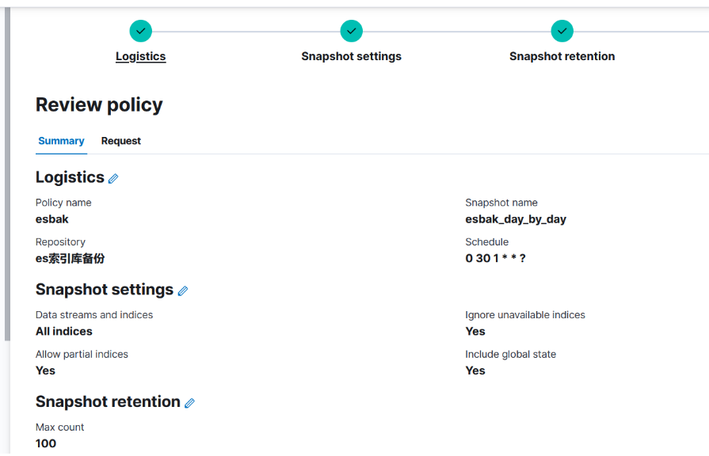

 

 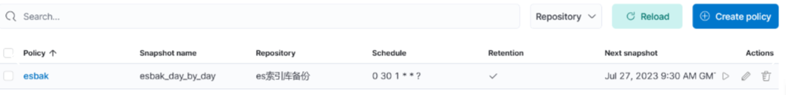

注意一下，kibana这个时区是美国时区，跟中国时区相差12小时

### 验证

在kibana和服务器看已经有备份了，快照备份成功

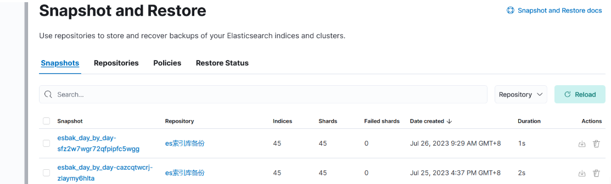

 

 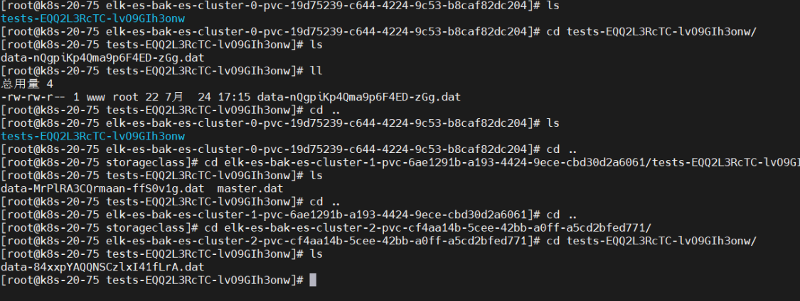