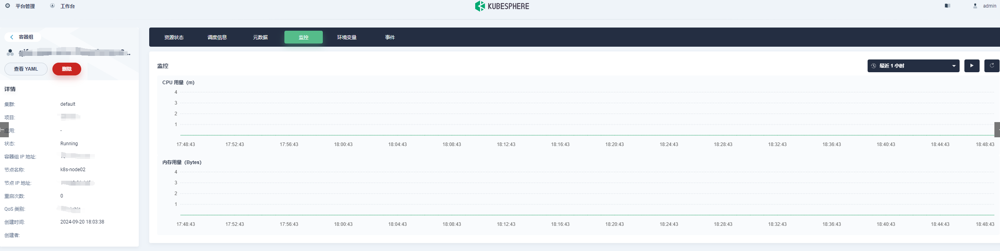
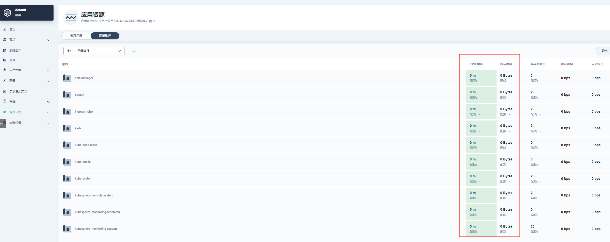
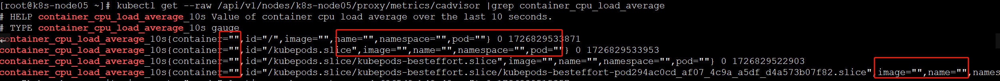
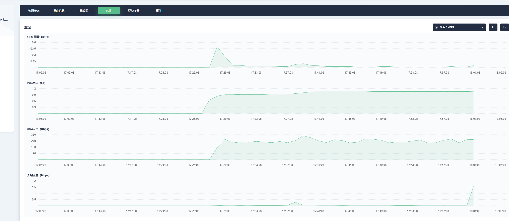
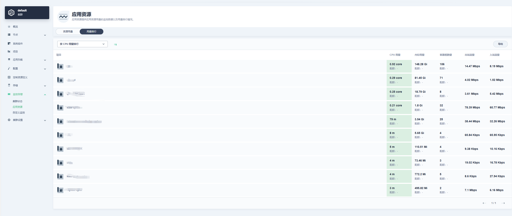

K8s 1.24 已从 cAdvisor 中删除了 Docker 插件。虽然可以使用 cri-dockerd（Docker by Mirantis）来调整容器运行时，但 kubelet 无法再通过 cAdvisor 检索 Docker 容器信息，例如镜像、pod、容器标签等，导致kubesphere的pod监控页面监控信息缺失。

<!--more-->

kubesphere版本：v3.3.2

k8s版本：v1.27.4

pod监控没有数据：



应用资源，用量排行也没有数据：



标签缺失：



原因：高版本 Kubernetes （v1.24及以上）使用 docker 运行时存在指标缺少关键标签问题， 可以切换运行时，或者额外部署一个cadvisor 负载。


cAdvisor standalone & ServiceMonitor yaml：

```
apiVersion: v1
kind: ServiceAccount
metadata:
  labels:
    app: cadvisor
  name: cadvisor
  namespace: kube-system
---
apiVersion: rbac.authorization.k8s.io/v1
kind: ClusterRole
metadata:
  labels:
    app: cadvisor
  name: cadvisor
rules:
- apiGroups:
  - policy
  resourceNames:
  - cadvisor
  resources:
  - podsecuritypolicies
  verbs:
  - use
---
apiVersion: rbac.authorization.k8s.io/v1
kind: ClusterRoleBinding
metadata:
  labels:
    app: cadvisor
  name: cadvisor
roleRef:
  apiGroup: rbac.authorization.k8s.io
  kind: ClusterRole
  name: cadvisor
subjects:
- kind: ServiceAccount
  name: cadvisor
  namespace: kube-system
---
apiVersion: apps/v1
kind: DaemonSet
metadata:
  annotations:
    seccomp.security.alpha.kubernetes.io/pod: docker/default
  labels:
    app: cadvisor
  name: cadvisor
  namespace: kube-system
spec:
  selector:
    matchLabels:
      app: cadvisor
      name: cadvisor
  template:
    metadata:
      annotations:
        scheduler.alpha.kubernetes.io/critical-pod: ""
      labels:
        app: cadvisor
        name: cadvisor
    spec:
      automountServiceAccountToken: false
      containers:
      - args:
        - --housekeeping_interval=10s
        - --max_housekeeping_interval=15s
        - --event_storage_event_limit=default=0
        - --event_storage_age_limit=default=0
        - --enable_metrics=app,cpu,disk,diskIO,memory,network,process
        - --docker_only
        - --store_container_labels=false
        - --whitelisted_container_labels=io.kubernetes.container.name,io.kubernetes.pod.name,io.kubernetes.pod.namespace
        image: gcr.io/cadvisor/cadvisor:v0.45.0
        name: cadvisor
        ports:
        - containerPort: 8080
          name: http
          protocol: TCP
        resources:
          limits:
            cpu: 800m
            memory: 2000Mi
          requests:
            cpu: 400m
            memory: 400Mi
        volumeMounts:
        - mountPath: /rootfs
          name: rootfs
          readOnly: true
        - mountPath: /var/run
          name: var-run
          readOnly: true
        - mountPath: /sys
          name: sys
          readOnly: true
        - mountPath: /var/lib/docker
          name: docker
          readOnly: true
        - mountPath: /dev/disk
          name: disk
          readOnly: true
      priorityClassName: system-node-critical
      serviceAccountName: cadvisor
      terminationGracePeriodSeconds: 30
      tolerations:
      - key: node-role.kubernetes.io/controlplane
        value: "true"
        effect: NoSchedule
      - key: node-role.kubernetes.io/etcd
        value: "true"
        effect: NoExecute
      volumes:
      - hostPath:
          path: /
        name: rootfs
      - hostPath:
          path: /var/run
        name: var-run
      - hostPath:
          path: /sys
        name: sys
      - hostPath:
          path: /var/lib/docker
        name: docker
      - hostPath:
          path: /dev/disk
        name: disk
---
apiVersion: policy/v1beta1
kind: PodSecurityPolicy
metadata:
  labels:
    app: cadvisor
  name: cadvisor
  namespace: kube-system
spec:
  allowedHostPaths:
  - pathPrefix: /
  - pathPrefix: /var/run
  - pathPrefix: /sys
  - pathPrefix: /var/lib/docker
  - pathPrefix: /dev/disk
  fsGroup:
    rule: RunAsAny
  runAsUser:
    rule: RunAsAny
  seLinux:
    rule: RunAsAny
  supplementalGroups:
    rule: RunAsAny
  volumes:
  - '*'
---
apiVersion: v1
kind: Service
metadata:
  name: cadvisor
  labels:
    app: cadvisor
  namespace: kube-system
spec:
  selector:
    app: cadvisor
  ports:
  - name: cadvisor
    port: 8080
    protocol: TCP
    targetPort: 8080
---
apiVersion: monitoring.coreos.com/v1
kind: ServiceMonitor
metadata:
  labels:
    app: cadvisor
  name: cadvisor
  namespace: kube-system
spec:
  endpoints:
  - metricRelabelings:
    - sourceLabels:
      - container_label_io_kubernetes_pod_name
      targetLabel: pod
    - sourceLabels:
      - container_label_io_kubernetes_container_name
      targetLabel: container
    - sourceLabels:
      - container_label_io_kubernetes_pod_namespace
      targetLabel: namespace
    - action: labeldrop
      regex: container_label_io_kubernetes_pod_name
    - action: labeldrop
      regex: container_label_io_kubernetes_container_name
    - action: labeldrop
      regex: container_label_io_kubernetes_pod_namespace
    port: cadvisor
    relabelings:
    - sourceLabels:
      - __meta_kubernetes_pod_node_name
      targetLabel: node
    - sourceLabels:
      - __metrics_path__
      targetLabel: metrics_path
      replacement: /metrics/cadvisor
    - sourceLabels:
      - job
      targetLabel: job
      replacement: kubelet
  namespaceSelector:
    matchNames:
    - kube-system
  selector:
    matchLabels:
      app: cadvisor
```

部署完成后监控恢复正常：




