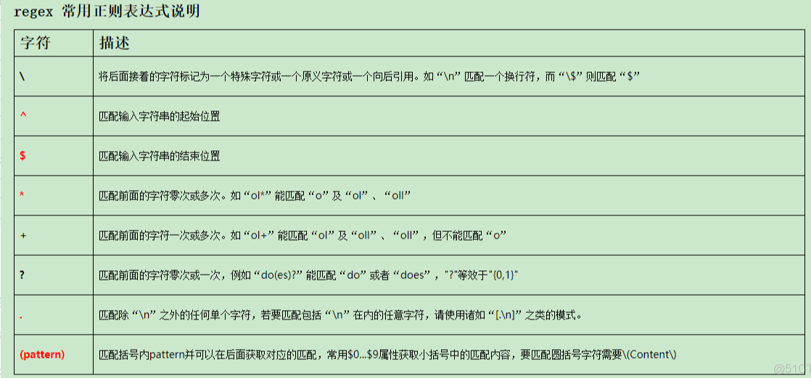
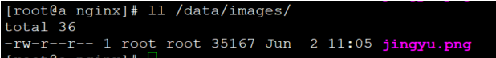
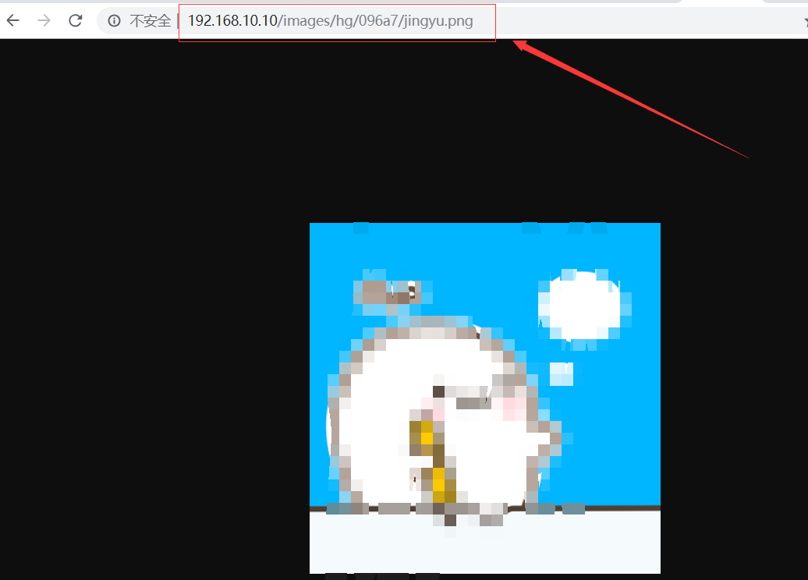
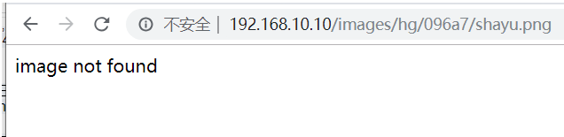

访问重写rewrite是Nginx HTTP请求处理过程中的一个重要功能，它是以模块的形式存在于代码中的，其功能是对用户请求的URI进行PCRE正则重写，然后返回30×重定向跳转或按条件执行相关配置。rewrite模块内置了类似脚本语言的set、if、break、return配置指令，通过这些指令，用户可以在HTTP请求处理过程中对URI进行更灵活的操作控制。rewrite模块提供的指令可以分两类，一类是标准配置指令，这部分指令只是对指定的操作进行相应的操作控制；另一类是脚本指令，这部分指令可以在HTTP指令域内以类似脚本编程的形式进行编写。

<!--more-->

### rewrite模块介绍：

nginx的重写模块是一个简单的正则表达式匹配与一个虚拟堆叠机结合。依赖于PCRE库，因此需要安装pcre。根据相关变量重定向和选择不同的配置，从一个location跳转到另一个location，不过这样的循环最多可以执行10次，超过后nginx将返回500错误。同时，重写模块包含set指令，来创建新的变量并设其值，这在有些情景下非常有用的，如记录条件标识、传递参数到其他location、记录做了什么等等。

rewrite模块指令：

```
break
语法：break
默认值：none
使用字段：server, location, if
```

作用:完成当前设置的重写规则，停止执行其他的重写规则。

```
if
语法：if (condition) { … }
默认值：none
使用字段：server, location
```

注意：尽量考虑使用trp_files代替。

判断的条件可以有以下值：

```
一个变量的名称：空字符串”“或者一些“0”开始的字符串为false。
字符串比较：使用=或!=运算符
正则表达式匹配：使用~(区分大小写)和~*(不区分大小写)，取反运算!~ 和!~*。
文件是否存在：使用-f和!-f操作符
目录是否存在：使用-d和!-d操作符
文件、目录、符号链接是否存在：使用-e和!-e操作符
文件是否可执行：使用-x和!-x操作符


return
语法：return code
默认值：none
使用字段：server, location, if
```


按照相关的正则表达式与字符串修改URI，指令按照在配置文件中出现的顺序执行。可以在重写指令后面添加标记。

注意：如果替换的字符串以http://开头，请求将被重定向，并且不再执行多余的rewrite指令。

尾部的标记(flag)可以是以下的值：

```
last – 停止处理重写模块指令，之后搜索location与更改后的URI匹配。
break – 完成重写指令。
redirect – 返回302临时重定向，如果替换字段用http://开头则被使用。
permanent – 返回301永久重定向。


rewrite_log
语法：rewrite_log on | off
默认值：rewrite_log off
使用字段：server, location, if
变量：无
```


启用时将在error log中记录notice级别的重写日志。

```
set
语法：set variable value
默认值：none
使用字段：server, location, if
```

为给定的变量设置一个特定值。

```
uninitialized_variable_warn
语法：uninitialized_variable_warn on|off
默认值：uninitialized_variable_warn on
使用字段：http, server, location, if
```

控制是否记录未初始化变量的警告信息。

### 重写规则组成部分：

#### 第一部分–正则表达式

可以使用括号来捕获，后续可以根据位置来将其引用，位置变量值取决于捕获正则表达式中的顺序，$1引用第一个括号中的值，$2引用第二个括号中的值，以此类推。如：

```
^/images/([a-z]{2})/([a-z0-9]{5})/(.*)\.(png|jpg|gif)$
# $1是两个小写字母组成的字符串
# $2是由小写字母和0到9的数字组成的5个字符的字符串
# $3将是个文件名
# $4是png、jpg、gif中的其中一个。
```



#### 第二部分–URL

请求被改写。该URI可能包含正则表达式中的捕获的位置参数或这个级别下的nginx任何配置变量。如：

```
 /data?file=$3.$4
```

如果这个URI不匹配nginx配置的任何location，那么将给客户端返回301(永久重定向)或302(临时重定向)的状态码来表示重定向类型。该状态码可以通过第三个参数来明确指定。

#### 第三部分–标记

flag标记说明：

```
last  #本条规则匹配完成后，继续向下匹配新的location URI规则
break  #本条规则匹配完成即终止，不再匹配后面的任何规则
redirect  #返回302临时重定向，浏览器地址会显示跳转后的URL地址
permanent  #返回301永久重定向，浏览器地址栏会显示跳转后的URL地址
```

第三部分也就是尾部的标记(flag)。 last标记将导致重写后的URI搜索匹配nginx的其他location，最多可循环10次。如：

```
rewrite '^/images/([a-z]{2})/([a-z0-9]{5})/(.*)\.(png|jpg|gif)$' /data?file=$3.$4 last;
```

### 实例1

nginx配置文件：

```
http {
#定义image日志格式
log_format imagelog '[$time_local] ' $image_file ' ' $image_type ' ' $body_bytes_sent ' ' $status;
#开启重写日志
rewrite_log on;
server {
    root html;
    location / {
        # 重写规则信息
        error_log logs/rewrite.log notice;  
        #注意这里要用‘’单引号引起来，避免{}
        rewrite '^/images/([a-z]{2})/([a-z0-9]{5})/(.*)\.(png|jpg|gif)$' /data?file=$3.$4;
        #注意不能在上面这条规则后面加上“last”参数，否则下面的set指令不会执行
        set $image_file $3;
        set $image_type $4;
    }
    location /data {
        # 指定针对图片的日志格式，来分析图片类型和大小
        access_log logs/images.log imageslog;
        root /data/images;
        #应用前面定义的变量。判断首先文件在不在，不在再判断目录在不在，如果还不在就跳转到最后一个url里
        try_files /$arg_file /image404.html;
    }
    location = /image404.html {
        # 图片不存在返回特定的信息
        return 404 "image not found\n";
    }
}
```

图片位置：



浏览器访问(测试机IP为192.168.10.10）：



访问一个不存在的图片时：


