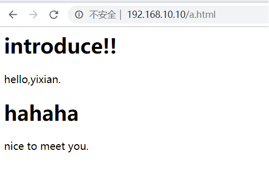

### 什么是SSI

Server Side Include，通常称为服务器端嵌入，是一种类似于ASP的基于服务器的网页制作技术。大多数（尤其是基于Unix平台）的WEB服务器如Netscape Enterprise Server等均支持SSI命令。

<!--more-->

### 为什么要用SSI

用个例子来说明，一个静态化的页面中，需要嵌入一小块实时变化的内容，例如首页，大部分的页面内容需要缓存但是用户登录后的个人信息是动态信息，不能缓存。那么如何解决这个”页面部分缓存”问题，利用SSI就可以解决，在首页的静态页面中嵌入个人信息的动态页，由于是服务器端的嵌入，所以用户浏览的时候都是一个嵌入后的页面。

### nginx配置SSI

nginx 默认就自带了 SSI,不需要安装任何组件模块。

主要是三个参数，ssi，ssi_silent_errors和ssi_types，均可以放在http,server和location的作用域下。

### 配置

修改nginx.conf配置文件增加以下内容：
（ssi配置，可以放在http,server和location的作用域下，当前放到了location下了）

```
location / {
		 root   html;
		#ssi配置开始
		ssi on;  
		ssi_silent_errors on;  
		ssi_types text/shtml;  
		#ssi配置结束         
		index  index.html index.htm;
	 }
```

参数详解：

```bash
ssi on
##开启ssi支持，默认是off
ssi_silent_errors on
##默认值是off，开启后在处理SSI文件出错时不输出错误提示:”[an error occurred while processing the directive] ”
ssi_types
##默认是ssi_types text/html，所以如果需要htm和html支持，则不需要设置这句，如果需要shtml支持，则需要设置：ssi_types text/shtml
```

### 编写a.html文件：

```html
<html>

<head>
</head>

	<body>
	introduce!!
	<p>hello,yixian.</p>
	<!--# include file="b.html" -->
	</body>

</html>	
```

编写b.html文件：

```html
<html>

<head>
</head>

	<body>
	      hahaha
	 nice to meet you.
	</body>

</html>	
```

把编写的两个html都放到nginx的html目录中，并通过浏览器访问( [http://192.168.10.10/a.html]( http://192.168.10.10/a.html))，测试机IP为192.168.10.10，得到以下页面：



可以看到A页面中引入了B页面的内容。
