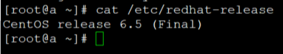
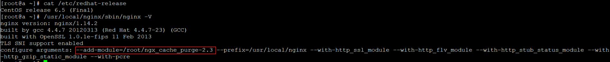
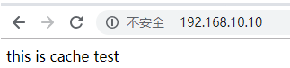
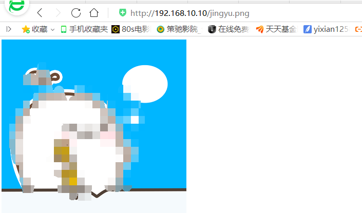
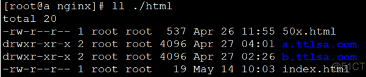
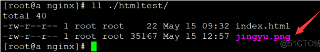
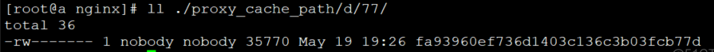
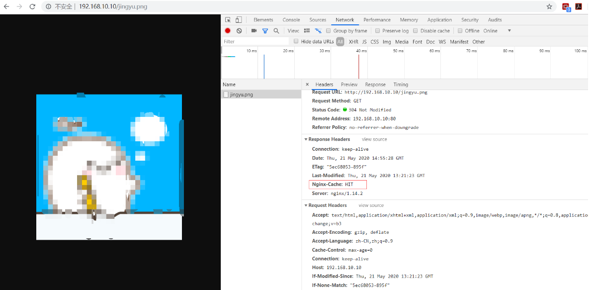
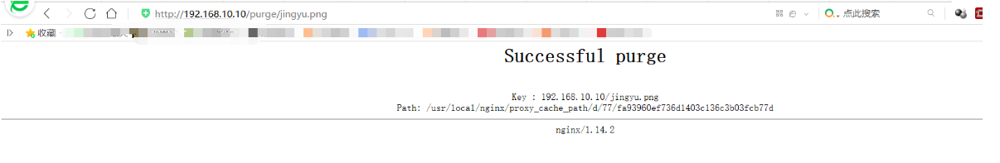
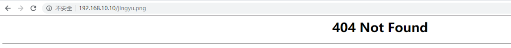

Nginx作为Web缓存服务器，它介于客户端和应用服务器之间，当用户通过浏览器访问一个URL时，web缓存服务器会去应用服务器获取要展示给用户的内容，将内容缓存到自己的服务器上，当下一次请求到来时，如果访问的是同一个URL，web缓存服务器就会直接将之前缓存的内容返回给客户端，而不是向应用服务器再次发送请求。web缓存降低了应用服务器、数据库的负载，减少了网络延迟，提高了用户访问的响应速度，增强了用户的体验。
<!--more-->

测试环境：



NGINX版本及编译的模块：



清除缓存模块版本：ngx_cache_purge-2.3

1.下载解压ngx_cache_purge模块

```
[root@a ~]#cd /root
[root@a ~]#wget https://github.com/FRiCKLE/ngx_cache_purge/archive/2.3.tar.gz
[root@a ~]#tar zxf 2.3.tar.gz
```

2.创建NGINX所需依赖：

```
[root@a ~]yum install gcc gcc-c++ pcre pcre-devel openssl openssl-devel zlib zlib-devel
```

编译安装NGINX：

```
[root@a ~]#cd nginx-1.14.2
[root@a nginx-1.14.2]# ./configure --add-module=/root/ngx_cache_purge-2.3 --prefix=/usr/local/nginx --with-http_ssl_module --with-http_flv_module --with-http_stub_status_module --with-http_gzip_static_module --with-pcre
[root@a nginx-1.14.2]#make
[root@a nginx-1.14.2]#make install
```

3.创建一个用于缓存的目录：

```
[root@a nginx-1.14.2]#mkdir /usr/local/nginx/proxy_cache_path
```

4.创建一个主页文件充当后端服务器默认主页：

```
[root@a nginx]#mkdir /usr/local/nginx/htmltest
[root@a nginx]#vim /usr/local/nginx/htmltest/index.html
```

5.配置nginx缓存（为了简单明了，配置文件里我只留了和缓存相关的配置）

```
worker_processes  1;
events {
		worker_connections  1024;
}
http {
		include       mime.types;
		default_type  application/octet-stream;
		sendfile        on;
		keepalive_timeout  65;
		proxy_temp_path /usr/local/nginx/proxy_temp_path;
		proxy_cache_path /usr/local/nginx/proxy_cache_path levels=1:2 keys_zone=cache_one:200m inactive=1d max_size=1g;

proxy_headers_hash_max_size 51200;
proxy_headers_hash_bucket_size 6400;
proxy_buffering on;
proxy_buffer_size 128k;
proxy_buffers 32 128k;
proxy_busy_buffers_size 128k;
proxy_temp_file_write_size 128k;
server {
    listen       8080;
    server_name  127.0.0.1;  ##充当后端服务器
    root /usr/local/nginx/htmltest;
    index index.html;
}

server {
listen 80;
server_name 192.168.10.10;
root html;
index index.html;
  location ~ /purge(/.*)
{
    	allow            all;
  		proxy_cache_purge    cache_one  $host$1$is_args$args;
		       } 

 location ~ .*\.(png|jpg)$
	{
	proxy_cache cache_one;
	proxy_cache_valid 200 302 304 1h;
	proxy_cache_key $host$uri$is_args$args;
				proxy_set_header Host $host;
	proxy_set_header X-Forward-For $remote_addr;
	add_header  Nginx-Cache $upstream_cache_status;   ##增加http头，可在浏览器访问时候观察缓存命中情况。MISS未命中，HIT命中，有5种状态
	proxy_pass http://127.0.0.1:8080;   ##将请求转到后端服务器
	}


    error_page   500 502 503 504  /50x.html;
    location = /50x.html {
        root   html;
    }

}
}
```

参数详解：

```
 proxy_connect_timeout 500;
#跟后端服务器连接的超时时间_发起握手等候响应超时时间
proxy_read_timeout 600;
#连接成功后_等候后端服务器响应的时间_其实已经进入后端的排队之中等候处理
proxy_send_timeout 500;
#后端服务器数据回传时间_就是在规定时间内后端服务器必须传完所有数据
proxy_buffer_size 128k;
#代理请求缓存区_这个缓存区间会保存用户的头信息以供Nginx进行规则处理_一般只要能保存下头信息即可  
proxy_buffers 4 128k;
#同上 告诉Nginx保存单个用的几个Buffer最大用多大空间
proxy_busy_buffers_size 256k;
#如果系统很忙的时候可以申请更大的proxy_buffers 官方推荐*2
proxy_temp_file_write_size 128k;
#proxy缓存临时文件的大小
proxy_temp_path /usr/local/nginx/temp;
#用于指定本地目录来缓冲较大的代理请求
proxy_cache_path /usr/local/nginx/cache levels=1:2 keys_zone=cache_one:200m inactive=1d max_size=1g;
#设置web缓存区名为cache_one,内存缓存空间大小为200M，自动清除超过1天没有被访问过的缓存数据，硬盘缓存空间大小1g
proxy_cache_path
#定义缓存存储位置
levels=1:2
#设置缓存目录深度，最多能创建3层。
keys_zone=cache_one:200m
#定义缓存区域名称和内存缓存空间大小。
max_size=1g
#磁盘缓存空间最大使用值，达到配额后删除最少使用的缓存文件。
inactive=60m
#设置缓存时间，60分钟内没有被访问过就删除。
use_temp_path=off
#不使用temp_path指定的临时存储路径，直接将缓存文件写入指定的cache文件中，建议off。
proxy_cache cache_one
#缓存区域名称，要和keys_zone定义的名称一致
proxy_cache_valid 200 302 304 60m
#设置状态码为200 302 304过期时间为60分钟
proxy_cache_key $host$uri$is_args$args
#设置缓存的key，这里是以域名、URI、参数组成web缓存的key值，根据key值哈希存储缓存内容到二级缓存目录内
expires 3d
#缓存时间3天
location ~ /purge(/.*) 
#用于手动清除缓存，allow表示只允许指定的IP才可以清除URL缓存
location ~ .*\.(jsp|php)?$
#扩展名以jsp或php结尾的不做缓存
```

6.实践

这是我们NGINX服务器默认主页：



我们访问一下指定文件：



可以访问到，但是我们的nginx服务器上并没有这个图片啊



这是因为我们在配置的时候，把请求转到了后端服务器，我们可以到后端服务器上看一下是否存在这个文件:




我们在后端服务器上找到了图片，那现在我们再把图片删掉，看一下是否还可以访问。

```
[root@a nginx]# rm -rf ./htmltest/jingyu.png 
```

现在我们再到浏览器访问一下指定文件：


图片不是删除了吗？为什么还可以访问到？这是因为我们配置了缓存，我们可以到配置的路径下查看是否有文件：



我们也可以在浏览器上按F12键查看缓存信息（在配置文件里我们配置了参数）：



可以看到，已经生成了缓存文件。我们想要清除缓存的话，只需要在清除缓存网页的URI地址前加上purge即可，
例如：192.168.10.10/purge/jingyu.png




此时再访问的话就找不到文件了



至此，清除缓存模块就完成了。
