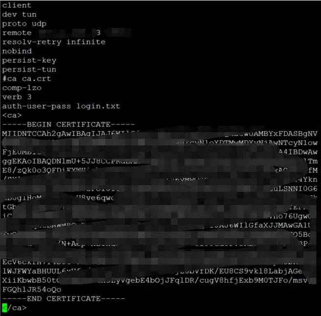

上一章已经部署好了openVPN服务器，现在我们说一下客户端如何连接服务器从而访问内网。

<!--more-->

### Windows连接：

下载OpenVPN GUI客户端：链接:  https://pan.baidu.com/s/161nsft8FnVMz6vY_Xp0MXQ 提取码: qect
默认下一步就可以安装完成（如果自定义安装的话要记住安装路径，一会会用到）。
安装完成后，首先进入到安装目录下，默认安装目录为C:\Program Files\OpenVPN/config,创建一个ovpn后缀的配置文件：


输入以下内容：


```
client
dev tun
proto udp
remote **** *    #公网ip 端口
resolv-retry infinite
nobind
persist-key
persist-tun
#ca ca.crt
comp-lzo
verb 3
auth-user-pass login.txt
<ca>
###服务器ca证书###
</ca>
```

再在同目录下创建一个login.txt的文件，第一行写用户名，第二行写密码。

然后运行Openvpn GUI客户端，在右下角任务栏会有图标:


鼠标右键，连接：


连接成功后，图标为绿色：


### Linux服务器连接：

安装openVPN，前两章已经有教程，这里不再赘述。
创建一个openvpn的文件夹并进入：

```
mkdir /etc/openvpn
cd  /etc/openvpn/
```

创建客户端配置文件

```
vim client.conf
```

填写以下内容：



```
client
dev tun
proto udp
remote *.*.*.* *    #公网IP和端口
resolv-retry infinite
nobind
persist-key
persist-tun
#ca ca.crt
comp-lzo
verb 3
auth-user-pass login.txt
<ca>
####服务器ca证书####
</ca>
```

再在同目录下创建一个login.txt的文件，第一行写用户名，第二行写密码。
启动openvpn客户端：

```
[root@localhost ~]# openvpn --daemon --writepid /var/run/openvpn.pid --cd /etc/openvpn --config client.conf --script-security 2
```

查看openvpn是否在运行：


ping内网服务看是否能通：


至此，openVPN客户端连接完成。
