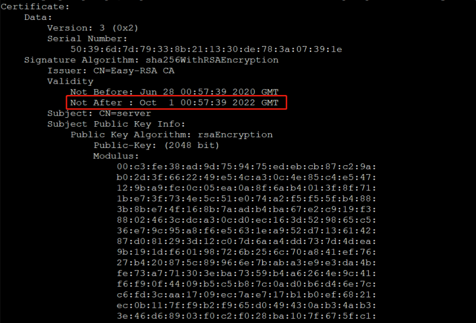
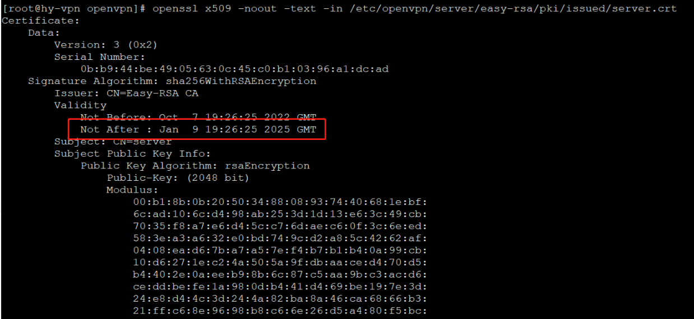

今天连接openVPN一直报错，连接失败，查看连接错误日志如下：

<!--more-->

```
Sat Oct 08 11:04:24 2022 VERIFY ERROR: depth=0, error=certificate has expired: CN=server
Sat Oct 08 11:04:24 2022 OpenSSL: error:14090086:SSL routines:SSL3_GET_SERVER_CERTIFICATE:certificate verify failed
Sat Oct 08 11:04:24 2022 TLS_ERROR: BIO read tls_read_plaintext error
Sat Oct 08 11:04:24 2022 TLS Error: TLS object -> incoming plaintext read error
Sat Oct 08 11:04:24 2022 TLS Error: TLS handshake failed
Sat Oct 08 11:04:24 2022 SIGUSR1[soft,tls-error] received, process restarting
Sat Oct 08 11:04:24 2022 MANAGEMENT: >STATE:1665198264,RECONNECTING,tls-error,,
Sat Oct 08 11:04:24 2022 Restart pause, 2 second(s)
Sat Oct 08 11:04:26 2022 WARNING: No server certificate verification method has been enabled.
```

从日志消息得知证书过期，到服务器查看证书到期时间：

```
openssl x509 -noout -text -in /etc/openvpn/server/easy-rsa/pki/issued/server.crt
```

看到证书确实到期了：



解决方法1：

续期证书：

```
./easyrsa renew server nopass
```

重新查看证书到期时间：



验证证书有效性：

```
[root@xxx cert_new]# openssl verify -CAfile ca.crt -purpose sslserver server.crt
 
server.crt: OK
```

证书续期成功，重启服务重新连接即可。

ps：Windows连接面板没反应可把log文件删除再重新连接。


解决方法2：

把相关证书文件重新生成一次（可生成长时间不到期的证书）：

首先新建一个空文件夹，用于存放新证书相关文件:

```
mkdir /etc/openvpn/cert_new
```

当时搭建OpenVPN时，使用的是easy-rsa进行证书生成，因此将之前的easy-rsa拷贝至cert_new文件夹：

```
cp -r /etc/openvpn/easy-rsa /etc/openvpn/cert_new
```

进入新的easy-rsa文件夹，删除旧的pki文件夹：

```
rm -rf pki
```

使用“easyrsa”命令新建pki目录：

```
[root@xxx easy-rsa]# ./easyrsa init-pki
 
init-pki complete; you may now create a CA or requests.
Your newly created PKI dir is: /etc/openvpn/cert_new/easy-rsa/pki
```

生成ca证书：

```
[root@xxx easy-rsa]# ./easyrsa --batch build-ca nopass
 
Generating RSA private key, 2048 bit long modulus
...............................................................................................................+++
...................+++
e is 65537 (0x10001)
```

生成服务端证书（前面的环境变量代表证书超时天数为3650天）：

```
[root@xxx easy-rsa]# EASYRSA_CERT_EXPIRE=3650 ./easyrsa build-server-full server nopass
 
 
Using SSL: openssl OpenSSL 1.0.2k-fips  26 Jan 2017
Generating a 2048 bit RSA private key
................+++
......+++
writing new private key to '/etc/openvpn/cert_new/easy-rsa/pki/private/server.key.c8ybv0BPWo'
-----
Using configuration from /etc/openvpn/cert_new/easy-rsa/pki/safessl-easyrsa.cnf
Check that the request matches the signature
Signature ok
The Subject's Distinguished Name is as follows
commonName            :ASN.1 12:'server'
Certificate is to be certified until Apr 26 07:27:46 2032 GMT (3650 days)
 
Write out database with 1 new entries
Data Base Updated
```

生成客户端证书：

```
[root@xxx easy-rsa]# EASYRSA_CERT_EXPIRE=3650 ./easyrsa build-client-full client nopass
 
 
Using SSL: openssl OpenSSL 1.0.2k-fips  26 Jan 2017
Generating a 2048 bit RSA private key
.........+++
.............+++
writing new private key to '/etc/openvpn/cert_new/easy-rsa/pki/private/client.key.nsEQpRpArw'
-----
Using configuration from /etc/openvpn/cert_new/easy-rsa/pki/safessl-easyrsa.cnf
Check that the request matches the signature
Signature ok
The Subject's Distinguished Name is as follows
commonName            :ASN.1 12:'client'
Certificate is to be certified until Apr 26 07:30:30 2032 GMT (3650 days)
 
Write out database with 1 new entries
Data Base Updated
```

生成crl.pem文件：

```
[root@xxx easy-rsa]# EASYRSA_CRL_DAYS=3650 ./easyrsa gen-crl
 
Using SSL: openssl OpenSSL 1.0.2k-fips  26 Jan 2017
Using configuration from /etc/openvpn/cert_new/easy-rsa/pki/safessl-easyrsa.cnf
 
An updated CRL has been created.
CRL file: /etc/openvpn/cert_new/easy-rsa/pki/crl.pem
```

将这些文件统一复制到/etc/openvpn/cert_new目录：

```
cp pki/ca.crt pki/private/ca.key pki/issued/server.crt pki/private/server.key pki/crl.pem /etc/openvpn/cert_new
```

为避免权限问题，将crl.pem的所有者改为nobody：

```
chown nobody:nobody crl.pem
```

进入/etc/openvpn/cert_new目录，使用openssl命令验证证书有效性：

```
[root@xxx cert_new]# openssl verify -CAfile ca.crt -purpose sslserver server.crt
 
server.crt: OK
```

生成OpenVPN所需的secret文件ta.key：

```
openvpn --genkey --secret ta.key
```

将所有需要的文件复制到/etc/openvpn：

```
cp ca.crt ca.key crl.pem easy-rsa server.crt server.key ta.key /etc/openvpn
```

重启OpenVPN服务，即可使OpenVPN加载新的证书文件。
