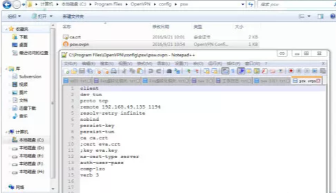
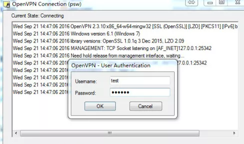
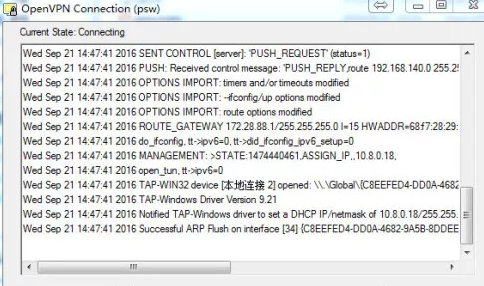

紧接上一篇，让openvpn读取本地文件中的用户名密码，通过判断用户名密码是否存在文件中进行认证，搭建openvpn环境就不多做说明了，只要把openvpn搭建好，客户端能够连接就可以了。

<!--more-->

1、修改openvpn配置文件

```
vi /etc/server.conf
```

编辑/etc/server.conf文件，并添加如下内容：

```
auth-user-pass-verify /etc/openvpn/checkpsw.sh via-env
client-cert-not-required  
username-as-common-name 
```

例如：

```
[root@openVPN openvpn-2.0.9]# cat /etc/server.conf 
port 1194
proto udp
dev tun
ca   /opt/tools/openvpn-2.0.9/easy-rsa/2.0/keys/ca.crt
cert /opt/tools/openvpn-2.0.9/easy-rsa/2.0/keys/server.crt
key  /opt/tools/openvpn-2.0.9/easy-rsa/2.0/keys/server.key
dh   /opt/tools/openvpn-2.0.9/easy-rsa/2.0/keys/dh1024.pem
server 10.8.0.0 255.255.255.0
push "route 172.16.0.0.0 255.255.255.0"
ifconfig-pool-persist ipp.txt
keepalive 10 120
comp-lzo
persist-key
persist-tun
status openvpn-status.log
verb 5

####openvpn authenticated with user/pass
auth-user-pass-verify /etc/openvpn/checkpsw.sh via-env
client-cert-not-required  
username-as-common-name
```

2、下载用户验证脚本checkpsw.sh

文件的官方下载地址是： http://openvpn.se/files/other/checkpsw.sh

但是可能现在已经无法下载了，如果无法下载就把下面的内容拷贝到一个文件中，然后改名为checkpw.sh即可，当然网上有很多地方有这个脚本，所以脚本的下载不是什么问题。

```
[root@openvpn ~]# cat checkpsw.sh 
#!/bin/sh
###########################################################
# checkpsw.sh (C) 2004 Mathias Sundman <mathias@openvpn.se>
#
# This script will authenticate Openvpn users against
# a plain text file. The passfile should simply contain
# one row per user with the username first followed by
# one or more space(s) or tab(s) and then the password.
PASSFILE="/etc/openvpn/psw-file"
LOG_FILE="/var/log/openvpn/openvpn-password.log"
TIME_STAMP=`date "+%Y-%m-%d %T"`
###########################################################

if [ ! -r "${PASSFILE}" ]; then
	echo "${TIME_STAMP}: Could not open password file \"${PASSFILE}\" for reading." >> ${LOG_FILE}
	exit 1
fi

CORRECT_PASSWORD=`awk '!/^;/&&!/^#/&&$1=="'${username}'"{print $2;exit}' ${PASSFILE}`

if [ "${CORRECT_PASSWORD}" = "" ]; then
	echo "${TIME_STAMP}: User does not exist: username=\"${username}\", password=\"${password}\"." >> ${LOG_FILE}
	exit 1
fi

if [ "${password}" = "${CORRECT_PASSWORD}" ]; then
	echo "${TIME_STAMP}: Successful authentication: username=\"${username}\"." >> ${LOG_FILE}
	exit 0
fi

echo "${TIME_STAMP}: Incorrect password: username=\"${username}\", password=\"${password}\"." >> ${LOG_FILE}
exit 1
```

3、创建用户名密码文件

```
cp /root/checkpsw.sh /etc/openvpn/
chmod +x /etc/openvpn/checkpsw.sh

# 给脚本添加执行权限，并将脚本拷贝到/etc/server.conf中指定的位置

mkdir -p /var/log/openvpn
touch /var/log/openvpn/openvpn-password.log

# 创建目录以及日志文件，用来记录用户名密码认证产生的日志

echo "test 123456" >>/etc/openvpn/psw-file
chmod 400 /etc/openvpn/psw-file

# 创建用户名密码文件，并修改权限

[root@openvpn ~]# ll /etc/openvpn/psw-file 
-r-------- 1 root root 12 Sep 21 02:35 /etc/openvpn/psw-file
[root@openvpn ~]# cat /etc/openvpn/psw-file 
test 123456
```

4、修改客户端配置文件

注释掉cert和key（客户端不需要crt和key文件，但是需要服务器的CA证书）

```
;cert eva.crt
;key eva.key
```

添加如下内容：

```
auth-user-pass
```

例如：

```
client
dev tun
proto udp
remote 59.64.15.47 1194   #公网IP
resolv-retry infinite
nobind
persist-key
persist-tun
ca ca.crt
;cert eva.crt
;key eva.key
ns-cert-type server
auth-user-pass
comp-lzo
verb 5
```

5、客户端连接测试
创建一个新的名为“psw”的连接，里面的内容就是步骤4贴出来的，目录中只需要放服务器端CA证书即可：



客户端点击连接之后，弹出窗口，这里输入pws-file文件中的用户名密码：



认证通过，成功连接：



6、检查日志：
查看用户名密码认证产生的日志：

```
[root@open*** ~]# cat /var/log/openvpn/openvpn-password.log 

2016-09-21 02:52:16: Successful authentication: username="test".
```

查看openvpn状态日志：

```
[root@open*** open***-2.0.9]# tail -f /opt/tools/open***-2.0.9/easy-rsa/2.0/open***-status.log

Open××× CLIENT LIST
Updated,Wed Sep 21 02:58:31 2016
Common Name,Real Address,Bytes Received,Bytes Sent,Connected Since
test,192.168.49.1:7828,19111,5525,Wed Sep 21 02:52:15 2016
ROUTING TABLE
Virtual Address,Common Name,Real Address,Last Ref
10.8.0.18,test,192.168.49.1:7828,Wed Sep 21 02:52:16 2016
GLOBAL STATS
Max bcast/mcast queue length,0
END
```

