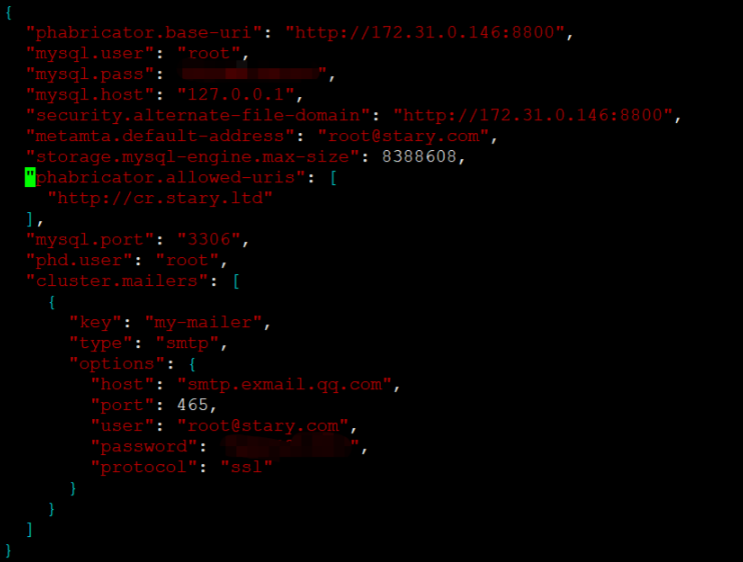

在新服务器上部署好phabricator服务，在此不再赘述，可参考此[文章](https://yixian12580.github.io/2022/09d5dcd440.html)。

<!--more-->

原服务器上把数据库备份：

```
./bin/storage dump | gzip > /tmp/backup.sql.gz
```

把备份数据传至新服务器上：

```
scp /tmp/backup.sql.gz root@172.31.0.146:/root/
```

把备份数据导入新服务器数据库：

```
gunzip -c /root/backup.sql.gz | mysql -u root -p
```

数据过大可能会报MySQL server has gone away错误，可把max_allowed_packet参数设置大一点，编辑my.cnf文件：

```
max_allowed_packet = 20M
```


查看托管存储库：

```
./bin/repository list-paths
```


把/var/repo目录整个复制到新服务器对应的托管存储库路径下：

```
scp -r /var/repo/ root@172.31.0.146:/var/
```

修改配置文件：



不可直接修改，需用以下命令设置：

```
./bin/config set mysql.host 'localhost'
./bin/config set mysql.port '3306'
./bin/config set mysql.user 'root'
./bin/config set mysql.pass 'root的密码'
```

设置完后，执行:

```
./bin/storage upgrade
```

测试邮件是否配置正确：

```
./bin/mail send-test --to chenmingchang@stary.com --subject hello < README.md
```


在web端访问成功：


