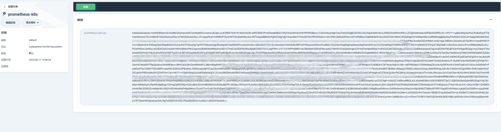

通过kubesphere安装的Prometheus的配置文件是加密的，想要修改的话需要先把文件解压，解密，修改完之后再压缩，加密再替换回去。

<!--more-->

加密文件：



解压：

```
kubectl get secret  -n prometheus  prometheus-prometheus-kube-prometheus-prometheus -oyaml
apiVersion: v1
data:
  prometheus.yaml.gz: H4sIAAAAAAAA/+ydzXPqOBLA7/wVOsyBvCm+8l7mvSGnqZrd2sPO7NTOcWtLJaQGNNiSRmqTpNb7v2/5C2wwWUiAQNIHqoxttbqltvpnWR+zyE5ENO4wBksRJQK1NVwbBL8U0Zh9HoYOY0F64WDrNDwieCMiHokJRCETwpjzNgacQxLGtePB+rC3SCbQq/1fH24I4B5cpKUYs++6v/3jZ/7rT7/85abjkwj4VEcQxp0eGwDKmvBBdrWR214Z97JkuczecPCp/yTiqFMaLa2Z6lme1x92wo2IYcwC+KWW8Is1Gq0ftNs582IqjBgMO4zNrbG+KieGPoEOY5k+3gBC4EGtM2Ksx7yNYMzAKGe1waJgsqyDExLKki7PVH96rFGQpfqoY7AJVlUWA3otA3cC52M2KP/mt88hs2yO6DqMech1bSoVbOIlNGo7L5T8CIWfARYXx4xzjB2vVWVVdrkgITM3G7MFgMsTt0rmPAYUvF5KRbEX93HhXP2itlybgMJI2E+A8xDA4P+T42EGj2PWXRtzc19W4OksKYvqVVasZFQWlA55BPUrx+TOetzKKPOh3gNMdjvNMxKFUh5C4KU/LbRRBydaKRTACS/Q+jG7r2v4q1Vw3+1/uilPukhIiMHgmH33n9F/WxzaWAWXa89vVh1mjrPqEGtWTU9bydSu7S2wcuGVZU2Z5eVDJDqrdkk70NhMkrQGhTbgd8lc3dB4jpS3Bz1HWVZuLkLzOf2r0BGo9PdESgAF6uaIJVs1121OcnAeReu1Eb935VfY1v9+t5P2NtJWj8N2gn1amOoZ4jvD01yEeX4xtiqJMmAZ5X+r2syux8/7TkNMaeN33d//9tM/f75pyCpb2CLg8s3wyv7178P5YhNnRAQeY2HEDHwLdExFFE5OHTv5AoyYRMCzirtdAdCVUMbBgbjh8ZvVFFDIRaOyjs4THiKoGpW99a4nOgPzBIimPC4c/DBFt1JW2mYaEtwQ3BDcENwQXJwQLkYXBhfEEcQR18YRHiIrFHhiCWIJYon3yhL7PuUfjyecztKdtadCwVQkEW587cgSYxRK+cXd2gSQiQceFtrxJXg9fVrrxVihemn/Ws38mhT516kxGyyFH/jEDAJIDxgG6xv72g7KYhNS2sTgQIq+9JluExAePEe7APMiSXnKK6EiaWNnDZSPzt6hu5msag5WPnV0yHDeLrWCAwGjkaqOcUWis3RVhMuNxcQWxBbEFkf6CNNsEc/1DebZ1uWamOa5LLJKLI3osajhJauIwz38mUBArhJfjKEJIK1RgU8SuQC87w77o7t02L9Nh/3P2S/78yX7ZQc/pMP+13TY/5YO+z+mo/7tXTrqZ7+vd+lt+jn93L9Lv6Rf+nfpD+nX9Fv6Yzq6S2/v0i/D9G7YtDP3/lfjmbQelAlnhLNcg/AUEOKPBkEn6hoq6/CD9Art8dVm3WF4oQRBRERERER0JCL6w07+nh2cFYj2aWOuiYuO0teT/88809soAt87/xiVJly8rPenjFDUwXMJbLPDpYh1iHWIdYh1iHWIdd6QdQCloq6Ta8eLrBYJKAgoCCgIKAgoCCjeECict49PRBTXThR5NRJSEFIQUhBSEFIQUrwhUgQ5B5VE9BmGqOaVVLPyJCIbIhsiGyIbIhsim7cjmwhw95JrxUnUMQQUsTvdWmxN1GFMIAo5zx1JCRSrVFbBmreIiM5KRPWLp1pzrfTIo6PR4ls4HOrqiY6v4B6TkQiMCIwIjD4MGNXbm7NNSdqzjVmtJNJKR/UbGhBT5kfU1UJd28vCXAV1tS8rM5BCLXXIlwYhLiMuIy4jLiMuIy4jLiMuOz2X7Tkfvcxg7fvSJbwrp4Hj3FvECNRqIjpaFFEaWaG4WIIXM+CjYUgLWtq4Kwngm6daJpm/UMVp4F1tuUy8B4OptjkYbihQnX0APZvjlhUehAo8Bj8DVZ4KINF6XlxpnHrwOnsEinPln3rS45kWQ2z9E+/GwjlQOaql4UG44+XQzWRyBUF67dD6kKIIi8ADCoQU52XBiMfjZRkcyP6nA8TpKlwWrfhKZP/7+20pR3v5uH1XLx/O2wls7stBrx706kGvHvTqQa8e9OpBrx706nHBXcLWQd70vNnmZ69b33ONTRvby0nwGEryqdPIcyudqliHoK3hUpTtcm3x0D3K8Hro6WBU2sKO7SGGVSnQ4EJa0ZNIiUjpGknpIFghjmjdovXidjT7wDH5hNt5XGZUfh9bjtDWZQQQBBDvHSBoq5HdDEEblxFDEEO8hiFo2zLiCOKI984RtG1ZY6kEFAjVN6Q3+qJxJaSwMfZBm4DCyFePoWjIOUN0PuNIkKZ3naUP4HLjHMVtitsUt4801OKZBuhcIy8+NDvUDrNWqgePWYt81gWXGgjxgkUICDzeJ3jsck1aHYkwhDCEMIRWR7ouAEEIqCC2A/mwUPPJRPTip/Bn1LMj3xuuWvdeWMrYmjPyR6VXjhVeOMjn4dgEx2w0vPovIwghgBcSuUwmwBOj8QXh+lkp1ZPRVq8nD9aV31xuYKNATYGaAvXLQ+U+T/i1hcmA1osZZLIxqEmRh02Q2ym3XoEvZxZro+zDmA1DR0TgUZt8bkB+3D4du1Ihv7TykFLZWqTJSljnY/1zYeXWhKWQfHqJ8zDVj2M2KHys+cL9TBTeFYfbIvFGLG7rDXCaL8GH3KjlbWnNluGt8aX1ydjTkVvKbHvSRK3kjqDDjji3PTLufwEAAP//pKqn8Q+hAAA=
kind: Secret
metadata:
  creationTimestamp: "2024-04-24T06:16:07Z"
  labels:
    managed-by: prometheus-operator
  name: prometheus-prometheus-kube-prometheus-prometheus
  namespace: prometheus
  ownerReferences:
  - apiVersion: monitoring.coreos.com/v1
    blockOwnerDeletion: true
    controller: true
    kind: Prometheus
    name: prometheus-kube-prometheus-prometheus
    uid: 0a2d7794-16ef-4884-a3c0-4c70227f05bd
  resourceVersion: "10317315"
  uid: c2bd7b0c-b1c3-4b33-b2c6-c4f3d384601a
type: Opaque
```

```
 echo -n 'H4sIAAAAAAAA/+ydzXPqOBLA7/wVOsyBvCm+8l7mvSGnqZrd2sPO7NTOcWtLJaQGNNiSRmqTpNb7v2/5C2wwWUiAQNIHqoxttbqltvpnWR+zyE5ENO4wBksRJQK1NVwbBL8U0Zh9HoYOY0F64WDrNDwieCMiHokJRCETwpjzNgacQxLGtePB+rC3SCbQq/1fH24I4B5cpKUYs++6v/3jZ/7rT7/85abjkwj4VEcQxp0eGwDKmvBBdrWR214Z97JkuczecPCp/yTiqFMaLa2Z6lme1x92wo2IYcwC+KWW8Is1Gq0ftNs582IqjBgMO4zNrbG+KieGPoEOY5k+3gBC4EGtM2Ksx7yNYMzAKGe1waJgsqyDExLKki7PVH96rFGQpfqoY7AJVlUWA3otA3cC52M2KP/mt88hs2yO6DqMech1bSoVbOIlNGo7L5T8CIWfARYXx4xzjB2vVWVVdrkgITM3G7MFgMsTt0rmPAYUvF5KRbEX93HhXP2itlybgMJI2E+A8xDA4P+T42EGj2PWXRtzc19W4OksKYvqVVasZFQWlA55BPUrx+TOetzKKPOh3gNMdjvNMxKFUh5C4KU/LbRRBydaKRTACS/Q+jG7r2v4q1Vw3+1/uilPukhIiMHgmH33n9F/WxzaWAWXa89vVh1mjrPqEGtWTU9bydSu7S2wcuGVZU2Z5eVDJDqrdkk70NhMkrQGhTbgd8lc3dB4jpS3Bz1HWVZuLkLzOf2r0BGo9PdESgAF6uaIJVs1121OcnAeReu1Eb935VfY1v9+t5P2NtJWj8N2gn1amOoZ4jvD01yEeX4xtiqJMmAZ5X+r2syux8/7TkNMaeN33d//9tM/f75pyCpb2CLg8s3wyv7178P5YhNnRAQeY2HEDHwLdExFFE5OHTv5AoyYRMCzirtdAdCVUMbBgbjh8ZvVFFDIRaOyjs4THiKoGpW99a4nOgPzBIimPC4c/DBFt1JW2mYaEtwQ3BDcENwQXJwQLkYXBhfEEcQR18YRHiIrFHhiCWIJYon3yhL7PuUfjyecztKdtadCwVQkEW587cgSYxRK+cXd2gSQiQceFtrxJXg9fVrrxVihemn/Ws38mhT516kxGyyFH/jEDAJIDxgG6xv72g7KYhNS2sTgQIq+9JluExAePEe7APMiSXnKK6EiaWNnDZSPzt6hu5msag5WPnV0yHDeLrWCAwGjkaqOcUWis3RVhMuNxcQWxBbEFkf6CNNsEc/1DebZ1uWamOa5LLJKLI3osajhJauIwz38mUBArhJfjKEJIK1RgU8SuQC87w77o7t02L9Nh/3P2S/78yX7ZQc/pMP+13TY/5YO+z+mo/7tXTrqZ7+vd+lt+jn93L9Lv6Rf+nfpD+nX9Fv6Yzq6S2/v0i/D9G7YtDP3/lfjmbQelAlnhLNcg/AUEOKPBkEn6hoq6/CD9Art8dVm3WF4oQRBRERERER0JCL6w07+nh2cFYj2aWOuiYuO0teT/88809soAt87/xiVJly8rPenjFDUwXMJbLPDpYh1iHWIdYh1iHWIdd6QdQCloq6Ta8eLrBYJKAgoCCgIKAgoCCjeECict49PRBTXThR5NRJSEFIQUhBSEFIQUrwhUgQ5B5VE9BmGqOaVVLPyJCIbIhsiGyIbIhsim7cjmwhw95JrxUnUMQQUsTvdWmxN1GFMIAo5zx1JCRSrVFbBmreIiM5KRPWLp1pzrfTIo6PR4ls4HOrqiY6v4B6TkQiMCIwIjD4MGNXbm7NNSdqzjVmtJNJKR/UbGhBT5kfU1UJd28vCXAV1tS8rM5BCLXXIlwYhLiMuIy4jLiMuIy4jLiMuOz2X7Tkfvcxg7fvSJbwrp4Hj3FvECNRqIjpaFFEaWaG4WIIXM+CjYUgLWtq4Kwngm6daJpm/UMVp4F1tuUy8B4OptjkYbihQnX0APZvjlhUehAo8Bj8DVZ4KINF6XlxpnHrwOnsEinPln3rS45kWQ2z9E+/GwjlQOaql4UG44+XQzWRyBUF67dD6kKIIi8ADCoQU52XBiMfjZRkcyP6nA8TpKlwWrfhKZP/7+20pR3v5uH1XLx/O2wls7stBrx706kGvHvTqQa8e9OpBrx706nHBXcLWQd70vNnmZ69b33ONTRvby0nwGEryqdPIcyudqliHoK3hUpTtcm3x0D3K8Hro6WBU2sKO7SGGVSnQ4EJa0ZNIiUjpGknpIFghjmjdovXidjT7wDH5hNt5XGZUfh9bjtDWZQQQBBDvHSBoq5HdDEEblxFDEEO8hiFo2zLiCOKI984RtG1ZY6kEFAjVN6Q3+qJxJaSwMfZBm4DCyFePoWjIOUN0PuNIkKZ3naUP4HLjHMVtitsUt4801OKZBuhcIy8+NDvUDrNWqgePWYt81gWXGgjxgkUICDzeJ3jsck1aHYkwhDCEMIRWR7ouAEEIqCC2A/mwUPPJRPTip/Bn1LMj3xuuWvdeWMrYmjPyR6VXjhVeOMjn4dgEx2w0vPovIwghgBcSuUwmwBOj8QXh+lkp1ZPRVq8nD9aV31xuYKNATYGaAvXLQ+U+T/i1hcmA1osZZLIxqEmRh02Q2ym3XoEvZxZro+zDmA1DR0TgUZt8bkB+3D4du1Ihv7TykFLZWqTJSljnY/1zYeXWhKWQfHqJ8zDVj2M2KHys+cL9TBTeFYfbIvFGLG7rDXCaL8GH3KjlbWnNluGt8aX1ydjTkVvKbHvSRK3kjqDDjji3PTLufwEAAP//pKqn8Q+hAAA=' | base64 -d | gzip -d > prometheus.yaml

```

修改参数，例如：scrape_timeout: 30s改为60s

修改完之后再压缩：

```
$ cat prometheus.yaml | gzip | base64 -w 0                                                  H4sIAEosQ2YAA+2d3ZPaNhDA3/NX+CEPXDIG7i6XpNxTZtJOH5o00zx2OhohL+BiW44k38fU/d+7smWwwVC4Aw7u9gHGlqyVdrXS/vwljyM55NHglefBDY8ybkKZsDAxoHB34F32NWZpoXgKteT3RTLc4X7CIxbxIUTaCvG8VMkYzAQyPaht9+ab/jQbgl/bn28uCGAK0igUfOC97nz7/TP7+unLz2evVBYBG4URYIW+1wMjasJ7NrdR20YV+7ZYIdPv995073kcvXJKC5mMwnFR199yyBIew8DTaIdQwBeZhEaqXrueY8VHPOG9Pqo1kYlUlZ08ozLARNselYABzXQwr8jzfE/JCKuBJEglWr00jK1ap1yAs7RLqXZ8r2FI13wTxiAzU/Uk5qtQaJZyMxl4PbdbHD4Bq9nEmBR3FRRtbTZKy0wJaPR2YZRiy3A1BlNmDjzGTJyyWldWtisEcWHdbOBNAdKicKtkxrAwZ3UrlWYvj2M8TeuZoUQH1YYnAjYTkCrQkJj/k6NgDHcDrzNX5uzadeD+NHGmepQWMxmVBs4hd9D8yjFZKpVZqsj6kH8Lw9VOs0YiDwLUSDPnT9MwCbYuNGuQhpQrjkN04F3XW/hVBnDd6b45c4lphMMqRjPiVPPP+b8tDp1giePV55sMtlMnlcE22symnjbL1PI2Fli58EyzpkyXvY1E1GiVtC2VtZJw3jM8TECtkjk7oDGOAiW3Gke2qnTCdXOc/sIxEgX590wIgACCsx1atpqu25xk6zrK2Wshfq+qr9St+3a1k/oLZavhsFxgkxmmGkNsZXhCw0+KzFgGWWSB5bzYrXrT5sfrfachxun4uvP9109/fD5ryHIzbBlw2WJ49f78a3u+WMQZHoEyMU7wY1At0DHikd47dazkC0j4ELnNdtzFDIBOhDK2DsQNj1/sJkQLMW101s55Au0K1aSycbvrhQ7APBqiEYtLB9+uoUslq9baFhLcENwQ3BDcEFzsES7OjwwuiCOII06NI9BMkgegiCWIJYglnitLbDrKXx5PpKEtd9ArFQGMeBbZXqrf7bCFTaSd/PLoMNEgMgVMT8OUYSvD0f28XZ5XNt3pP29mkSd4cXcKAeWGq57Kkh7KUmB0b35gN5Q9ZzYuhMwS0xO8K5Rt2xC4QtlGTiF5kKSi5IlQkZBxKhNwQ2fj0N0sVk0HM5/aOWSgEW7CALYEjEapOsaVhQ5yqUIfbywmtiC2ILbY0U2Y5ox4qHswa2eXU2KadVXYTnRK+F7U8JJZxEGBPzLQhgWZKp+hwVAtk0CzYSamYK47/e75Vd7vXuDv0v7szjv7sxvv8fcBfx/x91N+3r24wj/7+3CVX+SX+SXuvMvf4f/7/EP+McdjMAPT+vlVv6ln4f2PxjMhFQSJPiCcFS3Q99pA/NIgaE+XhlwfvpCrQhvctZlfMDxSgiAiIiIiItoREaHI3+zGQYFokznmlLhoJ9d6in3rmQgGESj/8M+oNOHiYVd/XISiCzzHwDYrXIpYh1iHWIdYh1iHWOcJWQeMCOjSyanjhe1FAgoCCgIKAgoCCgKKJwQK3L+7J6I4daIoupGQgpCCkIKQgpCCkOIJkcLeBEFl6DYMUc0jqWbmSUQ2RDZENkQ2RDZENk9HNhGY1UuulYl2UTQMYHG6v7XYmqiDRjAYMCeFIwXc8FkpnFXnvEVEdFAiqmfua80155E7R6PpR7091NUL7b6BG7yMRGBEYERg9GLAqD7fHOyVpA3nmNlKIq10VD+gATGuPqKuFupaXhbmJKgrbl1WBrEouAl1sTQIcRlxGXEZcRlxGXEZcRlx2f65bF0VtffRXQVz3xdpxjpihPPQRElj0ClnL6IbaXiU2+WIGEdE4WNg532dl7S0cFSG/tJMannJ/IFNxMZ1MCIjLyl0jhw3LRguNKBKvYVwPDFLWijguB0DdmHgkvAAnGVZmdNIulWhHQJlmtupF92dajHEUt2zToyDC6VbVMv1LU93V0PHymQBaKHCFJXTueF6iuPbcAM5dnppGH63uyp1CqL7ZgtxYRUuy1l8JrL79npZys5OPi6e1ckHKjiExe9y0KkHnXrQqQedetCpB5160KkHnXoc8SVhmUIx9TzZx88et77nHJsWPi8nQCHxlORTp5F1K50Gcai1XRJMcDcv1xYP3cCGp0NPW6PSEnYsP2JYWYEeLqQVPYmUiJROkZS2ghXiiNZPtB7dF81ecEze4+c8jjMqP49PjtCnywggCCCeO0DQp0ZWMwR9uIwYghjiMQxBny0jjiCOeO4cQZ8tayyVYB+uqe4hPdEdjRMhhYVnH8IEbZeIRz9D0ZBzgOh8wCdBmt51kGsAxxvnKG5T3Ka4vaNHLdZMQId68uJFs0Nt085SPtzZGfmgCy41EOIBixAQeDxP8FjlmrQ6EmEIYQhhCK2OdFoAglY3AcSyJ26nwWQ45H58r39EvjxXfn82u/v6RsQyOSB/VO0qsELxFIr3cGSGvXTeP/k7I5iCCSiLCTyEZdgXDwjXa6VUI6OtX/cerCu/Od7ARoGaAjUF6oeHyk1G+KmFSY3Dio/ByjY6GJZ1YMhhcsSkCkC5N4txAMvbgYdhiEegTJgU7wYU2+2vY1dNKLJmHuIaW4s01sJh8ax/Icx9mtAJKV4vwal/FGKhXuljzRPuNVF4VRxui8QLsbjtakAa2lcfdKHUzYXTZknx1vjSOjI2dOQWmy2/NFGz3A7asCLOLT8Z9x92ctyiD6EAAA==#               
```

把生成的加密信息替换回去就行。