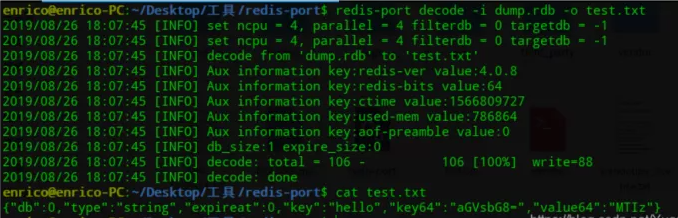
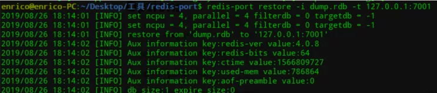
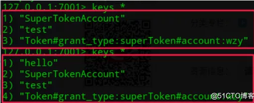
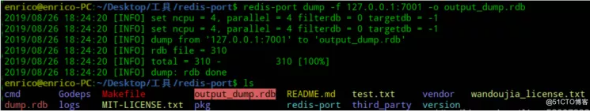
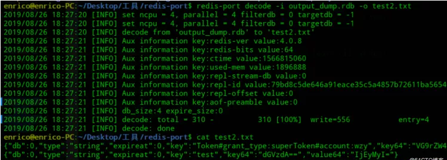
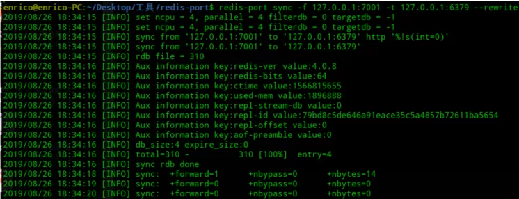
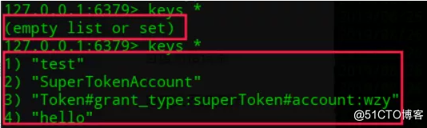

Redis数据持久化方式有AOF和RDB两种，这两种方式各有优缺点。AOF方式会生成appendonly.aof文件，记录执行的命令操作日志。RDB方式会生成dump.rdb文件，按照配置条件触发保存数据快照。

<!--more-->

redis-port 是一个 Redis 工具，通过解析 rdb 文件，实现 Redis 之间的数据同步以及数据恢复。

Github源码地址：https://github.com/CodisLabs/redis-port

阿里云有已经编译好的：[点此查看](http://docs-aliyun.cn-hangzhou.oss.aliyun-inc.com/assets/attach/85829/cn_zh/1533199526614/redis-port%282%29?spm=a2c63.p38356.879954.6.7c52162dADVBU5)

赋予可执行权限：

```
chmod 777 redis-port
```

1、decode 是把rdb文件解码输出到文件

```
redis-port decode -i dump.rdb -o test.txt
```



2、restore 是把rdb文件传输到指定redis实例（设置了密码的话需要用--auth=密码）

```
redis-port restore -i dump.rdb -t 127.0.0.1:7001
```



restore前后redis数据变化:



3、dump 是从redis实例数据转存为rdb文件

```
redis-port dump -f 127.0.0.1:7001 -o output_dump.rdb
```



可以通过decode查看输出文件是否是redis实例的数据：



4、sync 是两个redis实例间数据同步（rewrite存在相同的key覆盖）

```
redis-port sync -f 127.0.0.1:7001 -t 127.0.0.1:6379 --rewrite
```



当看到sync rdb done 后就同步结束了，下边继续执行的是监听源实例数据的修改，并同步。



数据同步完成.
