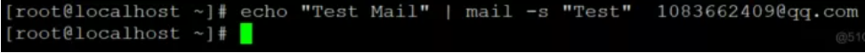
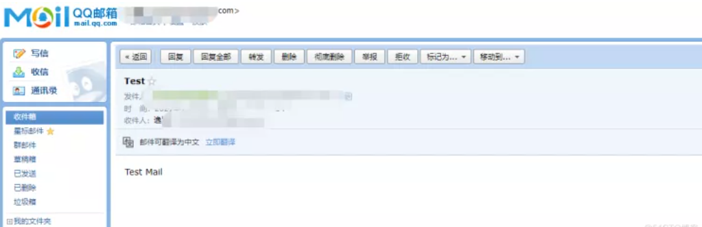
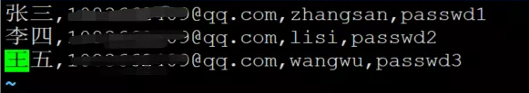
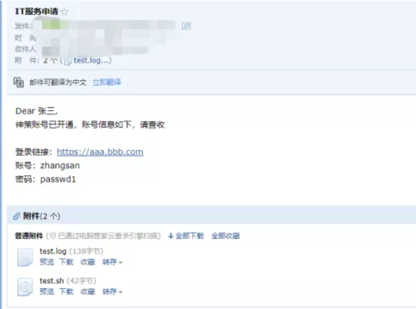
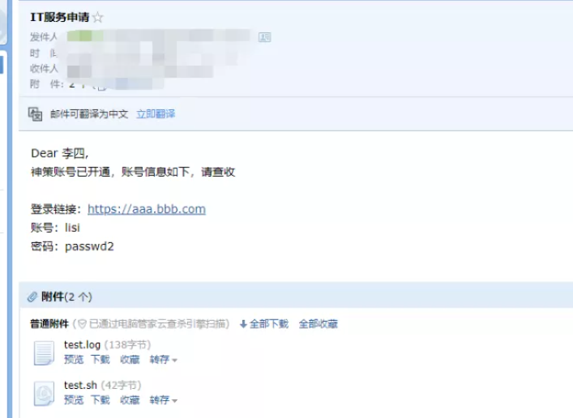
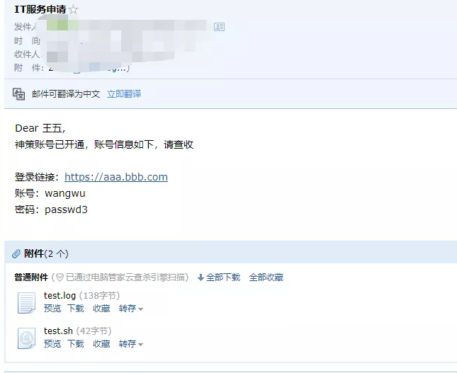

有时候我们有一对一发送邮件的需求，但是一个一个发太耗时间了，而这种耗时间的操作我们都可以交给机器来完成。

<!--more-->

没接触过shell语言以及对Linux系统不熟悉的可以看我另一篇[文章](https://yixian12580.github.io/2022/09/27/%E5%88%A9%E7%94%A8office%E5%8A%9E%E5%85%AC%E8%BD%AF%E4%BB%B6%E5%AE%9E%E7%8E%B0%E4%B8%80%E5%AF%B9%E4%B8%80%E7%BE%A4%E5%8F%91%E9%82%AE%E4%BB%B6%E5%8A%9F%E8%83%BD.html)，也可以实现需求。

环境：CentOS 7（自带postfix）

1.修改/etc/postfix/main.cf文件：

```
myhostname = sample.test.com　 ← 设置系统的主机名
mydomain = test.com　 ← 设置域名（我们将让此处设置将成为E-mail地址“@”后面的部分）
myorigin = $mydomain　 ← 将发信地址“@”后面的部分设置为域名（非系统主机名）
inet_interfaces = all　 ← 接受来自所有网络的请求
mydestination = $myhostname, localhost.$mydomain, localhost, $mydomain　 ← 指定发给本地邮件的域名
home_mailbox = Maildir/　 ← 指定用户邮箱目录
```

2.安装邮件发送工具mailx

```
yum -y install mailx
```


配置邮箱信息（修改/etc/mail.rc）：

```
set from=123456@qq.com     //你自己的真实邮箱地址
set smtp=smtp.exmail.qq.com         //在邮箱设置，客户端设置，设置方法，发送服务器里
set smtp-auth-user=123456@qq.com     //自己邮箱真实地址
set smtp-auth-password=123456       //自己邮箱密码
set smtp-auth=login
```


重启postfix服务：

```
service postfix restart
```


测试是否能发送邮件：

```
echo "Test Mail" | mail -s "Test"  123456@qq.com
```




收件人可以收到邮件：



3.编写shell脚本（vim email.sh）：

```
#!/bin/sh
cat /root/emailreceiver.txt | while read line
do
        from="yixian@qq.com"
        email_subject="IT服务申请"
        attachment1="/root/test.log"
        attachment2="/root/test.sh"

    name=$(echo $line | cut -d "," -f 1)
    to_all=$(echo $line | cut -d "," -f 2)
    account=$(echo $line | cut -d "," -f 3)
    password=$(echo $line | cut -d "," -f 4)

    email_content="Dear $name,

账号已开通，账号信息如下，请查收

登录链接：https://aaa.bbb.com
账号：$account
密码：$password"

echo -e "${email_content}" | mailx \
-r "逸贤<${from}>" \
-a ${attachment1} \
-a ${attachment2} \
-s ${email_subject} ${to_all}

done
```

```
-r  发送人邮箱
-a 上传附件
-s  邮件主题
```


给email.sh 700权限：

```
chmod 700 emai.sh
```


在/root/目录下创建emailreceiver.txt文件，并在里面写上对方的称呼，对方的邮箱，账号，密码，每一项以逗号隔开：



执行脚本：

```
sh email.sh
```


查看对应邮箱收取的邮件：









