SkyWalking是一个开源的可观察性平台，用于收集，分析，聚合和可视化来自本地或者云服务中的数据。即使在整个云环境中，SkyWalking也能提供一种简便的方法来维护您的分布式系统的清晰视图。它是一个现代的APM（Application Performance Monitor 应用性能监测软件），专门为基于云、容器的分布式系统而设计。

<!--more-->

**为什么要选择skywalking？**
SkyWalking提供了用于在许多不同情况下观察和监视分布式系统的解决方案，并通过agent方式，做到高性能、低损耗、无侵入性，与类似的功能组件如：Zipkin、Pinpoint、CAT相比，skywalking无论是从性能还是社区活跃度方面考虑，都具有一定的优势。

**skywalking监控维度**
skywalking从三个维度提供可观察项功能，分别是：服务，服务实例，端点

**服务**：表示一组/一组工作负载，这些工作负载为传入请求提供相同的行为。
**服务实例**：服务组中的每个单独工作负载都称为实例。像pods在Kubernetes中一样，它不必是单个OS进程，但是，如果您使用agent代理，则实例实际上是一个真正的OS进程。
**端点**：服务中用于传入请求的路径，例如HTTP URI路径或gRPC服务类+方法签名。

**skywalking架构**
从逻辑上看，skywalking分为四个部分：探针，平台后端，存储和UI。

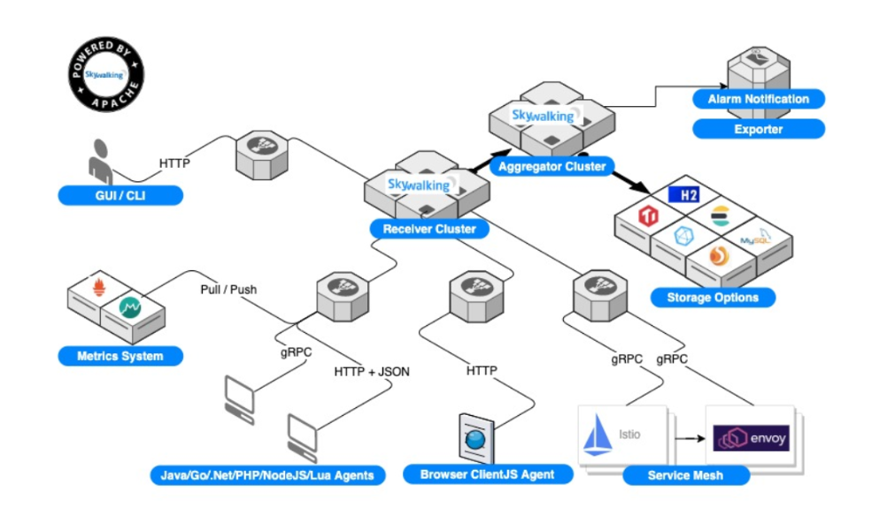

**探针**：收集数据并重新格式化以符合SkyWalking的要求（不同的探针支持不同的来源）。
**平台后端**：支持数据聚合，分析和流处理，涵盖跟踪，指标和日志。
**存储**：设备通过开放/可插入的界面存储SkyWalking数据。您可以选择现有的实现，例如ElasticSearch，H2，MySQL，TiDB，InfluxDB，或者实现自己的实现。
**UI**：是一个高度可定制的基于Web的界面，允许SkyWalking最终用户可视化和管理SkyWalking数据。

### skywalking安装

#### docker-compose部署

##### 版本

| 名称                  | 版本   |
| --------------------- | ------ |
| skywalking-oap-server | 8.9.1  |
| skywalking-ui         | 8.9.1  |
| elasticsearch         | 7.14.2 |
| java-agent            | 8.8.0  |

##### skywalking单机部署

docker-compose.yml

```
version: '3.3'
services:
  elasticsearch:
    image: docker.elastic.co/elasticsearch/elasticsearch:7.14.2
    container_name: elasticsearch
    restart: always
    ports:
      - 9200:9200
    environment:
      - "TAKE_FILE_OWNERSHIP=true" #volumes 挂载权限 如果不想要挂载es文件改配置可以删除
      - "discovery.type=single-node" #单机模式启动
      - "TZ=Asia/Shanghai" # 设置时区
      - "ES_JAVA_OPTS=-Xms512m -Xmx512m" # 设置jvm内存大小
    volumes:
      - ./elasticsearch/logs:/usr/share/elasticsearch/logs
      - ./elasticsearch/data:/usr/share/elasticsearch/data
#      - ./elasticsearch/conf/elasticsearch.yml:/usr/share/elasticsearch/config/elasticsearch.yml
    ulimits:
      memlock:
        soft: -1
        hard: -1
  skywalking-oap-server:
    image: apache/skywalking-oap-server:8.9.1
    container_name: skywalking-oap-server
    depends_on:
      - elasticsearch
    links:
      - elasticsearch
    restart: always
    ports:
      - 11800:11800
      - 12800:12800
    environment:
      SW_STORAGE: elasticsearch  # 指定ES版本
      SW_STORAGE_ES_CLUSTER_NODES: elasticsearch:9200
      TZ: Asia/Shanghai
#    volumes:
#     - ./oap/conf/alarm-settings.yml:/skywalking/config/alarm-settings.yml
  skywalking-ui:
    image: apache/skywalking-ui:8.9.1
    container_name: skywalking-ui
    depends_on:
      - skywalking-oap-server
    links:
      - skywalking-oap-server
    restart: always
    ports:
      - 8080:8080
    environment:
      SW_OAP_ADDRESS: http://skywalking-oap-server:12800
      TZ: Asia/Shanghai
```

执行命令

```
docker-compose up -d
```

等待大约2~3min，在浏览器中输入一下地址进行访问：

```
http://10.168.2.126:8080/
```

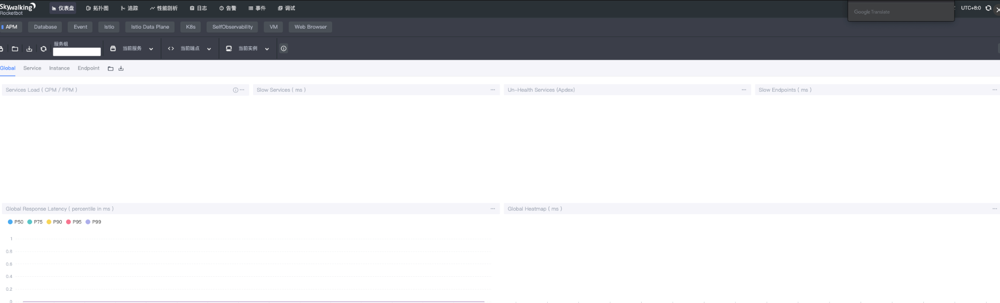

##### skywalking使用

agent目录简介

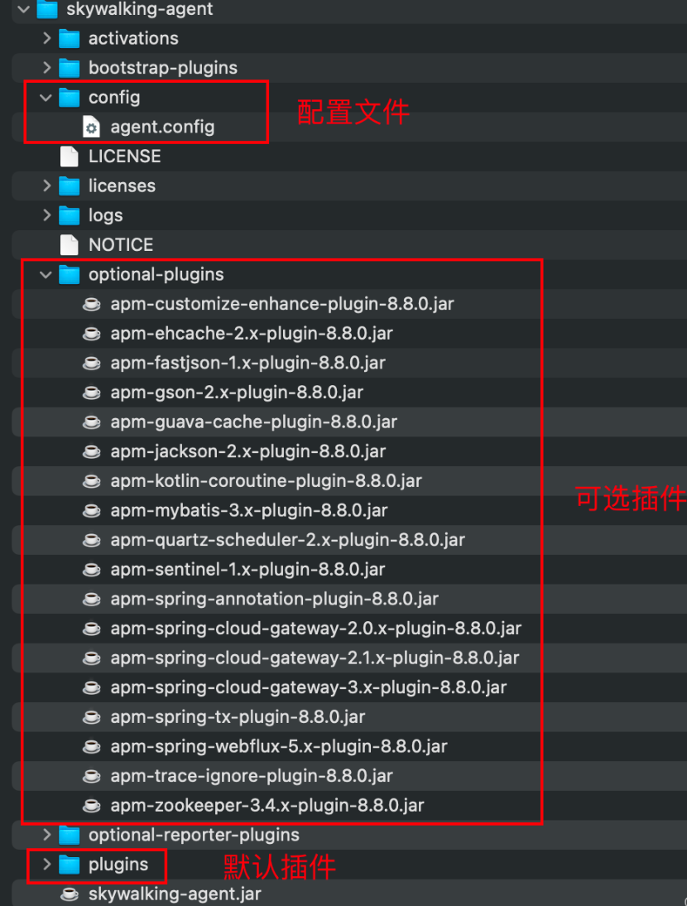

如果想要使用可选插件将其复制到plugins目录即可【需要重启应用程序生效】，不想用只需在plugins目录中将插件删除【需要重启应用后生效】，gateway服务需要使用单独的agent，把optional-plugins目录里的apm-spring-cloud-gateway-3.x-plugin-8.8.0.jar复制到plugins目录里。

**把服务引到k8s集群使用**

skywalking.yml：

```
apiVersion: v1
kind: Endpoints
metadata:
  name: oap
  namespace: qifu
subsets:
- addresses:
  - ip: 10.168.2.126
  ports:
  - port: 11800
    name: grpc
  - port: 12800
    name: rest
     
---
apiVersion: v1
kind: Service
metadata:
  name: oap
  namespace: qifu
spec:
  ports:
  - port: 11800
    name: grpc
  - port: 12800
    name: rest
```

创建ep和svc

```
kubectl apply -f skywalking.yml
```

**idea 配置**

在VM参数中增加如下配置

```
"-javaagent:/app/skywalking-agent/skywalking-agent.jar", "-Dskywalking.agent.service_name=qifu-saas-bc-test", "-Dskywalking.collector.backend_service=oap.qifu.svc:11800", 
```


 **java -jar配置**

```
java "-javaagent:/app/skywalking-agent/skywalking-agent.jar", "-Dskywalking.agent.service_name=qifu-saas-bc-test", "-Dskywalking.collector.backend_service=oap.qifu.svc:11800", -jar SpringBoot-0.0.1-SNAPSHOT.jar
```

注意：javaagent 需配置在 -jar前面

详细使用请看官网介绍：[java-agent使用教程](https://skywalking.apache.org/docs/skywalking-java/latest/en/setup/service-agent/java-agent/readme/)

**一切准备就绪后，启动项目**

1）仪表盘

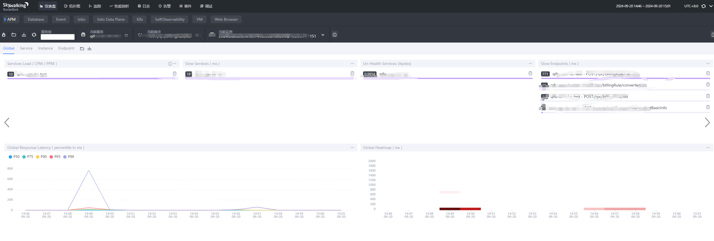

可以APM 处看见当前服务

**注意：**

1. 如果此处没有出现服务，可以尝试访问项目中的任意接口或者多刷新几次页面) 

2. 如果还是没有可以查看agent目录下的日志看是否存在报错访问项目中任意接口

   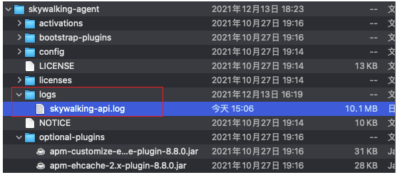

2）拓扑图

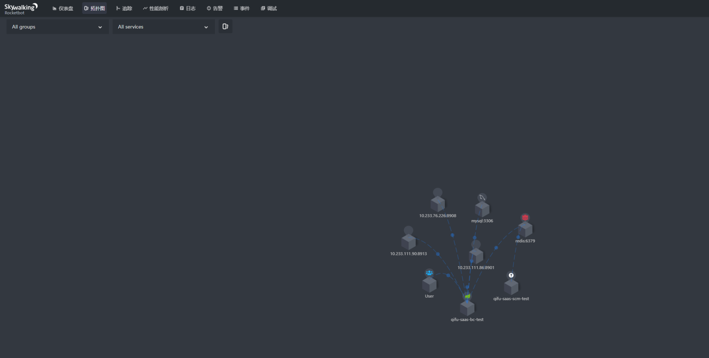

点击服务本身可以展示各种指标

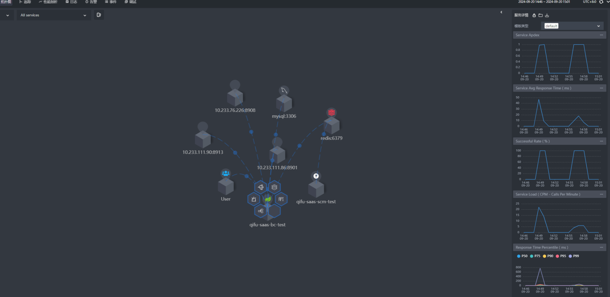


 3）追踪

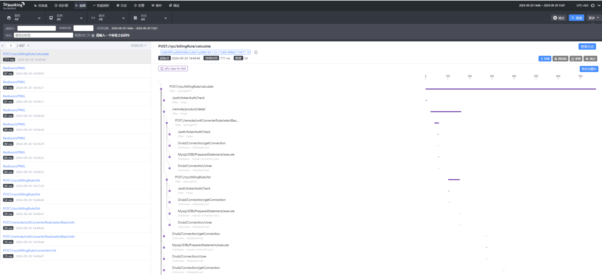

可以在此处看见刚刚访问的接口以及耗时情况(如果此时搜索不出来，需注意时间范围是否正确) 

4）性能剖析 

如果在追踪中发现了访问异常慢的接口可以通过性能剖析对其进行分析

操作步骤

1. 新建任务
2. 选择服务(如果此处未出现服务名称选择，需要刷新时间)
3. 配置端点名称（注意此处最好是从追踪里面获取端点名称，需要加上请求方式，此处还有一点需要注意的是，接口的请求路径是全路径，需要加上项目的contex-path才行）
4. 设置监控时间
5. 采样数
6. 点击新建任务请求配置的接口

 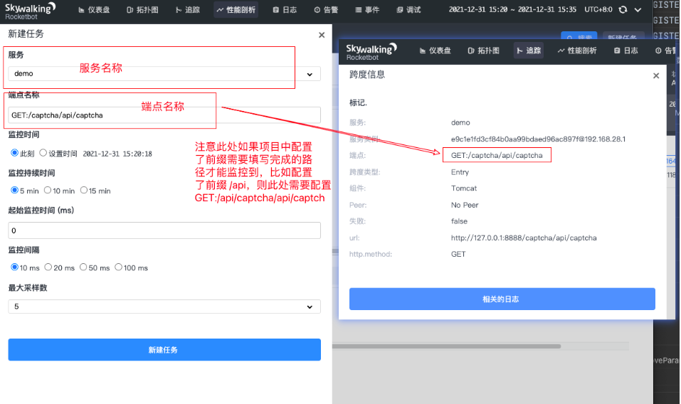

 出现如下页面（如果Sampled Traces未出现注意刷新时间【这是skywalking唯一一个不友好的地方，不管访问任务页面都要注意时间的影响】）

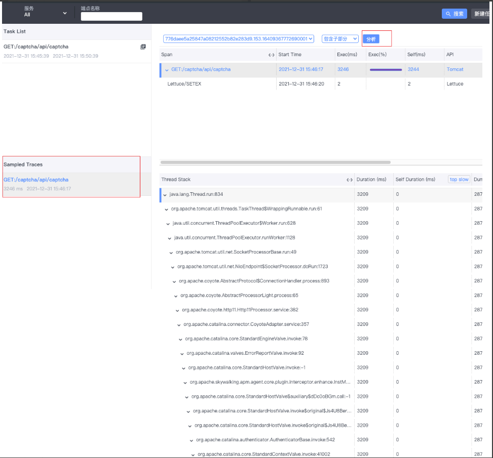

 点击分析按钮出现堆栈信息

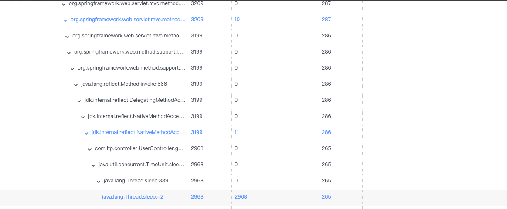

 可以看见耗时最下最长的信息。

5）日志采集

日志采集需要配合TraceId一起做，有一定的侵入性

在项目中引入jar包

注意此处由于我使用的日志框架是logback，如果使用其他日志框架需引入对应的jar包

目前支持的日志框架有：log4j、log4j2和 logback。

```
<dependency>
    <groupId>org.apache.skywalking</groupId>
    <artifactId>apm-toolkit-logback-1.x</artifactId>
    <version>${apm-toolkit.version}</version>
</dependency>
<dependency>
    <groupId>org.apache.skywalking</groupId>
    <artifactId>apm-toolkit-trace</artifactId>
    <version>${apm-toolkit.version}</version>
</dependency>
```


日志数据格式化

```
<!--日志文件输出格式-->
<encoder class="ch.qos.logback.core.encoder.LayoutWrappingEncoder">
    <layout class="org.apache.skywalking.apm.toolkit.log.logback.v1.x.TraceIdPatternLogbackLayout">
        <pattern>
            %d{yyyy-MM-dd HH:mm:ss.SSS} [%ip] [ %thread ] - [ %-5level ] [ %logger{50} : %line ] - [%tid] - %msg%n
        </pattern>
    </layout>
    <charset>UTF-8</charset> <!-- 设置字符集 -->
</encoder>
```


日志采集

```
<!-- skywalking日志收集 -->
    <appender name="skywalking-log" class="org.apache.skywalking.apm.toolkit.log.logback.v1.x.log.GRPCLogClientAppender">
        <encoder class="ch.qos.logback.core.encoder.LayoutWrappingEncoder">
            <layout class="org.apache.skywalking.apm.toolkit.log.logback.v1.x.mdc.TraceIdMDCPatternLogbackLayout">
                <pattern>%d{yyyy-MM-dd HH:mm:ss.SSS}  [%ip] %thread %logger %level - [%tid] %msg %n</pattern>
            </layout>
        </encoder>
    </appender>
```


完整配置文件

logback-spring.xml

```
<?xml version="1.0" encoding="UTF-8"?>
<configuration scan="true" scanPeriod="10 seconds">
    <!-- 定义日志的根目录 -->
    <property name="LOG_HOME" value="logs"/>
    <!-- 定义日志文件名称 -->
    <!--    <property name="appName" value="${}"/>-->
    <springProperty scope="context" name="APP_NAME" source="spring.application.name"/>
    <!-- 彩色日志 -->
    <!-- 彩色日志依赖的渲染类 -->
    <conversionRule conversionWord="clr" converterClass="org.springframework.boot.logging.logback.ColorConverter"/>
    <conversionRule conversionWord="wex"
                    converterClass="org.springframework.boot.logging.logback.WhitespaceThrowableProxyConverter"/>
    <conversionRule conversionWord="wEx"
                    converterClass="org.springframework.boot.logging.logback.ExtendedWhitespaceThrowableProxyConverter"/>
    <!-- 彩色日志格式 -->
    <property name="CONSOLE_LOG_PATTERN"
              value="${CONSOLE_LOG_PATTERN:-%clr(%d{yyyy-MM-dd HH:mm:ss.SSS}){faint} %clr(${LOG_LEVEL_PATTERN:-%5p}) %clr(${PID:- }){magenta} %clr(---){faint} %clr([%15.15t]){faint} %clr(%-40.40logger{39}){cyan} - [%tid] - %clr(:){faint}  %m%n${LOG_EXCEPTION_CONVERSION_WORD:-%wEx}}"/>
  
    <!-- ch.qos.logback.core.ConsoleAppender 表示控制台输出 -->
    <appender name="stdout" class="ch.qos.logback.core.ConsoleAppender">
        <encoder class="ch.qos.logback.core.encoder.LayoutWrappingEncoder">
            <layout class="org.apache.skywalking.apm.toolkit.log.logback.v1.x.TraceIdPatternLogbackLayout">
                <pattern>${CONSOLE_LOG_PATTERN}</pattern>
            </layout>
            <!-- 设置字符集 -->
            <charset>UTF-8</charset>
        </encoder>
    </appender>
  
    <!-- 滚动记录文件，先将日志记录到指定文件，当符合某个条件时，将日志记录到其他文件 -->
    <appender name="appLogAppender" class="ch.qos.logback.core.rolling.RollingFileAppender">
        <!--日志文件输出格式-->
        <encoder class="ch.qos.logback.core.encoder.LayoutWrappingEncoder">
            <layout class="org.apache.skywalking.apm.toolkit.log.logback.v1.x.TraceIdPatternLogbackLayout">
                <pattern>
                    %d{yyyy-MM-dd HH:mm:ss.SSS} [ %thread ] - [ %-5level ] [ %logger{50} : %line ] - [%tid] - %msg%n
                </pattern>
            </layout>
            <charset>UTF-8</charset> <!-- 设置字符集 -->
        </encoder>
  
        <rollingPolicy class="ch.qos.logback.core.rolling.TimeBasedRollingPolicy">
            <!--
            滚动时产生的文件的存放位置及文件名称 %d{yyyy-MM-dd}：按天进行日志滚动
            %i：当文件大小超过maxFileSize时，按照i进行文件滚动
            -->
            <fileNamePattern>${LOG_HOME}/${APP_NAME}-%d{yyyy-MM-dd}-%i.log</fileNamePattern>
            <!--
            可选节点，控制保留的归档文件的最大数量，超出数量就删除旧文件。假设设置每天滚动，
            且maxHistory是365，则只保存最近365天的文件，删除之前的旧文件。注意，删除旧文件是，
            那些为了归档而创建的目录也会被删除。
            -->
            <MaxHistory>31</MaxHistory>
            <timeBasedFileNamingAndTriggeringPolicy class="ch.qos.logback.core.rolling.SizeAndTimeBasedFNATP">
                <maxFileSize>30MB</maxFileSize>
            </timeBasedFileNamingAndTriggeringPolicy>
        </rollingPolicy>
    </appender>
  
    <!-- skywalking日志收集 -->
    <appender name="skywalking-log" class="org.apache.skywalking.apm.toolkit.log.logback.v1.x.log.GRPCLogClientAppender">
        <encoder class="ch.qos.logback.core.encoder.LayoutWrappingEncoder">
            <layout class="org.apache.skywalking.apm.toolkit.log.logback.v1.x.mdc.TraceIdMDCPatternLogbackLayout">
                <pattern>%d{yyyy-MM-dd HH:mm:ss.SSS}  %thread %logger %level - [%tid] %msg %n</pattern>
            </layout>
        </encoder>
    </appender>
    <!--
    root与logger是父子关系，没有特别定义则默认为root，任何一个类只会和一个logger对应，
    要么是定义的logger，要么是root，判断的关键在于找到这个logger，然后判断这个logger的appender和level。
    -->
    <springProfile name="dev,local,test">
        <root level="info">
            <appender-ref ref="stdout"/>
            <appender-ref ref="appLogAppender"/>
            <appender-ref ref="skywalking-log"/>
        </root>
    </springProfile>
    <springProfile name="prod">
        <root level="info">
            <appender-ref ref="appLogAppender"/>
        </root>
    </springProfile>
</configuration>
```


待一切配置好后(重启项目)需要等待3~5min就可以看见日志信息了

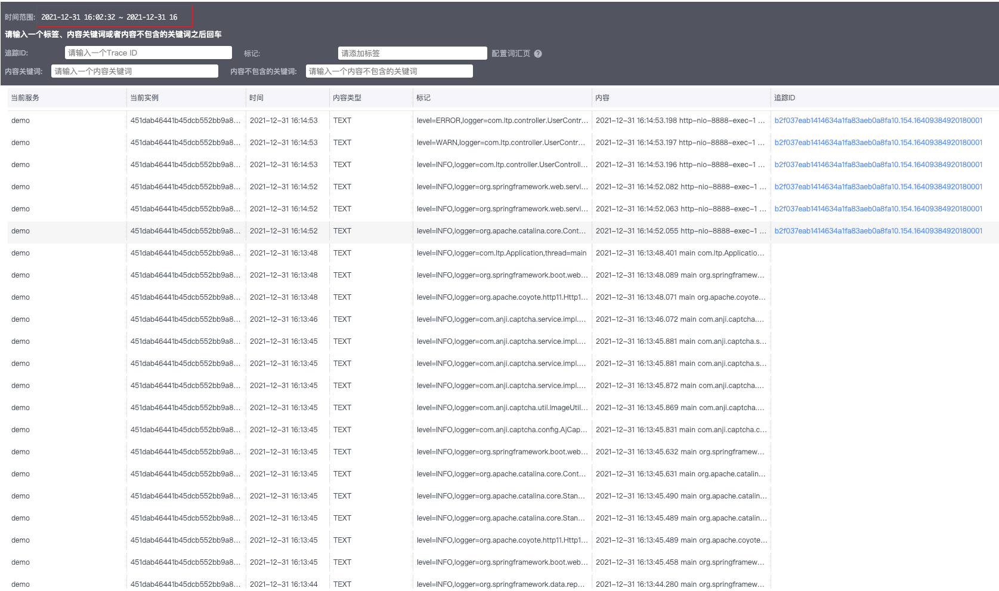

注意时间范围 


TraceId获取

配置了一个全局异常处理器，如果发生异常则返回TraceId,然后用该TraceId去查找相应的日志与链路信息

```
@ExceptionHandler(value = Exception.class)
@Trace
public ResponseModel handleException(Exception e) {
    log.error("异常堆栈=>", e);
    return ResponseModel.errorMsg(RepCodeEnum.BLANK_ERROR, TraceContext.traceId());
}
```


 定位链路

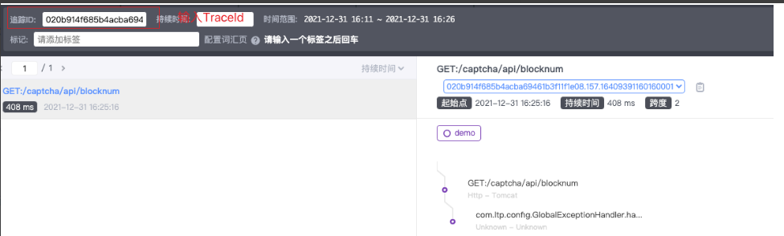

点击相关日志进入日志详情

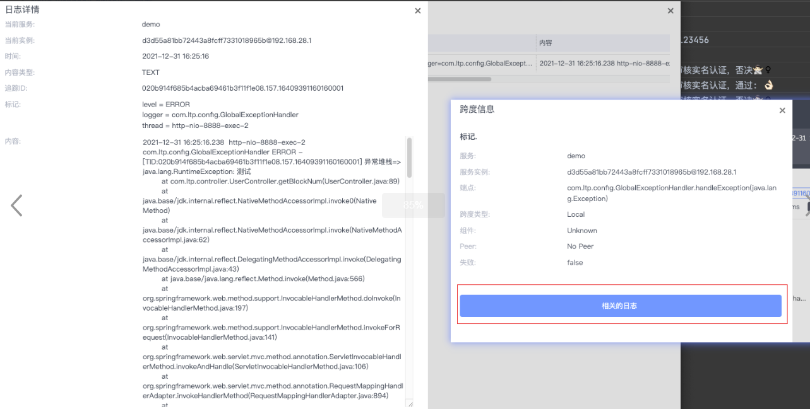

 注意：日志的上传需要时间，不能立马获取到实时日志

#### k8s部署skywalking

##### Elasticsearch 部署

`Skywalking OAP Server`会将数据存储到 Elasticsearch 中，并通过 Elasticsearch 进行数据查询和分析，这里直接使用已经部署好的es集群。

##### 数据初始化Job（init-job.yaml）

```
apiVersion: batch/v1
kind: Job
metadata:
  name: "skywalking-es-init"
  namespace: skywalking
  labels:
    app: skywalking-job
spec:
  template:
    metadata:
      name: "skywalking-es-init"
      labels:
        app: skywalking-job
    spec:
      serviceAccountName: skywalking-oap
      restartPolicy: Never
      initContainers:
      - name: wait-for-elasticsearch
        image: busybox:1.30
        imagePullPolicy: IfNotPresent
        command: ['sh', '-c', 'for i in $(seq 1 60); do nc -z -w3 elasticsearch.qifu-middleware.svc 9200 && exit 0 || sleep 5; done; exit 1']
      containers:
      - name: oap
        image: skywalking.docker.scarf.sh/apache/skywalking-oap-server:9.7.0
        imagePullPolicy: IfNotPresent
        env:
        - name: JAVA_OPTS
          value: "-Dmode=init -Xmx2g -Xms2g"
        - name: SW_STORAGE
          value: elasticsearch
        - name: SW_STORAGE_ES_CLUSTER_NODES
          value: "elasticsearch.qifu-middleware.svc:9200"            # 指定es地址，由于在k8s内部访问需要通过https协议，这里就指定外部地址，需要pods可以解析此地址。

```

##### 部署OAP Server

rbac.yaml

```
apiVersion: v1
kind: ServiceAccount
metadata:
  labels:
    app: skywalking
  name: skywalking-oap
  namespace: skywalking
---
kind: ClusterRole
apiVersion: rbac.authorization.k8s.io/v1
metadata:
  name: skywalking
  namespace: skywalking
  labels:
    app: skywalking
rules:
- apiGroups: [""]
  resources: ["pods", "endpoints", "services", "nodes"]
  verbs: ["get", "watch", "list"]
- apiGroups: ["extensions"]
  resources: ["deployments", "replicasets"]
  verbs: ["get", "watch", "list"]
---
apiVersion: rbac.authorization.k8s.io/v1
kind: ClusterRoleBinding
metadata:
  name: skywalking
  namespace: skywalking
  labels:
    app: skywalking
roleRef:
  apiGroup: rbac.authorization.k8s.io
  kind: ClusterRole
  name: skywalking
subjects:
- kind: ServiceAccount
  name: skywalking-oap
  namespace: skywalking
```

dp.yaml

```
apiVersion: apps/v1
kind: Deployment
metadata:
  labels:
    app: oap
  name: oap
  namespace: skywalking
spec:
  replicas: 1
  selector:
    matchLabels:
      app: oap
  template:
    metadata:
      labels:
        app: oap
    spec:
      serviceAccountName: skywalking-oap
      initContainers:
      - name: wait-for-elasticsearch
        image: busybox:1.30
        imagePullPolicy: IfNotPresent
        command: ['sh', '-c', 'for i in $(seq 1 60); do nc -z -w3 elasticsearch.qifu-middleware.svc 9200 && exit 0 || sleep 5; done; exit 1']
      containers:
      - name: oap
        image: skywalking.docker.scarf.sh/apache/skywalking-oap-server:9.7.0
        imagePullPolicy: IfNotPresent
        livenessProbe:
          tcpSocket:
            port: 12800
          initialDelaySeconds: 15
          periodSeconds: 20
        readinessProbe:
          tcpSocket:
            port: 12800
          initialDelaySeconds: 15
          periodSeconds: 20
        ports:
        - containerPort: 11800
          name: grpc
        - containerPort: 1234
          name: prometheus-port
        - containerPort: 12800
          name: rest
        env:
        - name: JAVA_OPTS
          value: "-Dmode=no-init -Xmx2g -Xms2g"
        - name: TZ                                       # 设置时区
          value: Asia/Shanghai
        - name: SW_OTEL_RECEIVER
          value: "default"
        - name: SW_ENABLE_UPDATE_UI_TEMPLATE             # 开启试图可编辑，默认为：false
          value: "true"
        - name: SW_CLUSTER
          value: kubernetes
        - name: SW_CLUSTER_K8S_NAMESPACE
          value: "skywalking"
        - name: SW_CLUSTER_K8S_LABEL
          value: "app=oap"
        - name: SKYWALKING_COLLECTOR_UID
          valueFrom:
            fieldRef:
              fieldPath: metadata.uid
        - name: SW_STORAGE                               # 使用es作为存储
          value: elasticsearch
        - name: SW_STORAGE_ES_CLUSTER_NODES              # es地址
          value: "elasticsearch.qifu-middleware.svc:9200"
        - name: SW_TELEMETRY
          value: "prometheus"
```

svc.yaml

```
apiVersion: v1
kind: Service
metadata:
  name: oap-svc
  namespace: skywalking
  labels:
    app: oap
spec:
  type: ClusterIP
  ports:
  - port: 11800
    name: grpc
  - port: 1234
    name: prometheus-port
  - port: 12800
    name: rest
  selector:
    app: oap
```

按以下顺序执行：

```
kubectl apply -f rbac.yaml
kubectl apply -f init-job.yaml
kubectl apply -f dp.yaml
kubectl apply -f svc.yaml
```

**注意，需要等init-job.yaml执行成功之后再执行dp.yaml，否则启动oap服务的时候会报错：table: alarm_record does not exist. OAP is running in 'no-init' mode, waiting... retry 3s later.**

init-job.yaml执行成功如图所示：

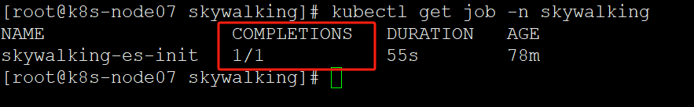


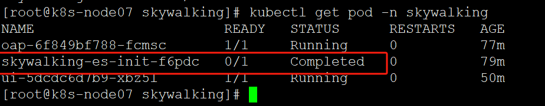

（k8s集群重启后可能还会出现报错table: alarm_record does not exist. OAP is running in 'no-init' mode, waiting... retry 3s later.，把skywalking-es-init的job删掉再重新kubectl apply -f init-job.yaml，初始化成功后再启动oap就行）

##### 部署UI

ui-dp.yaml

```

apiVersion: apps/v1
kind: Deployment
metadata:
  name: ui
  namespace: skywalking
  labels:
    app: ui
spec:
  replicas: 1
  selector:
    matchLabels:
        app: ui
  template:
    metadata:
      labels:
        app: ui
    spec:
      affinity:
      containers:
      - name: ui
        image: skywalking.docker.scarf.sh/apache/skywalking-ui:9.7.0
        imagePullPolicy: IfNotPresent
        ports:
        - containerPort: 8080
          name: page
        env:
        - name: SW_OAP_ADDRESS
          value: http://oap-svc:12800            # 根据oap的svc一致
```

ui-svc.yaml

```
apiVersion: v1
kind: Service
metadata:
  labels:
    app: ui
  name: ui-svc
  namespace: skywalking
spec:
  type: ClusterIP
  ports:
    - port: 80
      targetPort: 8080
      protocol: TCP
  selector:
    app: ui
```

ing.yaml

```
apiVersion: networking.k8s.io/v1
kind: Ingress
metadata:
  annotations:
    kubernetes.io/ingress.class: nginx
    kubesphere.io/creator: admin
    nginx.ingress.kubernetes.io/auth-realm: '''Authentication Required - admin'''
    nginx.ingress.kubernetes.io/auth-secret: skywalking-auth
    nginx.ingress.kubernetes.io/auth-type: basic
  generation: 1
  name: skywalking-web
  namespace: skywalking
spec:
  rules:
  - host: skywalking.keyfil.com
    http:
      paths:
      - backend:
          service:
            name: ui-svc
            port:
              number: 80
        path: /
        pathType: ImplementationSpecific
```

skywalking的ui界面默认没有访问控制，可以通过下面基于方案，实现自定义服务的外部验证：

安装httpd-tools：

```
yum install -y httpd-tools
```

输入密码：

```
htpasswd -c auth admin
```


生成文件auth，利用此文件进行创建secret

```
kubectl -n skywalking create secret generic skywalking-auth --from-file=auth
```

**这里有个坑，经过测试，在创建secret之前通过htpasswd工具生成的记录用户名密码的文件的文件名，必须叫auth，不然经过后续的一顿操作，最终访问的结果会报503 Service Temporarily Unavailable，这与传统方式配置nginx的basic auth是不同的，可能在源码中将此参数硬编码了，具体原因没有深究。**

部署服务：

```
kubectl apply -f ui-dp.yaml
kubectl apply -f ui-svc.yaml
kubectl apply -f ing.yaml
```

把skywalking.keyfil.com域名解析到对应的ingress-nginx后，访问skywalking的UI界面就行：

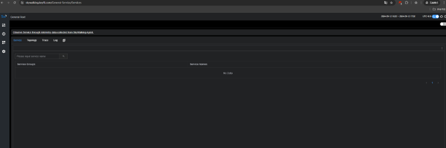