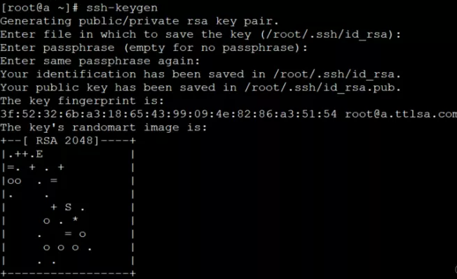
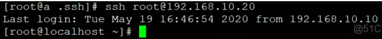

为了保证一台Linux主机的安全，所以我们每个主机登录的时候一般我们都设置账号密码登录。但是很多时候为了操作方便，我们都通过设置SSH免密码登录。

<!--more-->

### 环境：

主机1（充当跳板机）：
版本：CentOS6.5
IP地址：192.168.10.10

主机2（充当线上服务器）：
版本：CentOS7
IP地址：192.168.10.20

### 实践

主机1上操作：
生成密钥：

```
[root@a ~]# ssh-keygen
```



把公钥推到主机2上：

	[root@a .ssh]# ssh-copy-id -i id_rsa.pub root@192.168.10.20
（或者直接把 id_rsa.pub里的内容直接拷贝到主机2的用户家目录里的.ssh/authorized_keys，给600的权限。）


最后直接在主机1上登录到主机2上：


