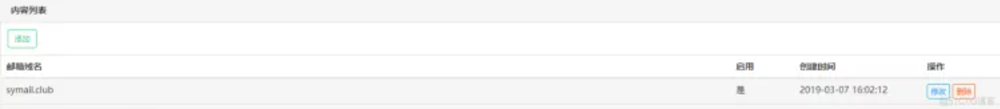

随着移动互联网的普及，邮件服务使用的场景越来越少。但是注册帐号的时候，还是需要邮箱地址。市面上免费的邮箱很多，不过一般需要绑定手机号，如果想在同一个邮箱服务商那注册多个邮箱帐号，需要准备多个手机号，这非常的烦人。接下来我们自己动手搭建邮件服务器吧。

<!--more-->

### 所需配置

搭建一个邮箱服务器,并不是无成本的.我们需要以下硬件即可

> 云服务器
>  域名

### 进入教程

主要分以下步骤：

> 购买云服务器Linux和域名
> 安装xshell和xftp
> 在Linux环境下安装EwoMail
> 解析域名
> 配置EwoMail（非常重要）
> 测试WebMail
> 邮件发送测试

### 购买云服务器和域名

 [云服务器购买](https://cloud.tencent.com/act/campus?fromSource=gwzcw.1129405.1129405.1129405)

 [域名购买](https://buy.cloud.tencent.com/domain?from=console)

### 安装xshell和xftp

这两个软件是用来玩Linux的,通俗点的解释一下这两个软件是用来干嘛的：

> xshell是用来操作Linux服务器的,和cmd控制的输入命令式相似；
> xftp是用来传输文件的,你也可以理解为手机的usb数据传输线,它可以让本地电脑和云服务器交换数据,因为是可视化界面,所以非常简单；


官网安装地址： [xshell和xftp下载](https://www.netsarang.com/zh/free-for-home-school/)
不出意外在你邮箱里,会收到两封附有下载链接的邮件,之后就请自行下载安装。

### 安装EwoMail

在第三步开始前,请检查你的xshell是否能打开,然后你还需要两个信息：

云服务器的公网IP和登录密码：


如果没问题,我们就开始使用xshell工具配置EwoMail了：

**1.打开xshell,连接云服务器**


**2.安裝EwoMail**

这里按照官方文档的步骤来：

关闭selinux

```
vi /etc/sysconfig/selinux
SELINUX=enforcing 改为 SELINUX=disabled 
```

小白指令：修改完之后,按键盘ESC,再按键盘 ：,输入wq ,回车；


**3.设置主机名**

```
#mail.symail.club 换成 mail.你的域名 
hostnamectl set-hostname mail.symail.club
```

  修改hosts

```
vi /etc/hosts
#把symail.club 全换成你的域名
```

**4.执行安装**

```
yum -y install git
cd /root
git clone https://github.com/gyxuehu/EwoMail.git
cd /root/EwoMail/install
#下面的symail.club请换成你注册的域名
sh ./start.sh symail.club
```

等待安装,大概10分钟左右,

### 解析域名

在解析域名之前,先确保你之前是安装成功的,怎么确认呢？很简单,你只需要访问以下,两个端口即可。

> 8000端口：即WebMail页面, 请在浏览器中输入 你云服务器的 公网IP：8000 即可, 如http://129.123.123.123:8000/
> 8010端口：即邮件管理后台, 地址同上,将那个8000改成8010即可。

如果你能够成功正确访问,那说明你之前三步,已经成功了,但是别高兴的太早,下面两步,是非常需要细心的。

**腾讯云的25端口解封**
25端口是发送邮件的关键,我们需要前往腾讯云->我的域名中


点击进入25端口解封,进行解封即可。
**解析域名**


### 配置

登录ewomail的后台管理系统，第四步有提到过后台系统的访问。

```
管理员默认账号：admin
默认密码：ewomail123
```

登录成功后,进入邮件系统设置：


将框起来的全换成你的域名。

换完之后,开始添加邮箱账号,邮箱管理>域名添加：



添加完你的域名之后,邮箱管理>邮箱添加：


如果你都按照以上要求完成了配置,那么我们的EwoMail，已经完成了百分之90%了。
接下来我们测试一下,是否能够连上webmail

### 测试WebMail

我们进入 您的域名或IP:8000端口,访问WebMail，进入之后是这个也页面：


输入你在第五步,添加的邮箱账号。

接下来，可能会有三种错误：

> 认证失败(账号密码错误)
> 域不允许(域名解析错误)
> 无法连接服务器（域名解析中的IP地址可能填错了）

如果你没有以上错误,并且成功登录了,那么接下来进行发收邮件测试。

### 邮件收发测试

发送一封邮件给你其他邮箱：


如果发送成功,那么恭喜你已经成功了95%,如果提示无法连接服务器,那么请回到第二步,修改你的hosts。

给自己邮箱发一封邮件：

如果收件也成功了,那么恭喜你，你的EwoMail，已经搭建完成了。


本文章主要是介绍安装教程,实现效果即可,如果需要更深入了解EwoMail： [EwoMail官方文档](http://doc.ewomail.com/docs/ewomail/changguipeizhi)

