有时我们需要在虚拟机中安装个 **Win10** 系统做测试使用，如果使用原版镜像不仅体积大、安装慢，而且占用资源也很多。因此我们常常会选择第三方封装的系统了，可以一键部署，开箱即用。然而，第三方封装的镜像一般是 **wim** 或者 **esd** 格式的，用 **WMware** 是无法直接安装的。本文介绍如何借助 **PE** 系统来进行安装。

<!--more-->

#### 制作系统镜像

（1）这里我们准备的 **Win10** 镜像是 **esd** 格式的，首先要将其转换成 **iso** 格式的。我们下载一个 **UltraISO** 软件，启动后选择“**文件**”->“**新建**”->“**UDF DVD映像**”：

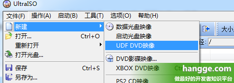

（2）找到我们的 **esd** 格式镜像，将其添加进来：

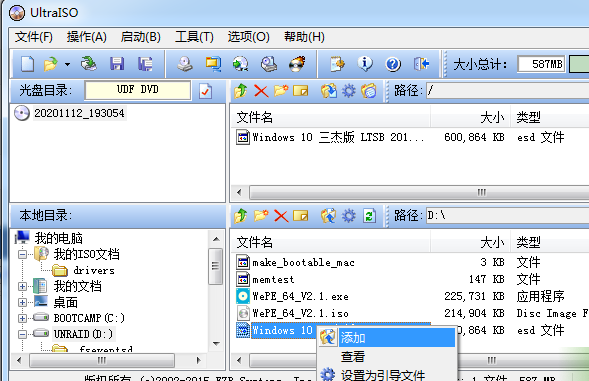

（3）点击保存按钮，选择保存路径，点击生成，即可生成 **iso** 镜像。

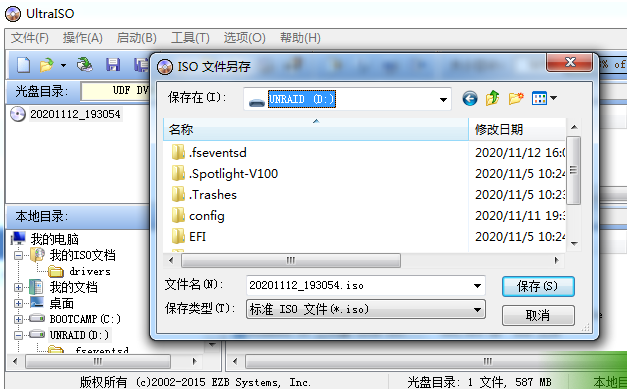

#### 制作 PE 镜像

（1）这里我使用的是“**微 PE 工具箱**”，首先到其官网（[点击访问](http://www.wepe.com.cn/download.html)）将程序下载到本地：

（2）打开微 **PE** 工具箱，选择右下角光盘图标：

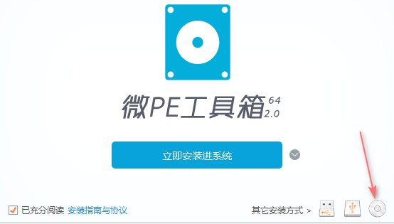

（3）选择 **PE** 镜像保存路径，点击“**立即生成 ISO**”，得到 **PE** 镜像 **iso** 文件：

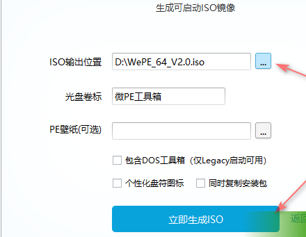

#### 创建虚拟机

（1）因为我这次安装的镜像是 **64** 位的 **win10**，那么就创建一个 **64** 位的 **win10** 虚拟机，虚拟机 **CD/DVD** 选项选择我们准备好的 **PE** 镜像：

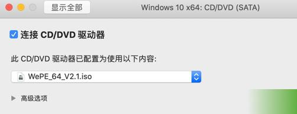

（2）开启虚拟机，第一个是高分辨率，第二个是低分辨率 **1024\*768**，这里我们选第二个：

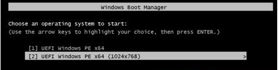

#### 创建磁盘分区

（1）进入 **PE** 系统后我们会发现目前还看不到分配给虚拟机的磁盘空间，我们运行桌面上的“**分区助手(无损)**”程序。

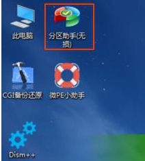

（2）启动后选择硬盘，然后点击“**转化成GPT硬盘**”按钮开始转换：

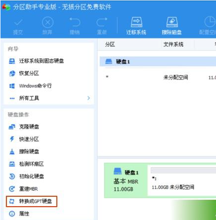

（3）转化后再次选中硬盘，点击左侧的“**快速分区**”按钮：

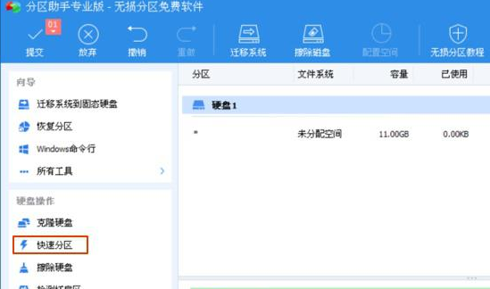

（4）在弹出的对话框中将分区数改成 **1**，硬盘类型设置为 **GPT**，最后点击“**执行**”按钮开始分区。

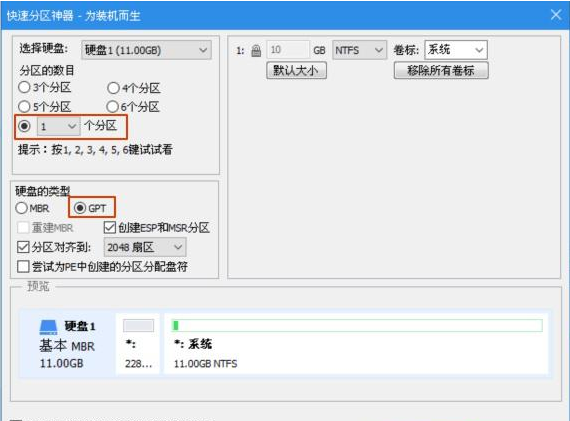

#### 安装系统

（1）将虚拟机的“**CD/DVD 驱动器**”设置成我们第一步制作的系统镜像：

（2）然后打开 **PE** 系统桌面的“**Windows安装器**”，第一个选择栏选择我们通过 **CD** 驱动加载进来的系统镜像，第二个引导驱动器位置不动，第三个安装磁盘位置选刚才制作的分区。然后点击开始安装。

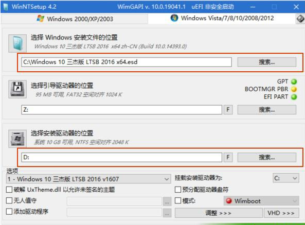

（3）安装完毕后，关闭虚拟机，然后再开启虚拟机，就会进入到系统安装界面。

（4）安装完毕后，就可以使用了。

