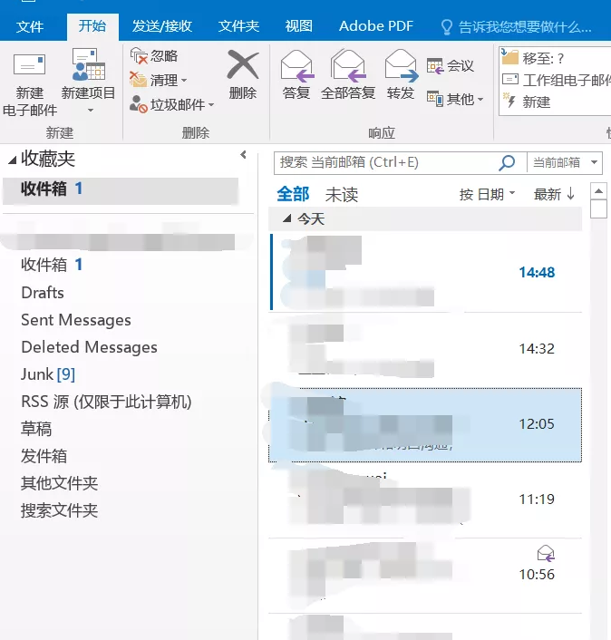
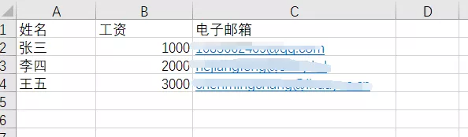
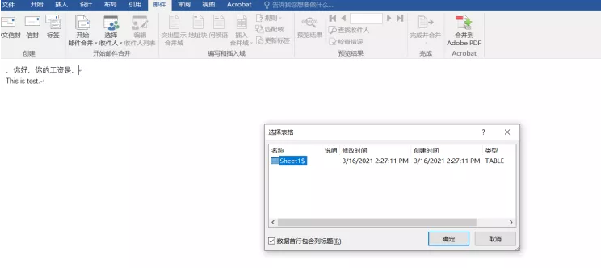
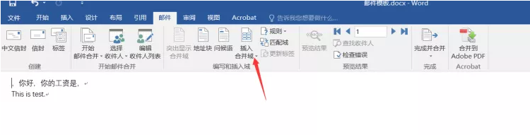
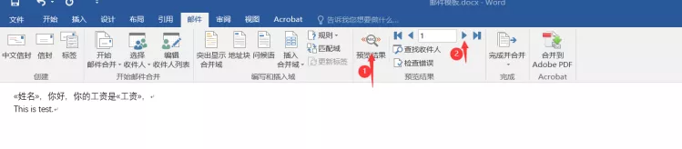
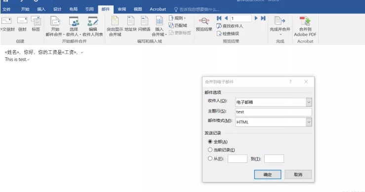

这里介绍运用office办公软件实现一对一邮件群发功能，也就是说你群发的邮件里面即使有好几十个收件人，收件人收到的你的邮件 他只会看到你的邮件只是发给他一个人，其余的收件人，他是无法看到的，所以邮件是一对一发送的。

<!--more-->

1.在Outlook登录自己要发送邮件的邮箱账号:

2.打开Word文档，选择邮件-开始合并邮件–电子邮件：

3.编写邮件内容：

4.新建Excel表：填好变量:

5.回到Word文档，关联刚创建的Excel表：

在Word文档中选择邮件–选择收件人–使用现有列表
然后在弹出框中选择刚刚新建的Excel表格，再选Sheet1

6.把光标停在需要使用变量的地方，点击插入合并域，选择需要插入的变量:

可以点击预览效果查看效果:

7.选择右侧的 完成并合并–发送电子邮件。
在弹出框中选择好收件人（Excel表中的邮箱地址），填好主题，单击确定，便可将邮件群发至刚刚在Excel表中填写好的邮箱地址。

