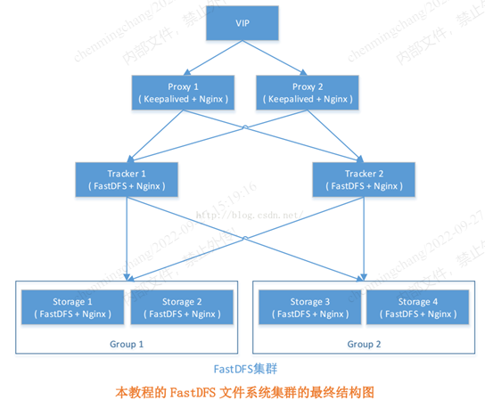
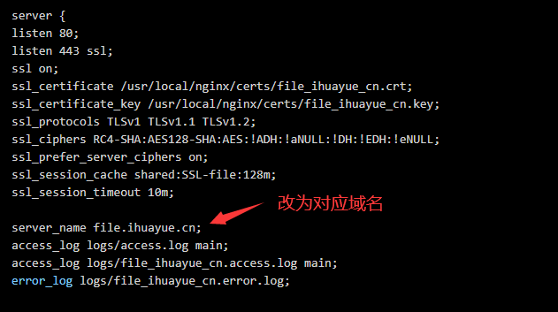
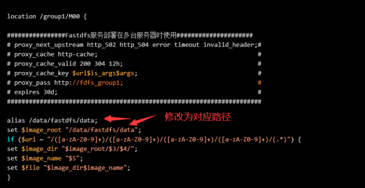

FastDFS是用c语言编写的一款开源的分布式文件系统。FastDFS为互联网量身定制，充分考虑了冗余备份、负载均衡、线性扩容等机制，并注重高可用、高性能等指标，使用FastDFS很容易搭建一套高性能的文件服务器集群提供文件上传、下载等服务。

<!--more-->



Storage安装:

```
wget https://github.com/happyfish100/fastdfs/archive/V5.05.tar.gz 
tar -zxf V5.05.tar.gz 
cd fastdfs-5.05/
./make.sh 
./make.sh install
mkdir -p /data/fastdfs
sed -i 's#/usr/local/bin/#/usr/bin/#g' /etc/init.d/fdfs_storaged 
cd /etc/fdfs/
cp storage.conf.sample storage.conf
```


修改配置：

```
vi storage.conf
```

参考如下参数：

```
[root@localhost fdfs]# egrep -v "^$|#" storage.conf
```

```
disabled=false
group_name=group1
bind_addr=
client_bind=true
port=23000
connect_timeout=30
network_timeout=60
heart_beat_interval=30
stat_report_interval=60
base_path=/data/fastdfs
max_connections=256
buff_size = 256KB
accept_threads=1
work_threads=4
disk_rw_separated = true
disk_reader_threads = 1
disk_writer_threads = 1
sync_wait_msec=50
sync_interval=0
sync_start_time=00:00
sync_end_time=23:59
write_mark_file_freq=500
store_path_count=1
store_path0=/data/fastdfs
subdir_count_per_path=256
tracker_server=10.27.95.39:22122
tracker_server=10.27.95.168:22122
log_level=info
run_by_group=
run_by_user=
allow_hosts=*
file_distribute_path_mode=0
file_distribute_rotate_count=100
fsync_after_written_bytes=0
sync_log_buff_interval=10
sync_binlog_buff_interval=10
sync_stat_file_interval=300
thread_stack_size=512KB
upload_priority=10
if_alias_prefix=
check_file_duplicate=0
file_signature_method=hash
key_namespace=FastDFS
keep_alive=0
use_access_log = false
rotate_access_log = false
access_log_rotate_time=00:00
rotate_error_log = false
error_log_rotate_time=00:00
rotate_access_log_size = 0
rotate_error_log_size = 0
log_file_keep_days = 0
file_sync_skip_invalid_record=false
use_connection_pool = false
connection_pool_max_idle_time = 3600
http.domain_name=
http.server_port=8080
```

启动storage服务：

```
[root@HY-DFS-01 fdfs]# /etc/init.d/fdfs_storaged start
Starting FastDFS storage server:
```

查看程序运行情况：

```
[root@HY-DFS-01 fdfs]# lsof -i :23000
COMMAND     PID USER   FD   TYPE DEVICE SIZE/OFF NODE NAME
fdfs_stor 10093 root    5u  IPv4 133350      0t0  TCP *:inovaport1 (LISTEN)
fdfs_stor 10093 root   20u  IPv4 133361      0t0  TCP iZbp13mxkrdvotpxv3btaoZ:inovaport1->10.27.96.119:36215 (ESTABLISHED)
```

```
[root@HY-DFS-01 fdfs]# netstat -tunlp|grep 23000
tcp        0      0 0.0.0.0:23000               0.0.0.0:*                   LISTEN      10093/fdfs_storaged
```

```
[root@HY-DFS-01 fdfs]# ps -ef|grep fdfs
root     10093     1  0 16:39 ?        00:00:00 /usr/bin/fdfs_storaged /etc/fdfs/storage.conf
root     10111  9489  0 16:40 pts/0    00:00:00 grep fdfs
```


安装nginx服务：

所需文件：

```
[root@HY-DFS-01 tools]# ll
total 3884
drwxrwxr-x 10 root root    4096 Nov 30 13:45 fastdfs-5.05
-rw-r--r--  1 root root   20335 Dec  1 11:41 fastdfs-nginx-module-master.zip
drwxr-xr-x  5 root root    4096 Nov 29 15:42 libfastcommon
-rw-r--r--  1 root root  751033 Nov 29 15:31 libfastcommon.tar.gz
-rw-r--r--  1 root root  805253 Dec  1 13:44 nginx-1.6.3.tar.gz
-rw-r--r--  1 root root 2041593 Dec  1 11:41 pcre-8.37.tar.gz
drwxr-xr-x  2 root root    4096 Dec  1 11:42 scripts
-rw-r--r--  1 root root  336001 Nov 14 16:53 V5.05.tar.gz
```


安装依赖包：

```
yum -y install gcc gcc-c++ autoconf libjpeg libjpeg-devel libpng libpng-devel freetype freetype-devel libxml2 libxml2-devel zlib zlib-devel glibc glibc-devel glib2 glib2-devel bzip2 bzip2-devel ncurses ncurses-devel curl curl-devel e2fsprogs e2fsprogs-devel krb5 krb5-devel libidn libidn-devel openssl openssl-devel openldap openldap-devel nss_ldap openldap-clients openldap-servers
```

安装nginx需要安装以下依赖包：

```
yum -y install pcre-devel zlib-devel make
```

创建用户：

```
useradd -u 602 -s /sbin/nologin -M nginx
mkdir -p /usr/local/nginx/tmp/{client,proxy,fcgi}
```


解压安装包：

```
tar -zxf pcre-8.37.tar.gz
unzip fastdfs-nginx-module-master.zip
tar -zxf nginx-1.6.3.tar.gz
cd nginx-1.6.3
```


编译:

```
./configure \
  --prefix=/usr/local/nginx \
  --user=nginx \
  --group=nginx \
  --with-http_ssl_module \
  --with-http_gzip_static_module \
  --http-client-body-temp-path=/usr/local/nginx/tmp/client/ \
  --http-proxy-temp-path=/usr/local/nginx/tmp/proxy/ \
  --http-fastcgi-temp-path=/usr/local/nginx/tmp/fcgi/ \
  --with-poll_module \
  --with-file-aio \
  --with-http_realip_module \
  --with-http_addition_module \
  --with-http_random_index_module \
  --with-pcre=/opt/tools/pcre-8.37 \
  --with-http_stub_status_module \
  --add-module=/opt/tools/fastdfs-nginx-module-master/src/
```


安装:

```
make && make install

chown -R nginx. /usr/local/nginx
cd /opt/tools/fastdfs-nginx-module-master/src/
cp mod_fastdfs.conf /etc/fdfs/ 
cp /opt/tools/fastdfs-5.05/conf/{anti-steal.jpg,http.conf,mime.types} /etc/fdfs/ 
touch /var/log/mod_fastdfs.log   
chown nginx:nginx /var/log/mod_fastdfs.log
```


修改nginx配置文件：

```
server {
listen 80;
listen 443 ssl;
ssl on;
ssl_certificate /usr/local/nginx/certs/file_yixian12580_cn.crt;
ssl_certificate_key /usr/local/nginx/certs/file_yixian12580_cn.key;
ssl_protocols TLSv1 TLSv1.1 TLSv1.2;
ssl_ciphers RC4-SHA:AES128-SHA:AES:!ADH:!aNULL:!DH:!EDH:!eNULL;
ssl_prefer_server_ciphers on;
ssl_session_cache shared:SSL-file:128m;
ssl_session_timeout 10m;

server_name file.yixian12580.cn;
access_log logs/access.log main;
access_log logs/file_yixian12580_cn.access.log main;
error_log logs/file_yixian12580_cn.error.log;

location /static {
alias /data/web/static;
index index.html index.htm;
}

location /download {
alias /data/web/download;
index index.html index.htm;
}

location /group1/M00 {
################Fastdfs服务部署在多台服务器时使用#####################
# proxy_next_upstream http_502 http_504 error timeout invalid_header;#
# proxy_cache http-cache;                                            #
# proxy_cache_valid 200 304 12h;                                     #
# proxy_cache_key $uri$is_args$args;                                 #
# proxy_pass http://fdfs_group1;                                     #
# expires 30d;                                                       #
######################################################################

alias /data/fastdfs/data;
set $image_root "/data/fastdfs/data";
if ($uri ~ "/([a-zA-Z0-9]+)/([a-zA-Z0-9]+)/([a-zA-Z0-9]+)/([a-zA-Z0-9]+)/(.*)") {
set $image_dir "$image_root/$3/$4/";
set $image_name "$5";
set $file "$image_dir$image_name";
}

if (!-f $file) {
# 关闭lua代码缓存，方便调试lua脚本
#lua_code_cache off;
content_by_lua_file "/usr/local/nginx/lua/fastdfs.lua";
#content_by_lua_file "/usr/local/nginx/lua/convert.lua";
}
# ngx_fastdfs_module;

}

location /group2/M00 {
################Fastdfs服务部署在多台服务器时使用#####################
# proxy_next_upstream http_502 http_504 error timeout invalid_header;#
# proxy_cache http-cache;                                            #
# proxy_cache_valid 200 304 12h;                                     #
# proxy_cache_key $uri$is_args$args;                                 #
# proxy_pass http://fdfs_group2;                                     #
# expires 30d;                                                       #
######################################################################

alias /data/fastdfs02/data;
set $image_root "/data/fastdfs02/data";
if ($uri ~ "/([a-zA-Z0-9]+)/([a-zA-Z0-9]+)/([a-zA-Z0-9]+)/([a-zA-Z0-9]+)/(.*)") {

set $image_dir "$image_root/$3/$4/";
set $image_name "$5";
set $file "$image_dir$image_name";
}

if (!-f $file) {
# 关闭lua代码缓存，方便调试lua脚本
#lua_code_cache off;
content_by_lua_file "/usr/local/nginx/lua/fastdfs.lua";
}

# ngx_fastdfs_module;

}

###清除缓存模块###

location ~ /purge(/.*) {
allow 127.0.0.1;
allow 10.0.77.0/24;
deny all;
proxy_cache_purge http-cache $1$is_args$args;
}

}
```


修改mod_fastdfs.conf文件（注意有两个group，Fastdfs服务部署在多台服务器时，要改成对应的group_name和 ip ）：

```
vi /etc/fdfs/mod_fastdfs.conf
```

参考如下配置：

```
connect_timeout=2
network_timeout=30
base_path=/data/fastdfs
load_fdfs_parameters_from_tracker=true
storage_sync_file_max_delay = 86400
use_storage_id = false
storage_ids_filename = storage_ids.conf
tracker_server=10.0.77.77:22122
storage_server_port=23000
group_name=group1
url_have_group_name = true
store_path_count=1
store_path0=/data/fastdfs
log_level=info
log_filename=/var/log/mod_fastdfs.log
response_mode=proxy
if_alias_prefix=
flv_support = true
flv_extension = flv
group_count = 0
```

上传文件测试：

```
[root@HY-DFS-01 ~]# fdfs_upload_file /etc/fdfs/client.conf /root/hello.txt
group1/M00/00/00/ChtgcVg_yJOAaqgGAAAADVFCBW8206.txt
```


http访问测试：

 http://10.0.77.77:8080/group1/M00/00/00/ChtgcVg_yJOAaqgGAAAADVFCBW8206.txt

开机自启动：

```
chkconfig --add fdfs_storaged
chkconfig fdfs_storaged on
echo '/usr/local/nginx/sbin/nginx' >>/etc/rc.local
```


验证：

```
[root@HY-DFS-04 ~]# chkconfig --list|grep 3:on|grep fdfs
fdfs_storaged         0:off 1:off 2:on 3:on 4:on 5:on 6:off

[root@HY-DFS-04 ~]# cat /etc/rc.local
#!/bin/sh
# This script will be executed *after* all the other init scripts.
# You can put your own initialization stuff in here if you don't
# want to do the full Sys V style init stuff.
touch /var/lock/subsys/local
/usr/sbin/ntpdate  time.nist.gov 210.72.145.44 64.147.116.229
/usr/local/nginx/sbin/nginx
```


Tracker的安装：

```
git clone https://github.com/happyfish100/libfastcommon.git 
tar -zxf libfastcommon.tar.gz
cd libfastcommon
./make.sh
./make.sh install
```

```
mkdir -p /data/fastdfs/tracker
```

```
sed -i 's#/usr/local/bin/#/usr/bin/#g' /etc/init.d/fdfs_trackerd
cd /etc/fdfs
cp tracker.conf.sample tracker.conf
```


修改配置文件：

```
vi tracker.conf
```

参考如下信息：

```
disabled=false
bind_addr=
port=22122
connect_timeout=30
network_timeout=60
base_path=/data/fastdfs/tracker
max_connections=256
accept_threads=1
work_threads=4
store_lookup=2
store_group=group2
store_server=0
store_path=0
download_server=0
reserved_storage_space = 10%
log_level=info
run_by_group=
run_by_user=
allow_hosts=*
sync_log_buff_interval = 10
check_active_interval = 120
thread_stack_size = 64KB
storage_ip_changed_auto_adjust = true
storage_sync_file_max_delay = 86400
storage_sync_file_max_time = 300
use_trunk_file = false
slot_min_size = 256
slot_max_size = 16MB
trunk_file_size = 64MB
trunk_create_file_advance = false
trunk_create_file_time_base = 02:00
trunk_create_file_interval = 86400
trunk_create_file_space_threshold = 20G
trunk_init_check_occupying = false
trunk_init_reload_from_binlog = false
trunk_compress_binlog_min_interval = 0
use_storage_id = false
storage_ids_filename = storage_ids.conf
id_type_in_filename = ip
store_slave_file_use_link = false
rotate_error_log = false
error_log_rotate_time=00:00
rotate_error_log_size = 0
log_file_keep_days = 0
use_connection_pool = false
connection_pool_max_idle_time = 3600
http.server_port=8080
http.check_alive_interval=30
http.check_alive_type=tcp
http.check_alive_uri=/status.html
```


启动tracker服务：

```
[root@hy-lb-02 fdfs]# /etc/init.d/fdfs_trackerd start
Starting FastDFS tracker server:
```

查看程序运行情况：

```
[root@hy-lb-02 fdfs]# lsof -i :22122
COMMAND     PID USER   FD   TYPE DEVICE SIZE/OFF NODE NAME
fdfs_trac 11025 root    5u  IPv4 105397      0t0  TCP *:22122 (LISTEN)
```

```
[root@hy-lb-02 fdfs]# netstat -tunlp|grep 22122
tcp        0      0 0.0.0.0:22122               0.0.0.0:*                   LISTEN      11025/fdfs_trackerd
```

```
[root@hy-lb-02 fdfs]# ps -ef|grep fdfs
root     11025     1  0 16:36 ?        00:00:00 /usr/bin/fdfs_trackerd /etc/fdfs/tracker.conf
root     11036 10358  0 16:37 pts/1    00:00:00 grep fdfs
```

图床服务如需搬迁，可在别的服务器部署完Fastdfs后，把/data/fastdfs/data/目录拷贝到新服务器上Fastdfs服务指定的路径，并修改相应配置文件的域名，ip及文件路径信息：

tracker.conf文件：

```
base_path=/data/fastdfs/tracker
```

client.conf：

```
base_path=/data/fastdfs
tracker_server=10.0.77.77:22122
```

storage.conf文件：

```
base_path=/data/fastdfs
store_path0=/data/fastdfs
tracker_server=10.0.77.77:22122
```

nginx配置文件：





mod_fastdfs.conf文件：

```
tracker_server=10.0.77.77:22122
url_have_group_name = true
store_path0=/data/fastdfs
```

