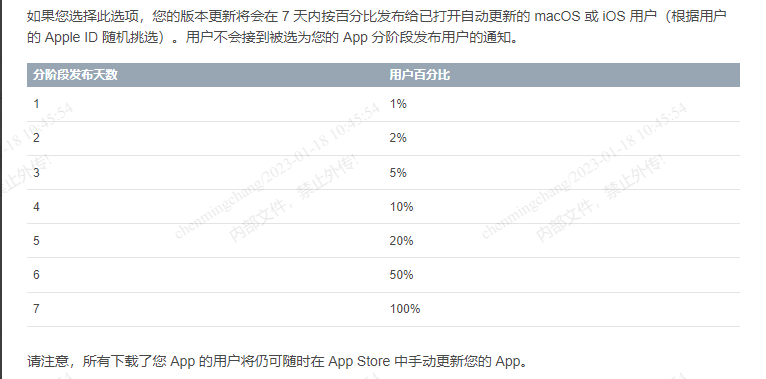

Google Play和Apple Store是海外的主流应用商店，今天详细说说一些比较冷门问题。

<!--more-->

**常见问题：**
 Google Play平台：

1. 首发没有灰度，只有全量发布
2. 无法回滚版本，只能创建新版本覆盖
3. 未灰度完创建新版本会自动暂停灰度，Google市场最新版为上一个版本
4. 灰度比例只能上升，不能降低，灰度期间有问题可暂停灰度，但已安装该版本的用户仍然是此版本，全量发布后，该版本不能再暂停
5. 灰度用户均随机选择，可选择特定地区进行灰度
6. 商店截图，文案等信息可随时修改，需审核，可能会因为包体有问题而拒绝
7. 有侵权风险，但已取得授权文件的应用，提审前可通过以下链接先提交授权文件再提审：[前往提交](https://support.google.com/googleplay/android-developer/answer/6320428?hl=zh-Hans)
8. 提审后无法撤回审核
9. 商品详情实验（A/B测试）：Google Play 上的商品详情，可以通过开展实验来找到对应用而言最富有成效的图片和本地化文本。可以针对自己的主要商品详情页面和自定义商品详情页面开展实验。对于已发布的应用，可以测试各种变体，并与目前的版本进行对比，从而根据安装数据找到效果最好的变体。
10. APP最低支持系统是4.4，下个版本的app改为最低支持系统为5.0，那4.4系统的用户无法接收相关更新通知或是查看到最新版本，查找该应用时，将会看到与他们的装置相匹配的旧版本。
11. 如需取消发布应用，需先关闭自管式发布应用。
12. Google商店发布手表包时，不会像Automotive包一样，有单独的渠道分发，手表包跟手机包是在同一渠道，所以按照Google官方文档操作加入Wear OS计划后，需要把手机包和手表包一起提审才行（同一版本，上传两个包），不然一直审核驳回。

​     iOS平台：

1. 灰度：只针对打开了自动更新的用户，手动到商店搜索都是最新版本

   App 处在分阶段发布过程中，可以选择暂停发布，总计 30 天，暂停次数没有限制。如果App 下架，当前的分阶段发布会停止，且不再对该版本可用。

​    2. 更改截图、文案等信息需创建新版本才可编辑

3. 提审后可撤回审核
3. 无法回滚版本，只能创建新版本覆盖

