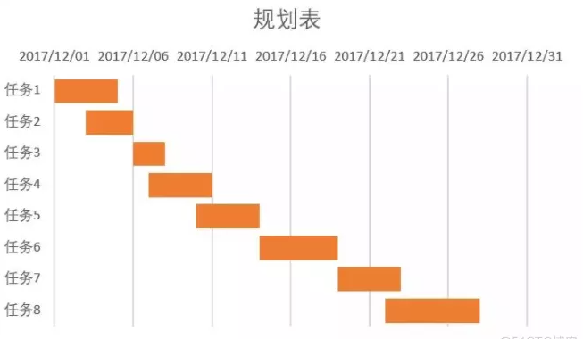
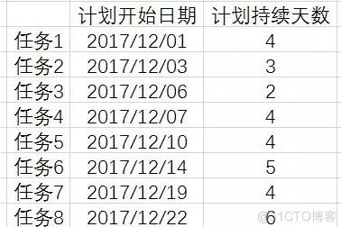
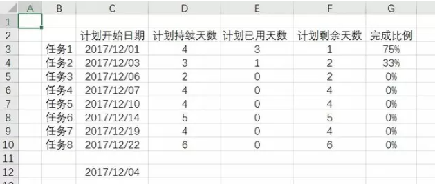

甘特图又叫横道图、条状图，以图示的方式通过活动列表和时间刻度形象地表示出任何特定项目的活动顺序与持续时间。能够直观地表明任务计划在什么时候进行，及实际进展与计划要求的对比，管理者由此可便利地弄清一项任务（项目）还剩下哪些工作要做，并可评估工作进度。

<!--more-->

## 静态

### 设置数据源

一个合格的工作进度规划，必须是要有任务开始时间以及任务持续时间的，因此在我们制作甘特图中，同样也需要这两组数据。

>建立工作进度规划表
>要求计划开始日期必须以日期格式储存
>计划持续天数必须以数字格式储存

### 插入图表

在我们excel中其实没有“甘特图”这种图表，然而我们为什么还能够用excel做出甘特图呢？在这里我们可以考虑利用其他图表，加以简单的修改，使他变成我们想要的“甘特图”。

> 选中任务、计划开始日期、计划持续天数这三列数据
> 点击插入选项卡
> 选择插入柱形图或条形图
> 在二维条形图中选择堆积条形图

### 设置排列顺序

在我们数据源中任务的先后顺序是从上往下排列的，然而我们刚刚生成的堆积条形图中，任务排列顺序却是反了过来。这样的逆序排列看起来并不是很美观，并且违背了人们从上往下阅读的习惯，因此我们需要对图表的垂直轴重新进行排列。

> 点击垂直坐标轴
> 点击右键并选择设置坐标轴格式
> 在坐标轴选项中找到“逆序类别”并且勾选它

#### 设置起始日期

我们的甘特图中持续天数是从第一天开始的，然而在刚刚生成的堆积条形图中，坐标轴边界的最小值并不是我们任务开始的这一天，因此我们需要手动设置坐标轴边界的最小值为任务开始的这一天。

> 点击水平坐标轴
> 单击右键并选择设置坐标轴格式
> 在坐标轴边界最小值中，输入我们任务开始这一天的日期敲击回车后我们发现录入的日期变为了数值，这是因为在我们的excel中所有的日期都是以数值的形式储存的（1900/1/1这天数值为1，以此类推）

### 隐藏系列

在我们甘特图中只需要保留的是持续天数这个系列，而持续天数这条橙色的系列已经能够显示出开始日期的值，那么我们可以利用系列的填充格式，隐藏蓝色这条开始日期的系列，达到更加美观的效果。

> 点击图表中蓝色系列数据条
> 单击右键并选择设置数据系列格式
> 在设置数据系列格式中选择第一个填充与线条
> 展开填充选项，选择无填充

### 美化系列

整个甘特图做的已经差不多了，剩下的就是针对系列数据条进行一些简单的修改美化，可以根据自己的偏好，对系列数据条进行加粗，或者修改颜色。

>点击图表中橙色系列数据条

>单击右键并选择设置数据系列格式

> 在系列选项中调整间隙宽度，缩小间隙宽度来加粗系列数据条

> 同时可以修改数据系列条的填充色，使比较重要的任务突出显示出来

最终的图表，已经基本完成了，就剩下最后的简单修饰，例如修改个标题，或者修改个图例等等，使得整个图表更加的简洁美观。

甘特图的基本思想和固有的简单性是惊人的，以一个时间表，配合资源和颜色条，展示任务活动及其持续时间。从你的一个idea开始，很轻易的就可以开始制作一个甘特图。

## 动态

然而有的小伙伴们就说了，这图是静态的，而人物进度是动态的，如何才能让自己的甘特图动起来呢？

我们插入一个滚动条控件，从而达到控制任务进度，达到动态管理的目的。

接下来我们来一步一步学习如何绘制出一个这样的动态甘特图。

### 设置数据源

动态图的数据源需要在原有的基础上增加【计划已用天数】和【计划剩余天数】两列内容作为辅助列，同时增加【完成比例】一列作为进度展示。

> 在C12单元格输入一个日期作为可变日期使用
> 在E3单元格内输入公式（=MIN(MAX($C$12-C3,0),D3)）
> 在F3单元格内输入公式（=D3-E3）
> 在G3单元格内输入公式（=E3/D3）

由于实际工作进度跟计划工作进度可能会有差别，因此这里以计划进度为例。

### 插入滚动条控件

利用滚动条控件来控制我们在C12单元格设置的日期，随着滚动条滚动，可以直接修改C12单元格内的日期数值，从而形成动态的数据表。

> 在选项卡标签上单击右键打开自定义功能区
> 在右侧功能区中勾选开发工具
> 点击开发工具选项卡，找到控件选择插入
> 在ActiveX控件中选择插入滚动条
> 根据自己需求画一个控件矩形框

### 设置控件数据

控件默认最大值和最小值都是数字格式，因此我们需要把开始日期和结束日期转化为数字格式才能录入进控件的属性。

> 选择控件后单击右键打开属性对话框
> 在 LinkedCell 中输入C12，使控件链接到C12单元格
> 在 Max 中输入值43100，2017/12/31转化为数字是43100
> 在 Min 中输入值43070，2017/12/1转化为数字是43070
> 关闭属性对话框后，点击一下开发工具中的设计模式，退出设计模式即可。

### 插入图表

同样的插入图表，然而在动态甘特图中，数据的选择是非常重要的，数据表中并不是所有的数据都需要被选择进去。

> 选中任务、计划开始日期、计划已用天数、计划剩余天数这四列数据
> 点击插入选项卡
> 选择插入柱形图或条形图
> 在二维条形图中选择堆积条形图，并适当调整格式。

### 设置横纵坐标轴

图表的纵坐标顺序并不是我们期望的顺序，我们期望能够从上到下排列任务的先后，因此在这里我们需要对类别重新排列，同时我们的横坐标起始日期应该是计划开始的第一天。

> 点击垂直坐标轴单击右键并选择设置坐标轴格式
> 在坐标轴选项中找到“逆序类别”并且勾选它
> 点击水平坐标轴单击右键并选择设置坐标轴格式
> 在坐标轴边界最小值中，输入我们任务开始这一天的日期

### 优化图表

整个动态甘特图框架已经完成，接下来可以对数据条进行一些简单的优化。

> 点击图表中蓝色系列数据条并选择设置数据系列格式
> 在设置数据系列格式中选择无填充
> 点击图表中橙色系列数据条并选择设置数据系列格式
> 在系列选项中调整间隙宽度，缩小间隙宽度来加粗系列数据条

### 添加数据标签

为了更直观的看出任务进行到哪里，我们可以选中已用时间系列，添加数据标签，借助数据标签来显示出任务完成比例。

> 选中表中橙色系列，并勾选数据标签
> 选中数据标签单击右键打开设置标签选项
> 去掉勾选值【值】，只勾选【单元格中的值】
> 在弹出的数据标签区域中选择完成比例区域
> 打开填充与线条，对数据标签进行简单的美化即可

### 图表美化

最后可以插入一个矩形框，让我们的时间可以直接展示在图表中，同时也可以根据自己的需求进行简单的编辑美化。

> 点击插入选项卡选择插入矩形
> 在编辑栏中直接输入（=C12）
> 选中矩形框，设置为无填充无边框组合最终的条形图、滚动条、矩形框，完成整个图表的制作。

动态的甘特图能够更加直接的查阅到工作计划进度，再配合着自己实际工作进度，可以手动输入完成的比例，时刻提醒自己还有剩下哪些工作需要继续。
