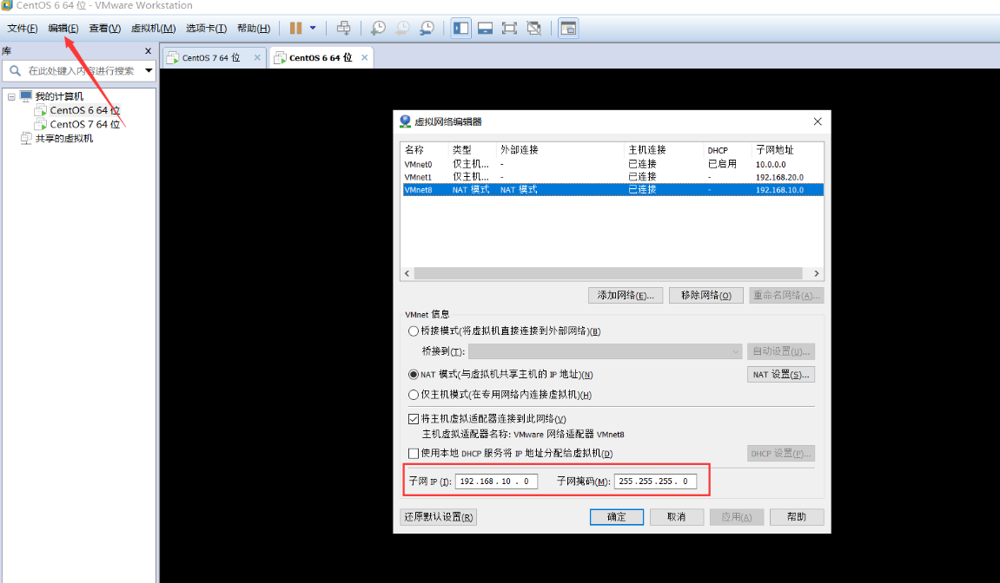
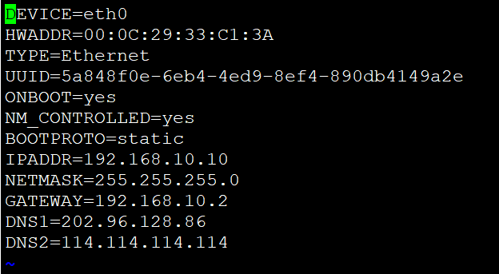
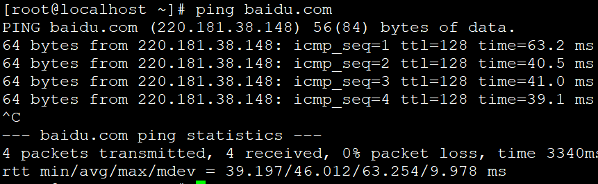
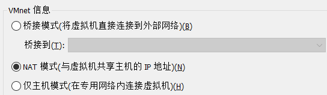

1.点击编辑，打开虚拟网络编辑器，可以设置子网网段

<!--more-->



2.修改网络配置
方法一（临时）：使用命令临时指派一个IP给网卡

```
#ifconfig eth0 192.168.10.10 netmask 255.255.255.0 up
```

方法二（永久）：打开网络配置文件

```
#[root@localhost ~]# vi /etc/sysconfig/network-scripts/ifcfg-eth0
```



IP地址要在第一步的子网网段范围内，HWADDR要和网卡物理地址一致。

然后，重启一下网络服务：

```
#[root@localhost ~]# service network restart
```

完成后就可以连接外网了



ps：网络连接三种模式详解



```
桥接模式：相当于在物理主机与虚拟机网卡之间架设了一座桥梁，从而可以通过物理主机的网卡上网。

NAT模式：让VM虚拟机的网络服务发挥路由器的作用，使得通过虚拟机软件模拟的主机可以通过物理主机上网，在物理机中NAT虚拟机网卡对应的物理网卡是VMnet8。

仅主机模式：仅让虚拟机内的主机与物理主机通信，不能上网，在物理机机中仅主机模式模拟网卡对应的物理网卡是VMnet1。
```

