VMware 可以使你在一台计算机上同时运行多个操作系统，例如同时运行 Windows、Linux 和 Mac OS。在计算机上直接安装多个操作系统，同一个时刻只能运行一个操作系统，重启才可以切换；而 Vmware 可以同时运行多个操作系统，可以像 Windows 应用程序一样来回切换。

<!--more-->

### 1.VMware

1.1 打开VMware Workstation，单击“创建新的虚拟机”选项，并在弹出的“新建虚拟机向导”界面中选择“典型”单选按钮，然后单击“下一步”按钮。

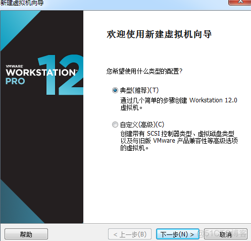

1.2 选中“稍后安装操作系统”单选按钮，然后单击“下一步”按钮

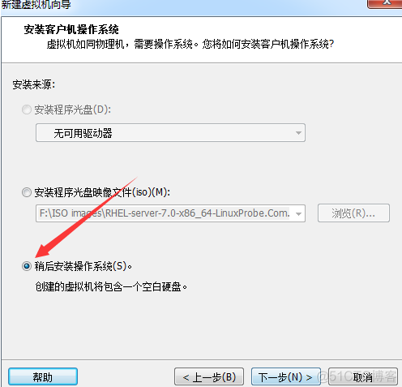

1.3 将客户机操作系统的类型选择为“Linux”，版本为“Red Hat Enterprise Linux 7 64位”，然后单击“下一步”按钮。

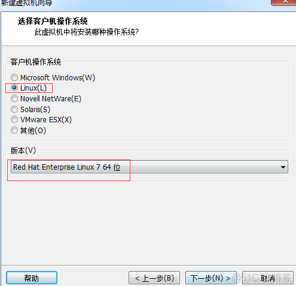

1.4 填写“虚拟机名称”字段，并在选择安装位置之后单击“下一步”按钮

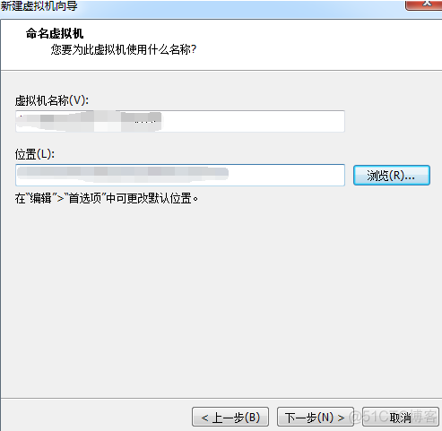

1.5 将虚拟机系统的“最大磁盘大小”设置为20.0GB（默认即可），然后单击“下一步”按钮

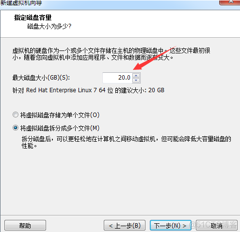

1.6 单击“自定义硬件”按钮

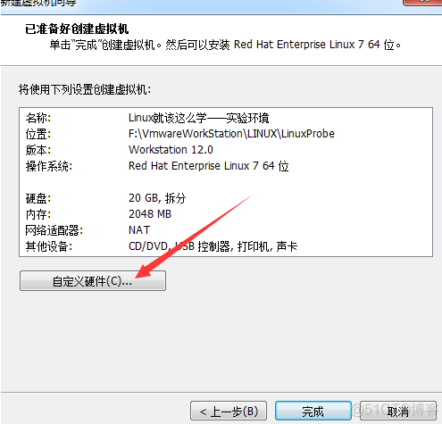

1.7 建议将虚拟机系统内存的可用量设置为2GB，最低不应低于1GB

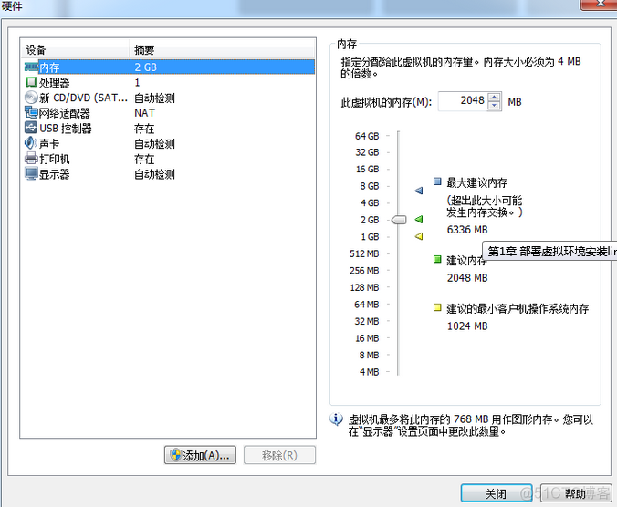

1.8 根据物理机的性能设置CPU处理器的数量以及每个处理器的核心数量，并开启虚拟化功能

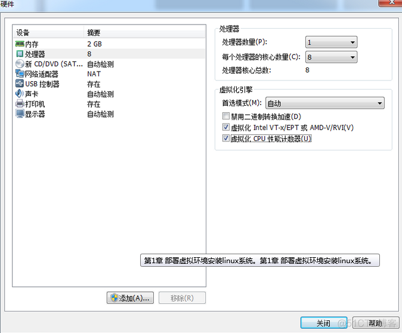

1.9 光驱设备此时应在“使用ISO镜像文件”中选中了下载好的RHEL系统镜像文件（镜像文件链接： https://pan.baidu.com/s/1PbEu4MKBovHdi3E-mgqQIw 提取码: tj6j ）

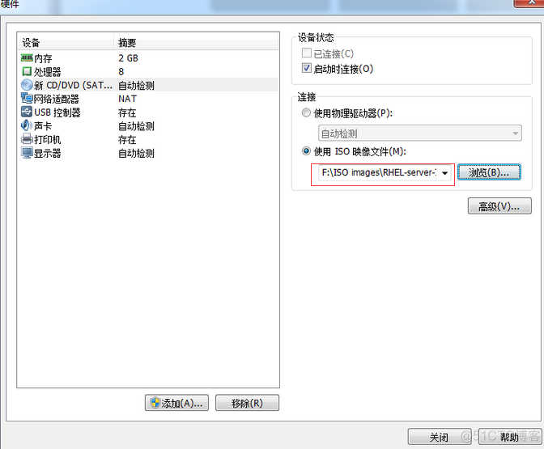

1.10 VM虚拟机软件为用户提供了3种可选的网络模式，分别为桥接模式、NAT模式与仅主机模式。这里选择“仅主机模式”。

`桥接模式：相当于在物理主机与虚拟机网卡之间架设了一座桥梁，从而可以通过物理主机的网卡上网。`

`NAT模式：让VM虚拟机的网络服务发挥路由器的作用，使得通过虚拟机软件模拟的主机可以通过物理主机上网，在物理机中NAT虚拟机网卡对应的物理网卡是VMnet8。`

`仅主机模式：仅让虚拟机内的主机与物理主机通信，不能上网，在物理机机中仅主机模式模拟网卡对应的物理网卡是VMnet1。`

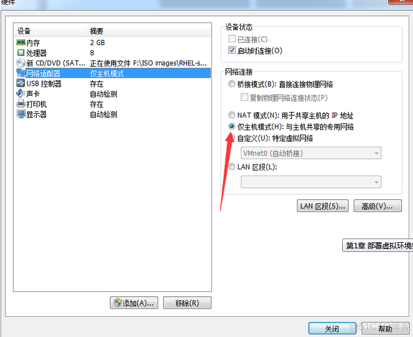

1.11 返回到虚拟机配置向导界面后单击“完成”按钮

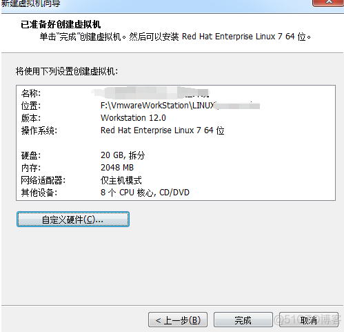

### 安装linux系统

安装RHEL 7或CentOS 7系统时，您的电脑的CPU需要支持VT（Virtualization Technology，虚拟化技术）。所谓VT，指的是让单台计算机能够分割出多个独立资源区，并让每个资源区按照需要模拟出系统的一项技术，其本质就是通过中间层实现计算机资源的管理和再分配，让系统资源的利用率最大化。如果开启虚拟机后提示“CPU不支持VT技术”等报错信息，请重启电脑并进入到BIOS中把VT虚拟化功能开启即可。

2.1 在虚拟机管理界面中单击“开启此虚拟机”按钮后数秒就看到RHEL 7系统安装界面。在界面中，Test this media & install Red Hat Enterprise Linux 7.0和Troubleshooting的作用分别是校验光盘完整性后再安装以及启动救援模式。此时通过键盘的方向键选择Install Red Hat Enterprise Linux 7.0选项来直接安装Linux系统。

2.2 接下来按回车键后开始加载安装镜像，所需时间大约在30～60秒

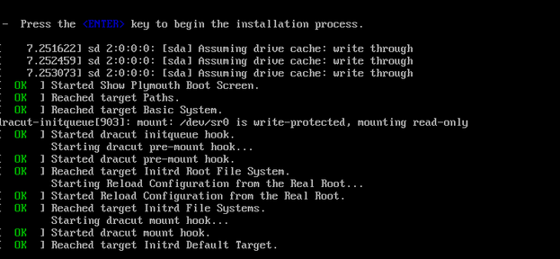

2.3 选择系统的安装语言后单击Continue按钮

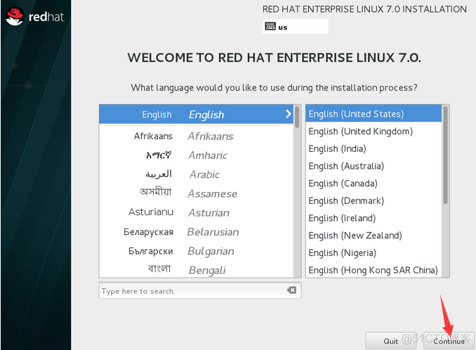

2.4 在安装界面中单击SOFTWARE SELECTION选项

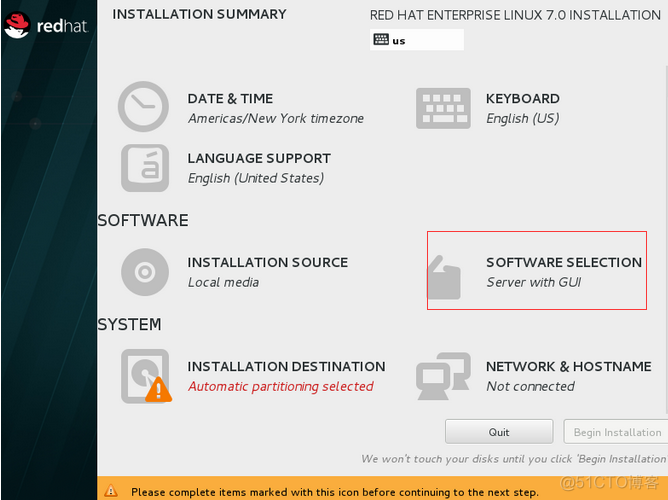

2.5 在界面中单击选中Server with GUI单选按钮，然后单击左上角的Done按钮

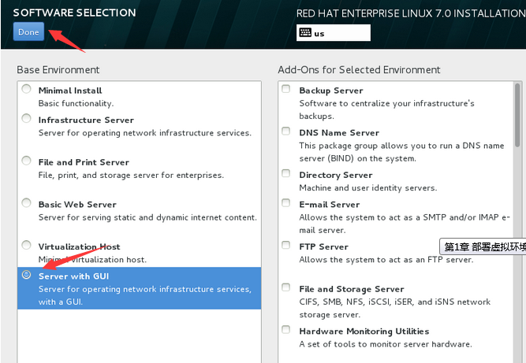

2.6 返回到RHEL 7系统安装主界面，单击NETWORK & HOSTNAME选项后，将Hostname字段设置为你想设置的名称，然后单击左上角的Done按钮

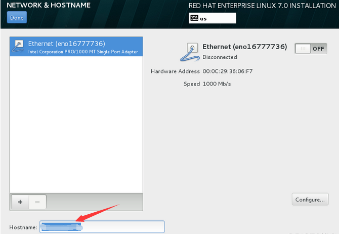

2.7 返回到安装主界面，单击INSTALLATION DESTINATION选项来选择安装媒介并设置分区。此时不需要进行任何修改，单击左上角的Done按钮即可

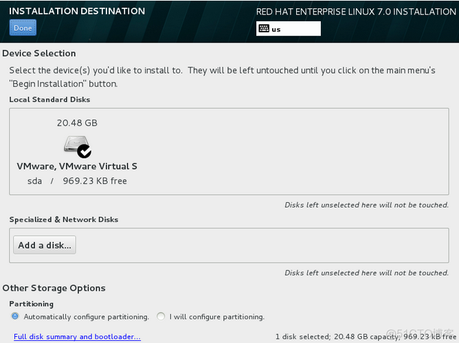

2.8 返回到安装主界面，单击Begin Installation按钮后即可看到安装进度，在此处选择ROOT PASSWORD

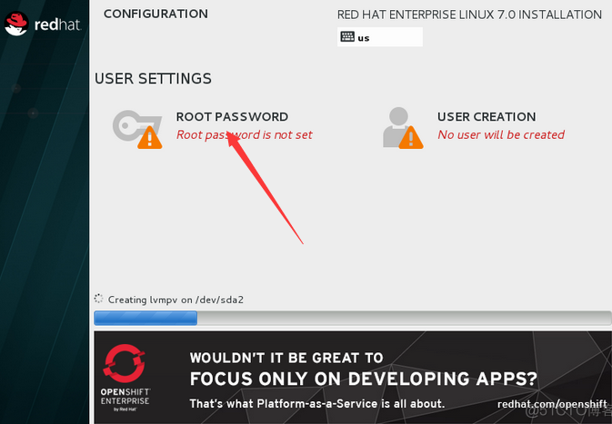

2.9 设置root管理员的密码。若坚持用弱口令的密码则需要单击2次左上角的Done按钮才可以确认

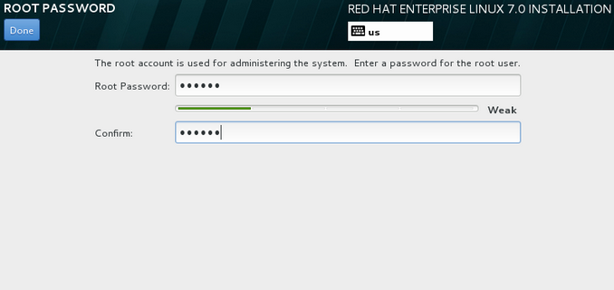

2.10 Linux系统安装过程一般在30～60分钟，在安装过程期间耐心等待即可。安装完成后单击Reboot按钮

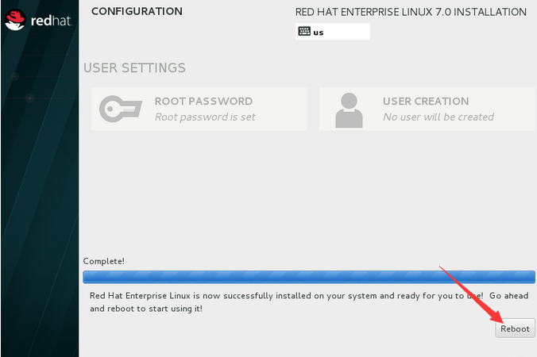

2.11 重启系统后将看到系统的初始化界面，单击LICENSE INFORMATION选项

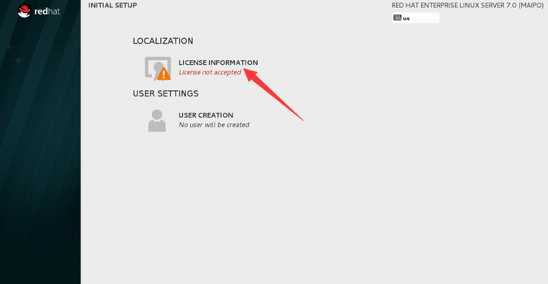

2.12 选中I accept the license agreement复选框，然后单击左上角的Done按钮

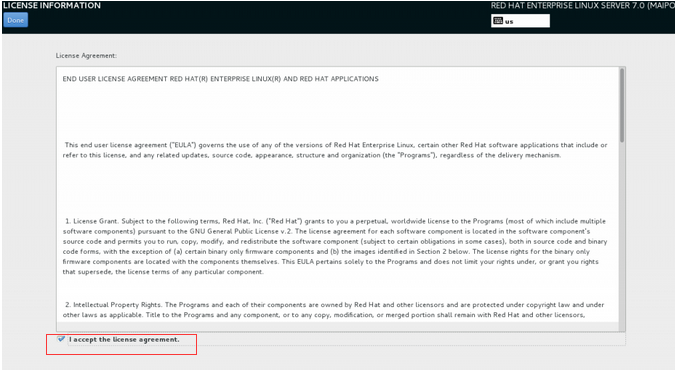

2.13 返回到初始化界面后单击FINISH CONFIGURATION选项，即可看到Kdump服务的设置界面。如果暂时不打算调试系统内核，也可以取消选中Enable kdump复选框，然后单击Forward按钮

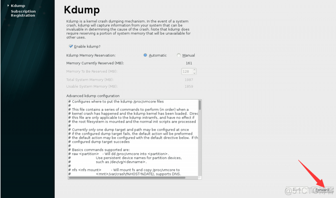

2.14 选中No, I prefer to register at a later time单选按钮，然后单击Finish按钮。此处设置为不注册系统

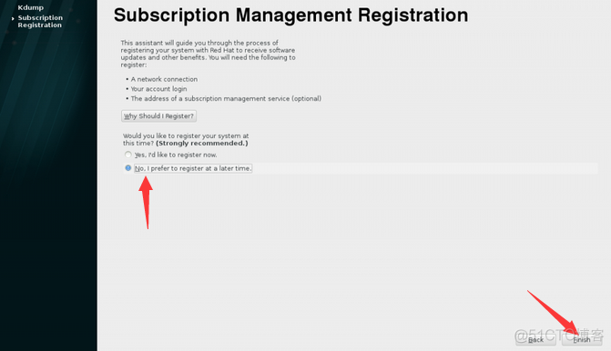

2.15 虚拟机软件中的RHEL 7系统经过又一次的重启后，看到系统的欢迎界面，在界面中选择默认的语言English (United States)，然后单击Next按钮。

2.16 将系统的输入来源类型选择为English (US)，然后单击Next按钮

2.17 为RHEL 7系统创建一个本地的普通用户，该账户的用户名为xxx，密码为xxx，然后单击Next按钮

2.18 设置系统的时区，然后单击Next按钮

2.19 单击Start using Red Hat Enterprise Linux Server按钮，至此，RHEL 7系统完成了全部的安装和部署工作。

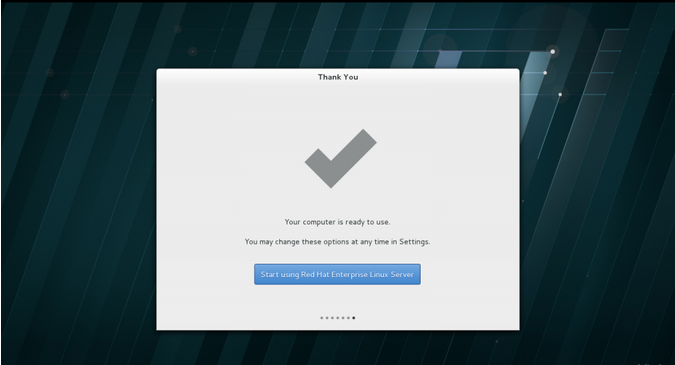

最后，希望入门的小伙伴不要依赖图形界面，要熟悉字符界面，才能快速提升，将来在生产环境中使用的也都是字符界面。

图形界面转字符界面：使用Ctrl+Alt+F1~Ctrl+Alt+F6，可切换到不同的字符控制台。

字符界面转图形界面：startx或使用Ctrl+Alt+F7

修改Linux 默认启动级别（模式）：
1.CentOs6.1: 以root 身份 vi /etc/inittab，找到 id:5:initdefault: 所在的行（这里的id 可能是其他数字）。修改id 值：3就是文字模式，5就是界面模式。保存该文件，reboot 后即生效。

2.Red Hat7.0: 在命令行中输入systemctl get-default，意为获取当前启动模式,graphical.target 为图形界面启动,multi-user.target 为字符界面启动，然后在命令行中输入systemctl set-default xxx.target 即可修改为对应的模式，最后重启生效。
