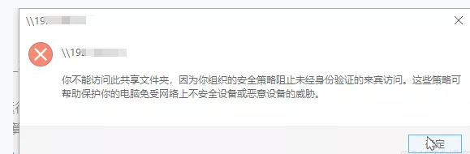
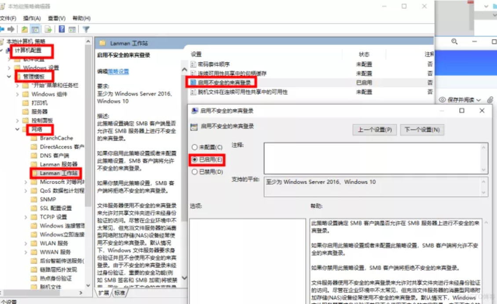

你不能访问此共享文件夹，因为你组织的安全策略阻止未经身份验证的来宾访问。

<!--more-->

访问共享文档挂了...

### 方法1:2020之前的版本

1、首先按window+R键打开运行键入gpedit.msc启动本地组策略编辑器。

2、在组策略编辑器中找到“计算机配置”–“管理模板”–“网络”–“Lanman工作站”

3、“Lanman工作站”这个节点，在右侧内容区可以看到“启用不安全的来宾登录”这一条策略设置。状态是“未配置”。双击“启用不安全的来宾登录”这一条策略设置，将其状态修改为“已启用”并单击确定按钮。

再次尝试,无效,据说2020版之后就不能用了

### 方法2:2020

1、打开编辑器。

2、进入地址计算机\HKEY_LOCAL_MACHINE\SYSTEM\CurrentControlSet\Services\LanmanWorkstation\Parameters 将AllowInsecureGuestAuth设置为1

3、进入计算机\HKEY_LOCAL_MACHINE\SOFTWARE\Policies\Microsoft\Windows\LanmanWorkstation，将AllowInsecureGuestAuth设置为1
