1.登录阿里云，进入云数据库MongoDB模块，点击对应实例，选择备份与恢复

<!--more-->

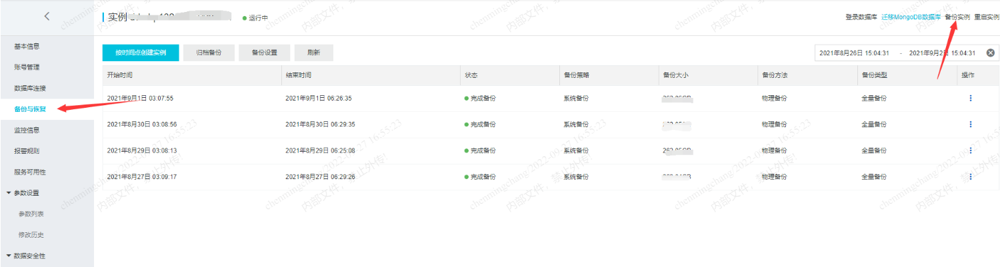

下载备份文件：

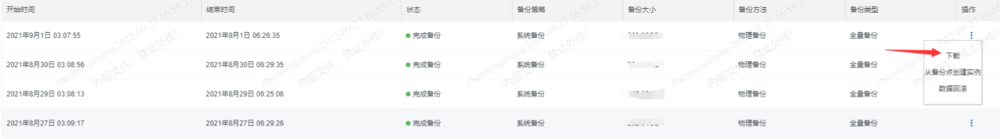

2.在本地服务器安装MongoDB（版本需与阿里云MongoDB版本一致），具体安装方法请查看上一篇文章，在此不再赘述。

3.解压下载的备份文件：

```
mkdir -p /mysql/mongo
tar -zxvf  /data/backups/MongoDB/hins4463797_data_20210825030706.tar.gz -C /mysql/mongo/
```

解压结果：

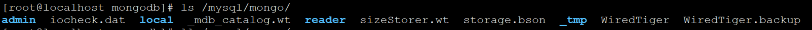 

4.以单节点模式恢复MongoDB物理备份的数据

4.1 执行如下命令在/usr/local/mongodb文件夹中新建配置文件mongod.conf。

```
touch /usr/local/mongodb/mongod.conf
```


4.2 在命令行中输入vi /usr/local/mongodb/mongod.conf打开mongod.conf文件，键盘输入i开启编辑模式。

根据云数据库MongoDB版的存储引擎选择启动的配置模板，您可以将其复制到mongod.conf文件中:

```
systemLog:
    destination: file
    path: /usr/local/mongodb/mongod.log
    logAppend: true
security:
    authorization: enabled
storage:
    dbPath: /mysql/mongo
    directoryPerDB: true
net:
    port: 27017
    unixDomainSocket:
        enabled: false
processManagement:
    fork: true
    pidFilePath: /usr/local/mongodb/mongod.pid
```

4.3 按Esc键退出编辑模式，键盘输入:wq保存并退出。

5.指定新建的配置文件mongod.conf来启动MongoDB

```
mongod -f /usr/local/mongodb/mongod.conf
```

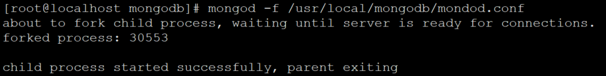

等待启动完成后，执行如下命令登录MongoDB数据库，进入Mongo Shell。

```
mongo --host 127.0.0.1 -u <username> -p <password> --authenticationDatabase admin
```

登录成功：

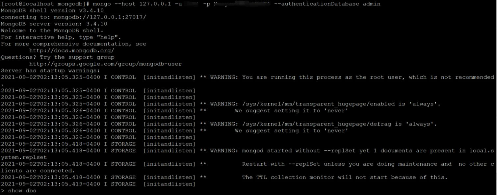

在Mongo Shell中，执行show dbs查询当前本地MongoDB中所有的数据库，以验证是否恢复成功:

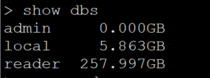

至此恢复工作已成功完成，您可以在Mongo Shell中执行exit命令退出Mongo Shell。

6.副本集模式启动MongoDB数据库

6.1 在命令行中通过服务器的Mongo Shell使用root用户登录MongoDB数据库：

（如果您的密码中包含特殊字符，则需要使用英文单引号（'）包裹密码，如：'test123!@#'。否则可能会登录失败。）

```
mongo --host 127.0.0.1 -u root -p <root用户密码> --authenticationDatabase admin
```

登录成功后，执行下方代码框中的命令完成如下动作：

​	1.在admin库中创建一个临时用户，赋予该用户临时的local库读写权限。
​	2.切换至临时用户移除local库中原有副本集配置。
​	3.切换回root用户删除临时用户和临时权限

```
use admin
db.runCommand({
    createRole: "tmprole",
    roles: [
        {
            role: "root",
            db: "admin"
        }
    ],
    privileges: [
        {
            resource: {
            db: 'local',
            collection: 'system.replset'
        },
        actions: [
                'remove'
            ]
        }
    ]
})


db.runCommand({
    createUser: "tmpuser",
    pwd: "tmppwd",
    roles: [
        'tmprole'
    ]
})

db.auth('tmpuser','tmppwd')
use local
db.system.replset.remove({})
use admin
db.auth('root','<root用户密码>')
db.dropRole('tmprole')
db.dropUser('tmpuser')
```


执行结果示例：

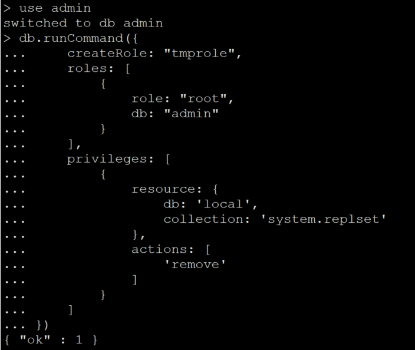

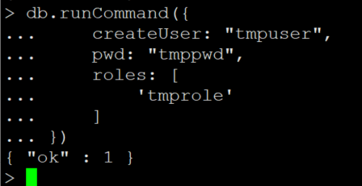

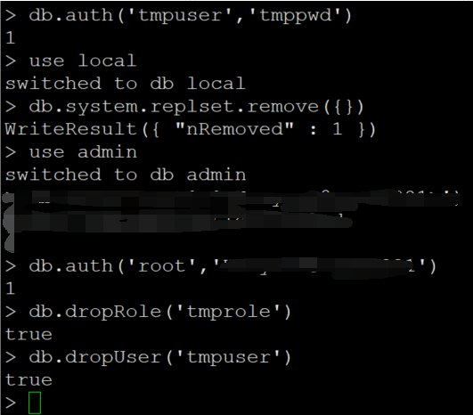

(对于local库的system.replset集合，root用户只有只读权限，且由于root用户无法更改自身的权限，因此只能通过其他用户进行删除。)

6.2 执行如下命令关闭MongoDB服务并退出Mongo Shell：

```
use admin
db.shutdownServer()
exit
```

7.创建副本集认证文件（如需以副本集模式启动MongoDB，您需要创建一个key文件作为每个副本集节点之间的认证文件）：

7.1 执行如下命令在mongo目录下创建keyFile文件夹作为认证文件的目录，并在该目录中创建一个key文件。

```
mkdir -p /usr/local/mongodb/keyFile && touch /usr/local/mongodb/keyFile/mongodb.key
```


执行vi /root/mongo/keyFile/mongodb.key打开mongodb.key文件，按键盘上的i进入编辑模式，输入加密内容。例如：

```
MongoDB Encrypting File
```

加密内容有如下几个限制

​	>长度必须在6~1024个字符之间。
​	>只能包含base64编码中的字符。
​	>不能包含等号（=）。
在命令行中执行如下命令将认证文件的权限修改为400，保证该文件内容仅对该文件所有者可见。

```
chmod 400 /usr/local/mongodb/keyFile/mongodb.key
```

8.通过下列步骤为副本集准备两个空的节点。

8.1 执行如下命令复制两份mongod.conf文件分别作为另外两个节点的启动配置文件。

```
cp /usr/local/mongodb/mongod.conf /usr/local/mongodb/mongod1.conf && cp /usr/local/mongodb/mongod.conf /usr/local/mongodb/mongod2.conf
```


执行如下命令分别为另外两个节点创建数据目录。

```
mkdir -p /mysql/mongo1 && mkdir -p /mysql/mongo2
```

9.分别通过下列指示修改各节点的配置文件：

执行vi /usr/local/mongodb/mongod.conf打开节点1的配置文件，并按照如下内容修改完成后保存退出。

```
systemLog:
    destination: file
    path: /usr/local/mongodb/mongod.log
    logAppend: true
security:
    authorization: enabled
    keyFile: /usr/local/mongodb/keyFile/mongodb.key
storage:
    dbPath: /mysql/mongo
    directoryPerDB: true
net:
    bindIp: 127.0.0.1
    port: 27017
    unixDomainSocket:
        enabled: false
processManagement:
    fork: true
    pidFilePath: /usr/local/mongodb/mongod.pid
replication:
    replSetName: "rs0"
```

执行vi /usr/local/mongodb/mongod1.conf打开节点2的配置文件，并按照如下内容修改完成后保存退出。

```
systemLog:
    destination: file
    path: /usr/local/mongodb/mongod1.log
    logAppend: true
security:
    authorization: enabled
    keyFile: /usr/local/mongodb/keyFile/mongodb.key
storage:
    dbPath: /mysql/mongo1
    directoryPerDB: true
net:
    bindIp: 127.0.0.1
    port: 27018
    unixDomainSocket:
        enabled: false
processManagement:
    fork: true
    pidFilePath: /usr/local/mongodb/mongod1.pid
replication:
    replSetName: "rs0"
```

执行vi /usr/local/mongodb/mongod2.conf打开节点3的配置文件，并按照如下内容修改完成后保存退出。

```
systemLog:
    destination: file
    path: /usr/local/mongodb/mongod2.log
    logAppend: true
security:
    authorization: enabled
    keyFile: /usr/local/mongodb/keyFile/mongodb.key
storage:
    dbPath: /mysql/mongo2
    directoryPerDB: true
net:
    bindIp: 127.0.0.1
    port: 27019
    unixDomainSocket:
        enabled: false
processManagement:
    fork: true
    pidFilePath: /usr/local/mongodb/mongod2.pid
replication:
    replSetName: "rs0"
```


各重要参数说明如下：

```
systemLog.path下的path：当前节点的MongoDB日志文件路径，
dbpath：当前节点的MongoDB数据文件路径。
pidFilePath：当前节点的MongoDB的PID文件（记录进程ID的文件）路径。
keyFile：副本集认证文件路径，所有节点必须使用同一个认证文件。
bindIp：当前节点的IP地址。如果是在同一台服务器上部署副本集，所有节点可采用相同的IP地址。
port：当前节点的端口号。如果是在同一台服务器上部署副本集，所有节点应采用不同的端口号。
replication：副本集配置。
replSetName：设置副本集的名称。
```

10. 执行如下命令启动3个节点。

```
mongod -f /usr/local/mongodb/mongod.conf && mongod -f /usr/local/mongodb/mongod1.conf && mongod -f /usr/local/mongodb/mongod2.conf
```

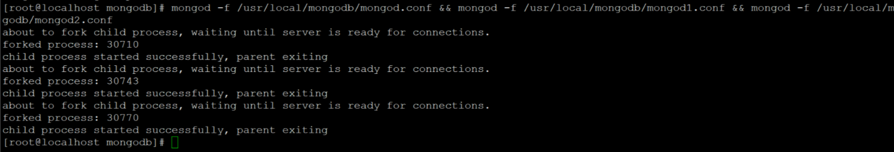


等待启动完成后，使用root账号登录MongoDB数据库。

```
mongo --host 127.0.0.1 -u root -p <root账号的密码> --authenticationDatabase admin
```

在Mongo Shell中通过如下命令将上述步骤中创建的副本集成员节点加入副本集并初始化。

```
rs.initiate( {
    _id : "rs0",
    version : 1,
    members: [
        { _id: 0, host: "127.0.0.1:27017" , priority : 1},
        { _id: 1, host: "127.0.0.1:27018" , priority : 0},
        { _id: 2, host: "127.0.0.1:27019" , priority : 0}
    ]
})
```

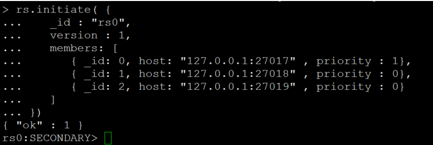

执行成功后，新加入的两个节点将会与主节点进行数据同步，注意此过程的耗时根据备份文件的大小会有较大差异。等待数据同步完成后，副本集模式启动完成。

11.通过如下步骤验证是否启动成功。

​		1.执行exit退出Mongo Shell。
​		2.执行如下命令重新登录MongoDB数据库.

```
mongo -u <username> -p <password> --authenticationDatabase admin
```

观察Mongo Shell命令行左侧，显示<副本集名称>:PRIMARY>即代表副本集模式启动成功。

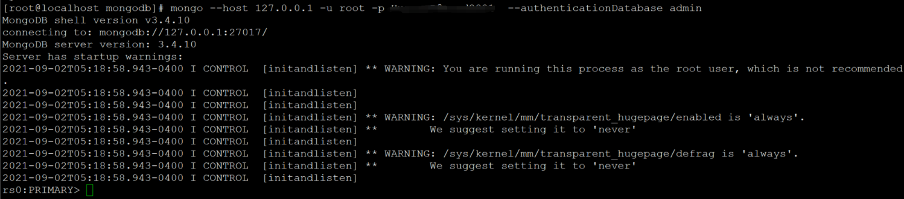
