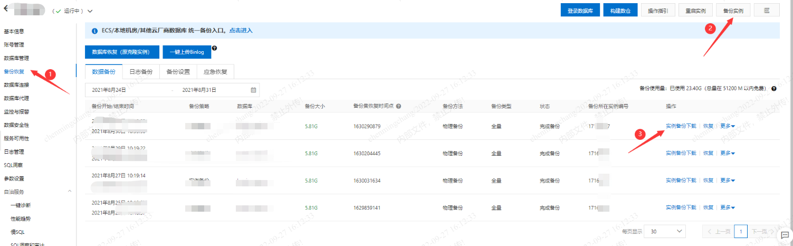
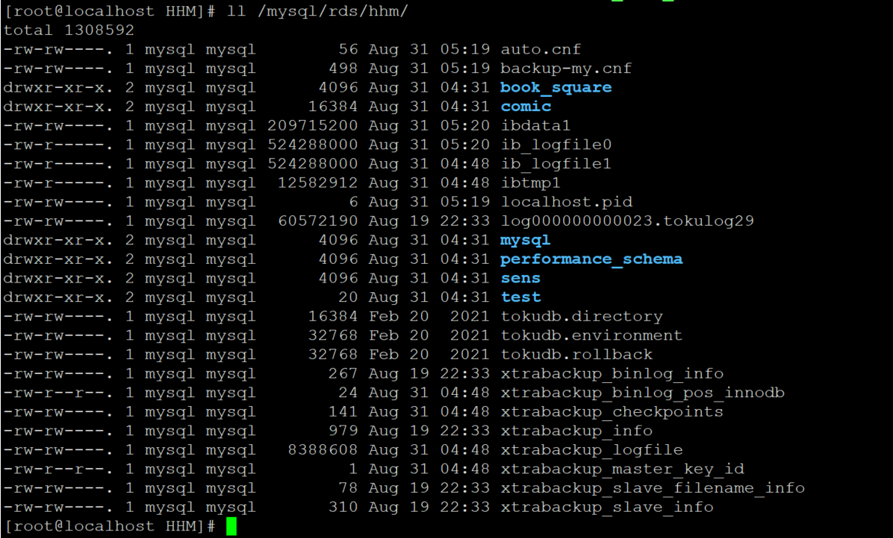
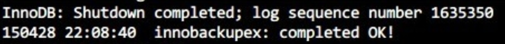
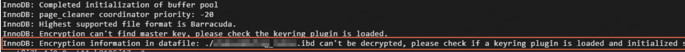
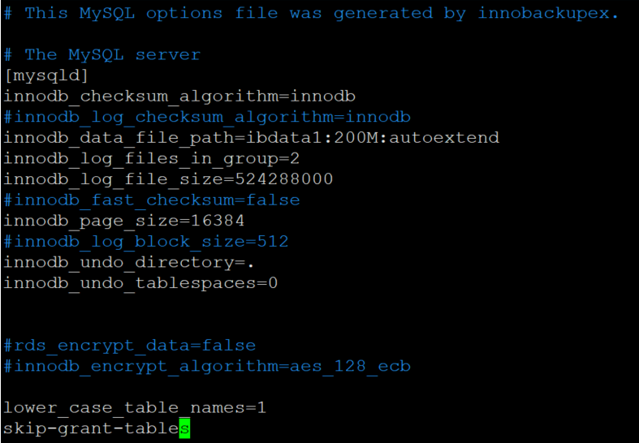
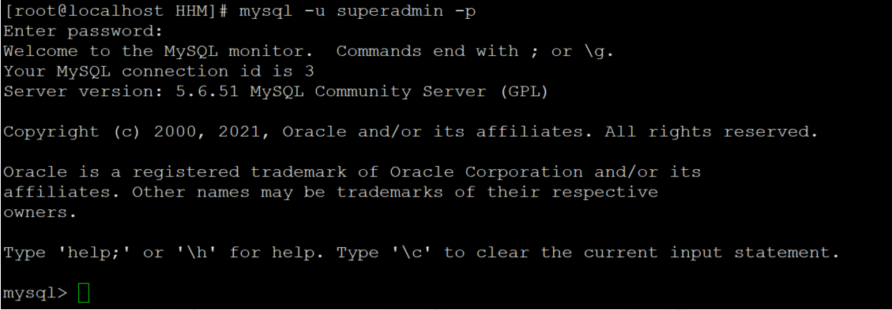
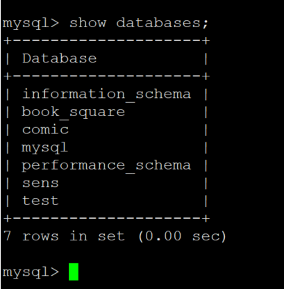
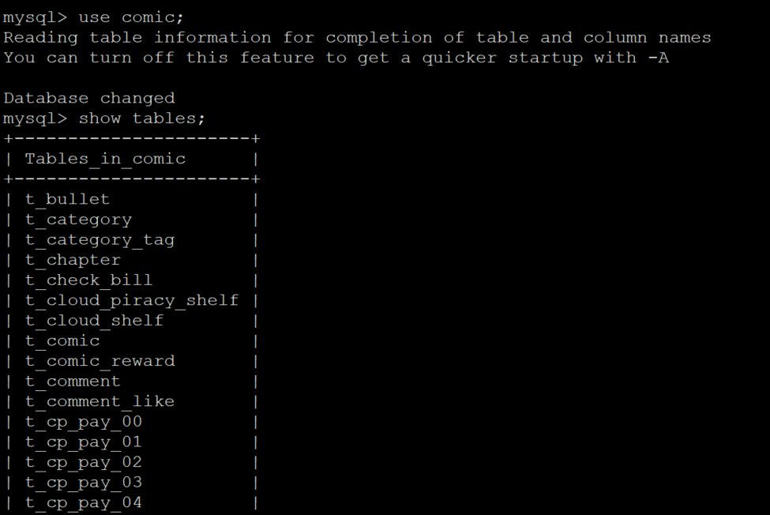
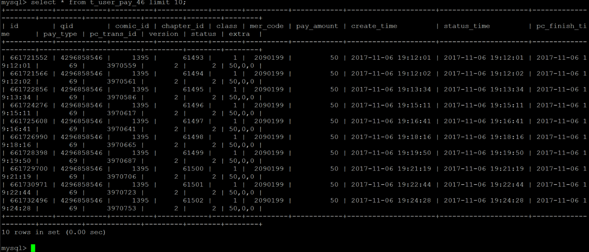

1.首先登陆阿里云平台，到云数据库RDS页面，点击对应实例，点击备份恢复。

2.右上角点击备份实例，备份完成后下载。

<!--more-->



3.把文件挂载到本地服务器：

3.1在本地服务器上创建挂载目录

```
mkdir  /data
```

由于移动硬盘磁盘格式是NTFS，执行挂载命令后会报错：mount: unknown filesystem type 'ntfs'，这是由于Linux上无法识别NTFS格式的分区的原因。

解决办法：安装ntfs-3g

```
wget https://tuxera.com/opensource/ntfs-3g_ntfsprogs-2017.3.23.tgz
tar -zxvf  ntfs-3g_ntfsprogs-2017.3.23.tgz
cd ntfs-3g_ntfsprogs-2017.3.23.tgz
./configure
make && make install
```

4.把移动硬盘挂在到本地服务器上：

```
mount -t ntfs-3g /dev/sdb1 /data
```

5.在本地服务器上，创建一个目录（例如/mysql/rds/hhm）用于存放解压后的文件。

```
mkdir -p /mysql/rds/hhm
```

6.解压备份数据至刚才创建的目录

```
tar -izxvf /data/backups/RDS/HHM/hins17168727_data_20210820101803.tar.gz -C /mysql/rds/hhm
```

解压后的文件如下：



7.在本地服务器上安装MySQL（版本需与阿里云上的版本一致），由于阿里云上RDS的MySQL版本为5.6，故安装MySQL5.6：

```
wget http://repo.mysql.com/mysql-community-release-el6-5.noarch.rpm
rpm -ivh mysql-community-release-el6-5.noarch.rpm
yum install -y mysql-server mysql-devel
```

8.在本地服务器上，安装Percona XtraBackup（恢复数据使用）：

```
yum install https://repo.percona.com/yum/percona-release-latest.noarch.rpm
yum install percona-xtrabackup-24
```

9.执行如下命令，恢复解压好的备份文件。

```
innobackupex --defaults-file=/mysql/rds/hhm/backup-my.cnf --apply-log /mysql/rds/hhm
```

恢复时请耐心等待，若系统返回如下类似结果，则说明备份文件已成功恢复到自建数据库。



若系统返回如下报错，可以用rm -rf /var/lib/mysql命令清空文件夹内文件，然后用chown -R mysql:mysql /var/lib/mysql修改权限。



10.启动MySQL：

为避免版本问题，需修改/mysql/rds/hhm/backup-my.cnf文件：

添加如下参数：

```
lower_case_table_names=1
```

注释掉如下自建数据库不支持的参数：

```
#innodb_log_checksum_algorithm
#innodb_fast_checksum
#innodb_log_block_size
#innodb_doublewrite_file
#innodb_encrypt_algorithm
#rds_encrypt_data
#redo_log_version
#master_key_id
#server_uuid
```

修改后文件如下：



执行如下命令，修改文件属主，并确定文件所属为MySQL用户。

```
chown -R mysql:mysql /mysql/rds/hhm
```

执行如下命令，启动MySQL进程。

```
mysqld --defaults-file=/mysql/rds/hhm/backup-my.cnf --user=mysql --datadir=/mysql/rds/hhm &
```

11.以原本的数据库账号密码登录验证是否成功：



登录成功，查看数据库是否导入成功：



可以看到，数据库已经成功导入，查看表是否成功导入：



表也成功导入，随机查看一个表是否有数据：



至此，阿里云RDS数据恢复至本地服务器完成。
