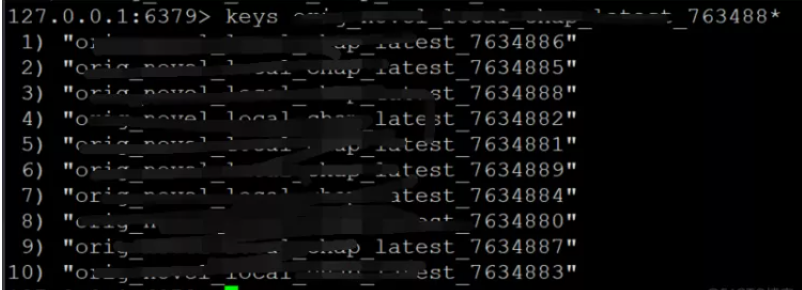

1.登录阿里云控制台，点击云数据库Redis，点击对应实例，选择备份恢复，点击备份实例，下载备份文件。

<!--more-->

2.在本地服务器安装Redis（具体查看[这篇文章](https://yixian12580.github.io/2022/09ca3d3aa4.html)，在此不再赘述）

3.使用redis-port工具把下载的备份文件导进Redis数据库：

3.1 下载redis-port

```
wget https://github.com/CodisLabs/redis-port
```


赋予可执行权限：

```
chmod 777 redis-port
```


把备份文件导入Redis：

```
./redis-port restore -i /data/backups/Redis/hy-redis02-hjl/hins2358867_data_20210821170224.rdb -t 127.0.0.1:6379
```


导入完成：

登入Redis查看数据：



至此，数据导入成功。
